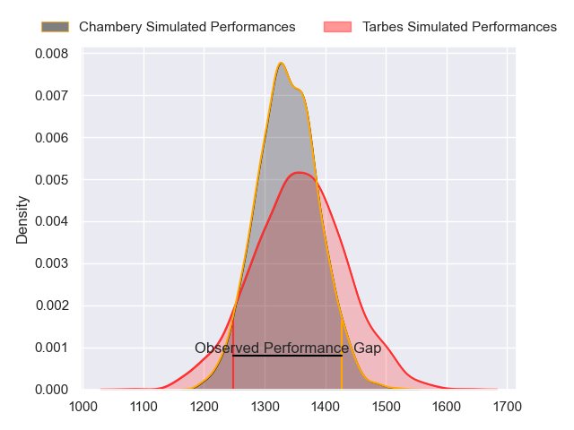
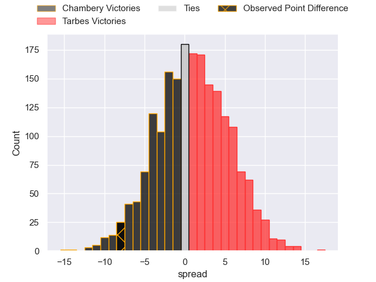
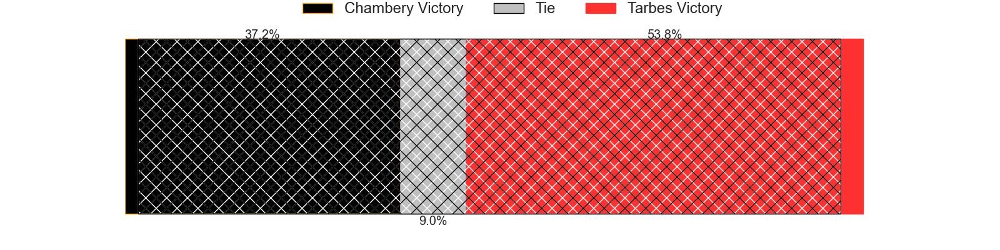
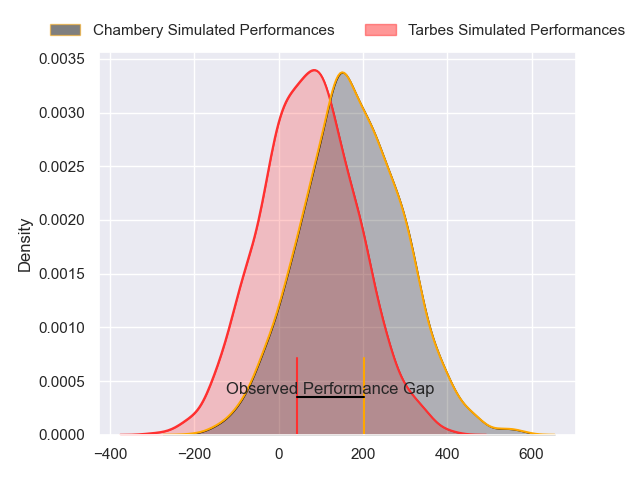
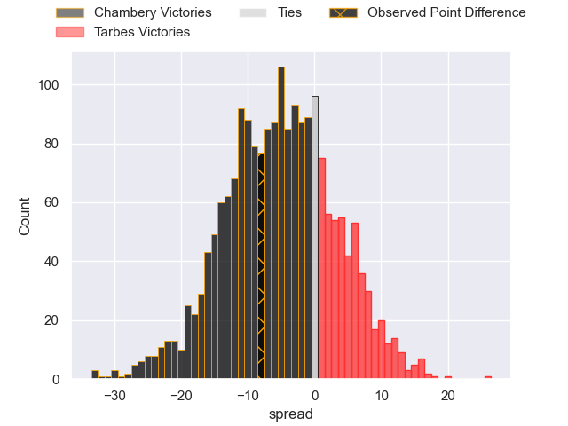
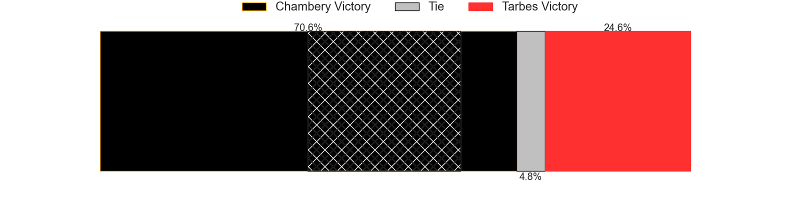

---  
layout: page  
title: Chambery at Tarbes; 32-24  
date: 2024-04-27 18:00:00 -0500  
categories: "Nationale 2023" match review  
---
# Chambery at Tarbes; 32-24

# Club Level Predictions

The first set of predictions treats a club as the smallest object, as the club develops its members, organizes a gameplan, and deploys its players as needed for each match. This club model has a prediction of 0.537, which translates to predicting Tarbes to win by 1.3.

Our Over/Under is 48.5 - and combined with the spread above, we have a predicted scoreline of 23 to 25

Each club has a rating and a rating deviation (similar to a Glicko rating), and expected performances can be generated. This allows for simulated matches and spreads like the ones below.
## Projected Performances - Club Model

## Projected Spreads - Club Model

## Projected Results - Club Model

# Player Level Predictions - Version 2

Treating teams instead as an entity made up of the currently active players, I have ratings for each player in an altogether different system. These can be combined to form team ratings once teamsheets are announced, weighting starters a bit higher than the reserves. After the match is played, players can be weighted by their minutes on the field, allowing for an accurate measure of the team's composition. With these compiled team ratings, we can make predictions, measure inaccuracy, and update the individual player ratings.
## Prediction without Player Minutes: Chambery by 7.5

Chambery by 14.0 on a neutral pitch

## Projected Performances - Player Model

## Projected Spreads - Player Model

## Projected Results - Player Model

|   Away Minutes | Away Player                  |   Away Percentile |   Number |   Home Percentile | Home Player        |   Home Minutes |
|---------------:|:-----------------------------|------------------:|---------:|------------------:|:-------------------|---------------:|
|             49 | Nugzar Somkhishvili          |             76.3  |        1 |              7.05 | Alexandre Combier  |             49 |
|             54 | Gauthier Brute de Remur      |             83.03 |        2 |             46.63 | Florian Lamothe    |             54 |
|             49 | Giorgi Pertaia               |             85.5  |        3 |             17.43 | Alexandre Duny     |             49 |
|             80 | Fabien Witz                  |             61.77 |        4 |             28.88 | Léo Estaque        |             61 |
|             49 | Corentin Astier              |             46.36 |        5 |             14.08 | Baptiste Peytavi   |             80 |
|             54 | Thomas Coignat               |             73.95 |        6 |             30.59 | Léo Saint-Guilhem  |             80 |
|             80 | Taniela Matakaiongo          |             38.47 |        7 |             21.03 | Jean Guicherd      |             80 |
|             80 | Tui Uru                      |             78.26 |        8 |              0.77 | Filipe Manu        |             54 |
|             61 | Thibault Dufau               |             68.3  |        9 |             28.3  | Mickael Thébault   |             49 |
|             80 | Victor Pisano                |             45.43 |       10 |              1.04 | Mathieu Berbizier  |             54 |
|             56 | Paul Baptiste Florent Altier |             43.51 |       11 |             27.37 | Jonathan Duffau    |             80 |
|             80 | Bastien Reymond              |             67.37 |       12 |              1.87 | Savenaca Rawaca    |             80 |
|             80 | Emmanuel Vaitulukina         |             75.97 |       13 |             71.11 | Johan Paulet       |             80 |
|             80 | Va'aufauese Apelu Maliko     |             41.87 |       14 |              5.15 | Jone Tuva          |             54 |
|             67 | Jules Dorrival               |             43.47 |       15 |             37.69 | Yon Camou          |             80 |
|             31 | Géraud Clermont              |             56.51 |       16 |             44.66 | Johan Mees Erasmus |             31 |
|             26 | Luka Begic                   |             20.86 |       17 |             62.37 | Vincent Dolier     |             26 |
|             31 | Enzo Bailly                  |             53.18 |       18 |             42.02 | Alec Lambert       |             31 |
|             31 | Ahmed Tidiane Kane           |             61.65 |       19 |             12.26 | Jone Trevor Seuvou |             19 |
|             26 | Colin Lebian                 |             60.69 |       20 |             14.83 | Julien Cantan      |             26 |
|             19 | Hugo Deschaux                |             21.49 |       21 |             39.79 | Thibaut Dulucq     |             31 |
|             13 | Clément Pérusin              |            nan    |       22 |             53.26 | Anthony Fuertes    |             26 |
|             24 | Thomas Hecquet               |             44.22 |       23 |             12.98 | Thibaut Trotta     |             26 |

