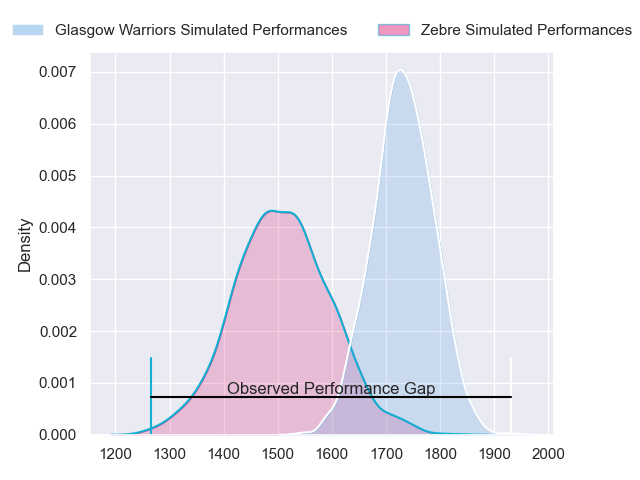
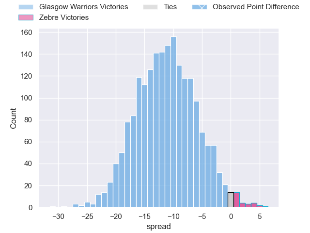
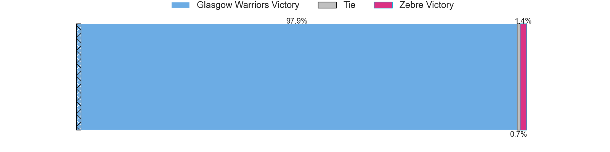
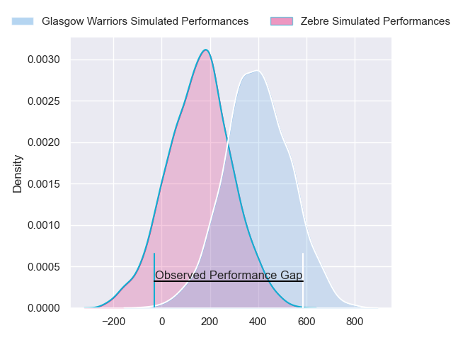
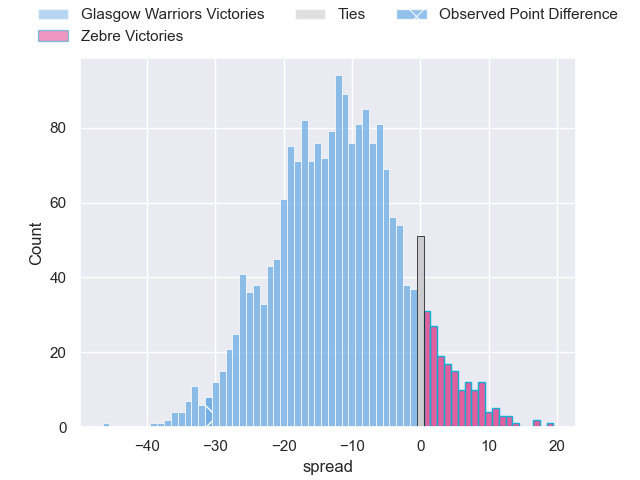
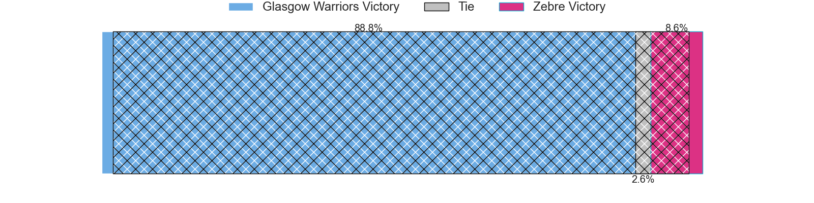

---  
layout: page  
title: Glasgow Warriors at Zebre; 40-9  
date: 2024-04-27 18:00:00 -0500  
categories: "United Rugby Championship 2023" match review  
---
# Glasgow Warriors at Zebre; 40-9

# Club Level Predictions

The first set of predictions treats a club as the smallest object, as the club develops its members, organizes a gameplan, and deploys its players as needed for each match. This club model has a prediction of 0.221, which translates to predicting Glasgow Warriors to win by 11.1.

Our Over/Under is 50.5 - and combined with the spread above, we have a predicted scoreline of 31 to 20

Each club has a rating and a rating deviation (similar to a Glicko rating), and expected performances can be generated. This allows for simulated matches and spreads like the ones below.
## Projected Performances - Club Model

## Projected Spreads - Club Model

## Projected Results - Club Model

# Player Level Predictions - Version 2

Treating teams instead as an entity made up of the currently active players, I have ratings for each player in an altogether different system. These can be combined to form team ratings once teamsheets are announced, weighting starters a bit higher than the reserves. After the match is played, players can be weighted by their minutes on the field, allowing for an accurate measure of the team's composition. With these compiled team ratings, we can make predictions, measure inaccuracy, and update the individual player ratings.
## Prediction without Player Minutes: Glasgow Warriors by 11.8

Glasgow Warriors by 16.1 on a neutral pitch

## Projected Performances - Player Model

## Projected Spreads - Player Model

## Projected Results - Player Model

|   Away Minutes | Away Player       |   Away Percentile |   Number |   Home Percentile | Home Player            |   Home Minutes |
|---------------:|:------------------|------------------:|---------:|------------------:|:-----------------------|---------------:|
|             80 | Allan Dell        |             88.24 |        1 |             61.91 | Danilo Fischetti       |             80 |
|             80 | Gregor Hiddleston |             63.86 |        2 |              6.83 | Marco Manfredi         |             80 |
|             80 | Lucio Sordoni     |             93.44 |        3 |             24.98 | Muhamed Hasa           |             80 |
|             80 | Sintu Manjezi     |             71.46 |        4 |              3.75 | Leonard Krumov         |             80 |
|             80 | Max Williamson    |             50.18 |        5 |             47.28 | Dylan De Leeuw         |             80 |
|             80 | Ally Miller       |             35.76 |        6 |             21.57 | Guido Volpi            |             80 |
|             80 | Tom Gordon        |             96.31 |        7 |              4.65 | Iacopo Bianchi         |             80 |
|             80 | Henco Venter      |             97.01 |        8 |             46.38 | Giacomo Ferrari        |             80 |
|             80 | Jamie Dobie       |             72.73 |        9 |             37.42 | Thomas Dominguez       |             80 |
|             80 | Ross Thompson     |             62.08 |       10 |             87.53 | Geronimo Prisciantelli |             80 |
|             80 | Kyle Rowe         |             84.57 |       11 |             39.31 | Scott Gregory          |             80 |
|             80 | Sione Tuipulotu   |             60.69 |       12 |             63.54 | Enrico Lucchin         |             80 |
|             80 | Stafford McDowall |             92.21 |       13 |             20.64 | Franco Smith           |             80 |
|             80 | Kyle Steyn        |             95.54 |       14 |              5.26 | Jacopo Trulla          |             80 |
|             80 | Josh McKay        |             57.51 |       15 |             22.9  | Lorenzo Pani           |             80 |

