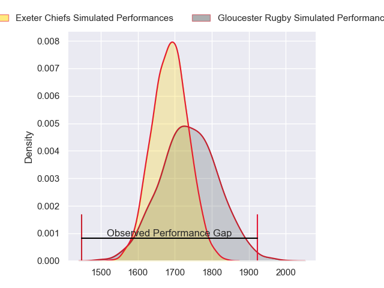
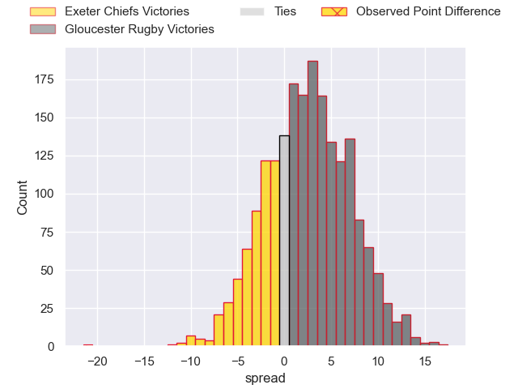
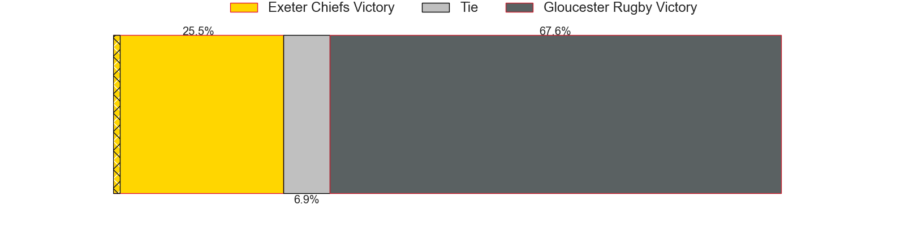
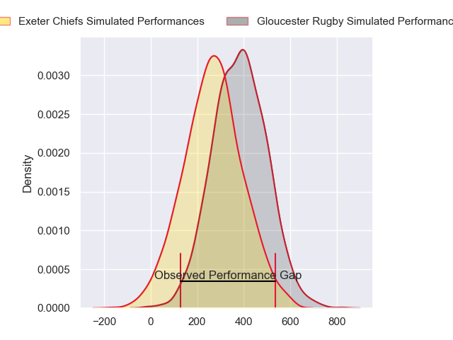
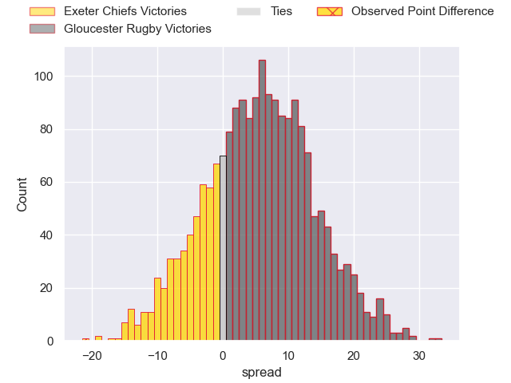
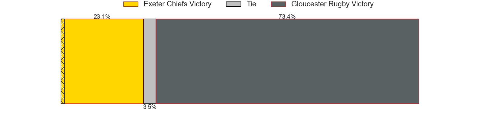

---  
layout: page  
title: Exeter Chiefs at Gloucester Rugby; 38-17  
date: 2024-04-28 18:00:00 -0500  
categories: "Gallagher Premiership 2023" match review  
---
# Exeter Chiefs at Gloucester Rugby; 38-17

# Club Level Predictions

The first set of predictions treats a club as the smallest object, as the club develops its members, organizes a gameplan, and deploys its players as needed for each match. This club model has a prediction of 0.573, which translates to predicting Gloucester Rugby to win by 2.6.

Our Over/Under is 57.5 - and combined with the spread above, we have a predicted scoreline of 28 to 30

Each club has a rating and a rating deviation (similar to a Glicko rating), and expected performances can be generated. This allows for simulated matches and spreads like the ones below.
## Projected Performances - Club Model

## Projected Spreads - Club Model

## Projected Results - Club Model

# Player Level Predictions - Version 2

Treating teams instead as an entity made up of the currently active players, I have ratings for each player in an altogether different system. These can be combined to form team ratings once teamsheets are announced, weighting starters a bit higher than the reserves. After the match is played, players can be weighted by their minutes on the field, allowing for an accurate measure of the team's composition. With these compiled team ratings, we can make predictions, measure inaccuracy, and update the individual player ratings.
## Prediction without Player Minutes: Gloucester Rugby by 8.3

Gloucester Rugby by 0.2 on a neutral pitch

## Projected Performances - Player Model

## Projected Spreads - Player Model

## Projected Results - Player Model

|   Away Minutes | Away Player          |   Away Percentile |   Number |   Home Percentile | Home Player          |   Home Minutes |
|---------------:|:---------------------|------------------:|---------:|------------------:|:---------------------|---------------:|
|             62 | Scott Sio            |             96.67 |        1 |             11.07 | Jamal Ford-Robinson  |             41 |
|             62 | Jack Yeandle         |             93.46 |        2 |             59.92 | Sebastian Blake      |             41 |
|             62 | Marcus Street        |             28.01 |        3 |             90.01 | Kirill Gotovtsev     |             41 |
|             62 | Jack Dunne           |             24.51 |        4 |             79    | Freddie Clarke       |             57 |
|             80 | Dafydd Jenkins       |             92.84 |        5 |             21    | Arthur Clark         |             80 |
|             76 | Ethan Roots          |             81.36 |        6 |             88.77 | Ruan Ackermann       |             62 |
|             80 | Jacques Vermeulen    |             71.8  |        7 |             15.77 | Jack Clement         |             80 |
|             80 | Greg Fisilau         |             73.15 |        8 |             60.1  | Zach Mercer          |             80 |
|             62 | Tom Cairns           |             72.98 |        9 |             14.47 | Stephen Varney       |             62 |
|             80 | Harvey Skinner       |             40.21 |       10 |             51.96 | Charlie Atkinson     |             62 |
|             80 | Olly Woodburn        |             92.4  |       11 |             83.04 | Ollie Thorley        |             80 |
|             76 | Joe Hawkins          |             33.87 |       12 |             80.2  | Max Llewellyn        |             50 |
|             80 | Henry Slade          |             97.14 |       13 |             74.97 | Chris Harris         |             80 |
|             80 | Immanuel Feyi-Waboso |             83.39 |       14 |             60.47 | Jonny May            |             80 |
|             41 | Dan John             |             29.15 |       15 |             20.6  | Jake Morris          |             80 |
|             18 | Max Norey            |            nan    |       16 |             55.01 | Santiago Socino      |             39 |
|             18 | Danny Southworth     |            nan    |       17 |              7.74 | Mayco Vivas          |             39 |
|             18 | Ehren Painter        |             44.47 |       18 |            nan    | Ciaran Knight        |             39 |
|             18 | Christ Tshiunza      |             52.09 |       19 |             50.85 | Freddie Thomas       |             23 |
|              4 | Ross Vintcent        |             64.45 |       20 |             50.66 | Lewis Ludlow         |             18 |
|             18 | Niall Armstrong      |            nan    |       21 |             36.38 | Charlie Chapman      |             18 |
|             39 | Will Haydon-Wood     |            nan    |       22 |             76.81 | Caolan Englefield    |             18 |
|              4 | Zack Wimbush         |             29.39 |       23 |             15.19 | Louis Hillman-Cooper |             30 |

