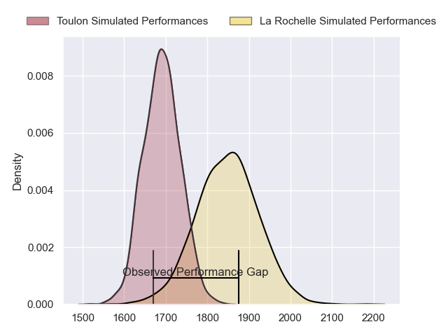
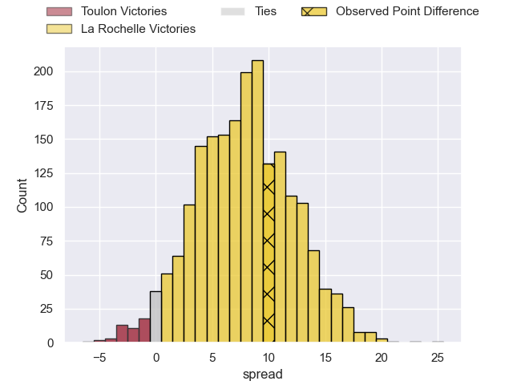
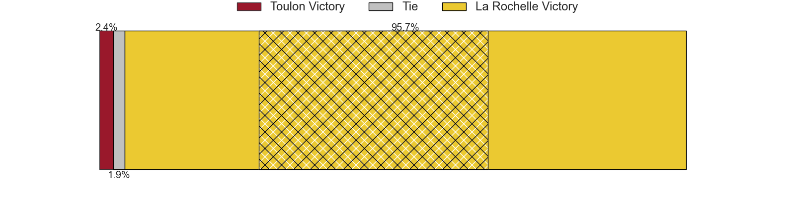
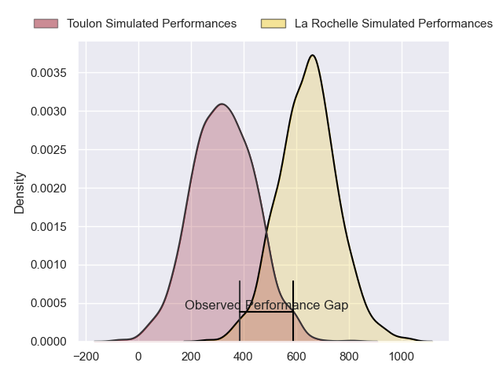
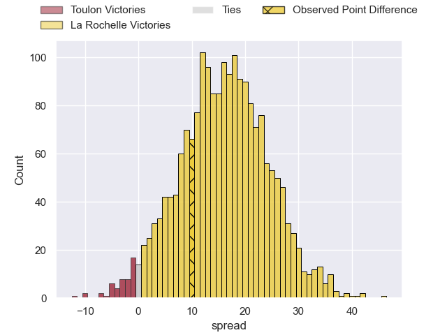
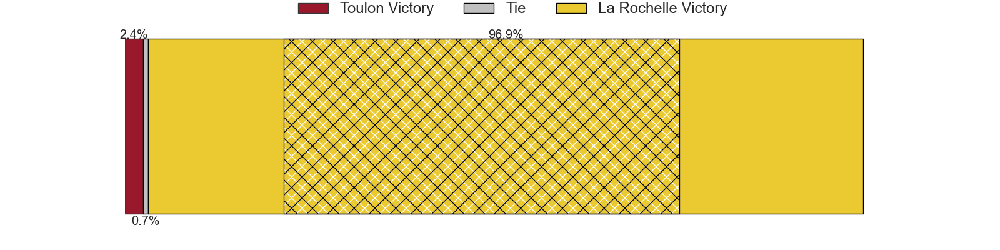

---  
layout: page  
title: Toulon at La Rochelle; 17-27  
date: 2024-04-28 18:00:00 -0500  
categories: "Top 14 Orange 2023" match review  
---
# Toulon at La Rochelle; 17-27

# Club Level Predictions

The first set of predictions treats a club as the smallest object, as the club develops its members, organizes a gameplan, and deploys its players as needed for each match. This club model has a prediction of 0.708, which translates to predicting La Rochelle to win by 7.8.

Our Over/Under is 45.5 - and combined with the spread above, we have a predicted scoreline of 19 to 27

Each club has a rating and a rating deviation (similar to a Glicko rating), and expected performances can be generated. This allows for simulated matches and spreads like the ones below.
## Projected Performances - Club Model

## Projected Spreads - Club Model

## Projected Results - Club Model

# Player Level Predictions - Version 2

Treating teams instead as an entity made up of the currently active players, I have ratings for each player in an altogether different system. These can be combined to form team ratings once teamsheets are announced, weighting starters a bit higher than the reserves. After the match is played, players can be weighted by their minutes on the field, allowing for an accurate measure of the team's composition. With these compiled team ratings, we can make predictions, measure inaccuracy, and update the individual player ratings.
## Prediction without Player Minutes: La Rochelle by 19.4

La Rochelle by 12.2 on a neutral pitch

## Projected Performances - Player Model

## Projected Spreads - Player Model

## Projected Results - Player Model

|   Away Minutes | Away Player        |   Away Percentile |   Number |   Home Percentile | Home Player        |   Home Minutes |
|---------------:|:-------------------|------------------:|---------:|------------------:|:-------------------|---------------:|
|             61 | Jean-Baptiste Gros |             96.82 |        1 |             37.42 | Louis Penverne     |             61 |
|             80 | Jack Singleton     |             91.97 |        2 |             87.75 | Tolu Latu          |             80 |
|             40 | Emerick Setiano    |             91.9  |        3 |             99.52 | Uini Atonio        |             56 |
|             51 | Matthias Halagahu  |             34.58 |        4 |             76.9  | Ultan Dillane      |             11 |
|             80 | Swan Rebbadj       |             74.97 |        5 |             98.07 | Will Skelton       |             80 |
|             45 | Matteo Le Corvec   |             66.03 |        6 |             13.47 | Paul Boudehent     |             39 |
|             80 | Yannick Youyoutte  |             61.62 |        7 |             97.14 | Levani Botia       |             80 |
|             46 | Jules Coulon       |             37.41 |        8 |             98.5  | Gregory Alldritt   |             80 |
|             56 | Ben White          |             81.18 |        9 |             83.72 | Teddy Iribaren     |             40 |
|             80 | Paolo Garbisi      |             82.86 |       10 |             50.65 | Hugo Reus          |             51 |
|             80 | Seta Tuicuvu       |             70.97 |       11 |             84.34 | Jules Favre        |             64 |
|              6 | Mathieu Smaili     |             13.84 |       12 |             90.98 | Jonathan Danty     |             80 |
|             80 | Maëlan Rabut       |             23.11 |       13 |             64.89 | Ulupano Seuteni    |             80 |
|             80 | Jiuta Wainiqolo    |             88.46 |       14 |             96.46 | Jack Nowell        |             80 |
|             80 | Marius Domon       |             51.15 |       15 |             98.47 | Dillyn Leyds       |             80 |
|             74 | Jérémy Sinzelle    |             21.56 |       16 |             33.25 | Judicael Cancoriet |             69 |
|             40 | Beka Gigashvili    |             69.91 |       17 |            nan    | Lucas Zamora       |             40 |
|             35 | Selevasio Tolofua  |             80.57 |       18 |             41.24 | Oscar Jegou        |             41 |
|             34 | Charles Ollivon    |             97.51 |       19 |             55.98 | Antoine Hastoy     |             29 |
|             29 | David Ribbans      |             88.88 |       20 |             87.46 | Joel Sclavi        |             24 |
|             24 | Baptiste Serin     |             96.19 |       21 |             50.82 | Alexandre Kaddouri |             19 |
|             19 | Bruce Devaux       |             13.11 |       22 |             87.43 | Teddy Thomas       |             16 |

