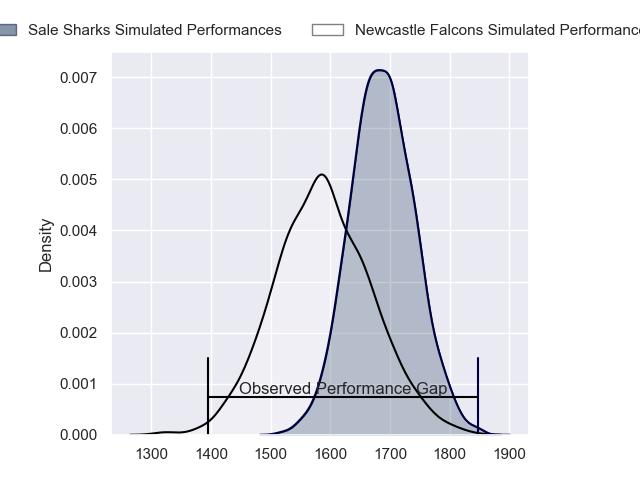
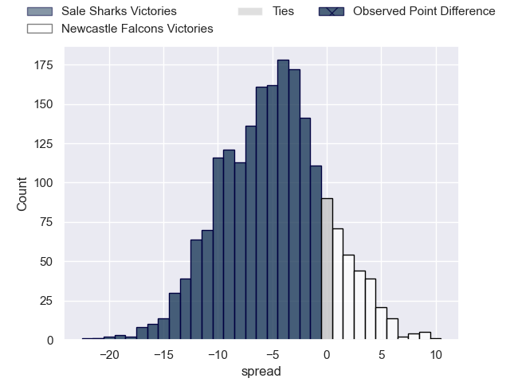
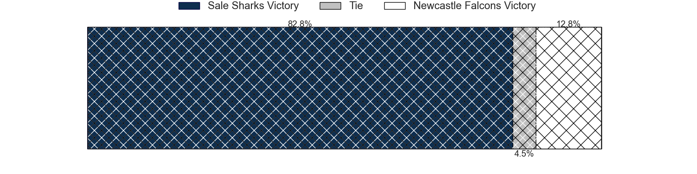
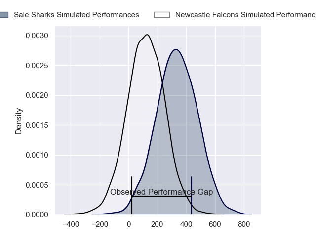
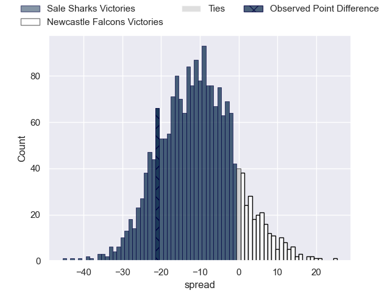
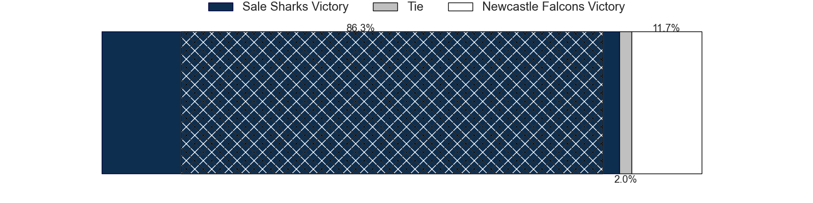

---  
layout: page  
title: Sale Sharks at Newcastle Falcons; 35-14  
date: 2024-04-28 18:00:00 -0500  
categories: "Gallagher Premiership 2023" match review  
---
# Sale Sharks at Newcastle Falcons; 35-14

# Club Level Predictions

The first set of predictions treats a club as the smallest object, as the club develops its members, organizes a gameplan, and deploys its players as needed for each match. This club model has a prediction of 0.362, which translates to predicting Sale Sharks to win by 5.0.

Our Over/Under is 48.5 - and combined with the spread above, we have a predicted scoreline of 27 to 22

Each club has a rating and a rating deviation (similar to a Glicko rating), and expected performances can be generated. This allows for simulated matches and spreads like the ones below.
## Projected Performances - Club Model

## Projected Spreads - Club Model

## Projected Results - Club Model

# Player Level Predictions - Version 2

Treating teams instead as an entity made up of the currently active players, I have ratings for each player in an altogether different system. These can be combined to form team ratings once teamsheets are announced, weighting starters a bit higher than the reserves. After the match is played, players can be weighted by their minutes on the field, allowing for an accurate measure of the team's composition. With these compiled team ratings, we can make predictions, measure inaccuracy, and update the individual player ratings.
## Prediction without Player Minutes: Sale Sharks by 11.4

Sale Sharks by 19.2 on a neutral pitch

## Projected Performances - Player Model

## Projected Spreads - Player Model

## Projected Results - Player Model

|   Away Minutes | Away Player       |   Away Percentile |   Number |   Home Percentile | Home Player         |   Home Minutes |
|---------------:|:------------------|------------------:|---------:|------------------:|:--------------------|---------------:|
|             80 | Bevan Rodd        |             92    |        1 |              1.06 | Adam Brocklebank    |             80 |
|             80 | Luke Cowan-Dickie |             87.35 |        2 |              3.01 | Jamie Blamire       |             80 |
|             80 | James Harper      |             14.66 |        3 |              1.74 | Eduardo Bello       |             80 |
|             80 | Cobus Wiese       |             87.3  |        4 |             15.84 | Philip van der Walt |             80 |
|             80 | Josh Beaumont     |             81.5  |        5 |              5.68 | Sebastian de Chaves |             80 |
|             80 | Ben Curry         |             39.21 |        6 |             30.27 | Sam Cross           |             80 |
|             80 | Sam Dugdale       |             12.75 |        7 |              9.3  | Guy Pepper          |             80 |
|             80 | Jean-Luc du Preez |             99.5  |        8 |              2.24 | Callum Chick        |             80 |
|             80 | Raffi Quirke      |             65.12 |        9 |              1.69 | Sam Stuart          |             80 |
|             80 | George Ford       |             94.55 |       10 |              3.64 | Brett Connon        |             80 |
|             80 | Arron Reed        |             72.8  |       11 |             37.03 | Ben Redshaw         |             80 |
|             80 | Manu Tuilagi      |             97.65 |       12 |             56.12 | Rory Jennings       |             80 |
|             80 | Robert du Preez   |             50.06 |       13 |             99.26 | Matias Moroni       |             80 |
|             80 | Tom Roebuck       |             63.43 |       14 |             38.97 | Adam Radwan         |             80 |
|             80 | Joe Carpenter     |              8.14 |       15 |             13.23 | Elliott Obatoyinbo  |             80 |

