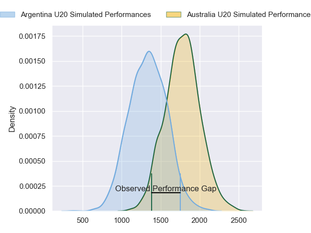
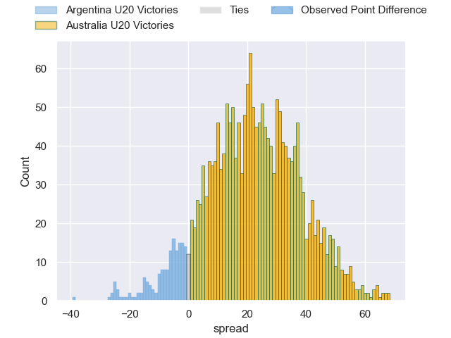
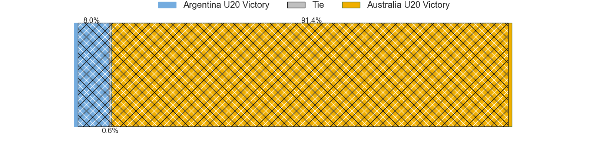
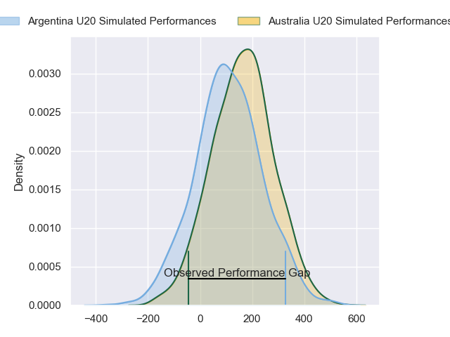
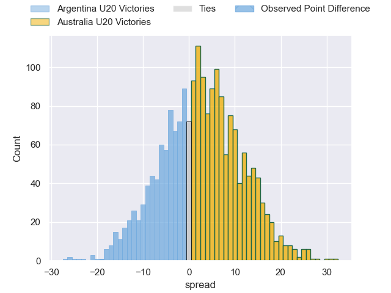
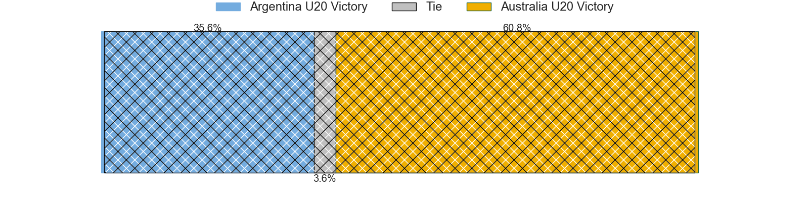

---  
layout: page  
title: Argentina U20 at Australia U20; 25-6  
date: 2024-05-02 18:00:00 -0500  
categories: "Rugby Championship U20 2024" match review  
---
# Argentina U20 at Australia U20; 25-6

# Club Level Predictions

The first set of predictions treats a club as the smallest object, as the club develops its members, organizes a gameplan, and deploys its players as needed for each match. This club model has a prediction of 0.886, which translates to predicting Australia U20 to win by 22.2.

Our Over/Under is 72.5 - and combined with the spread above, we have a predicted scoreline of 25 to 47

Each club has a rating and a rating deviation (similar to a Glicko rating), and expected performances can be generated. This allows for simulated matches and spreads like the ones below.
## Projected Performances - Club Model

## Projected Spreads - Club Model

## Projected Results - Club Model

# Player Level Predictions

Treating teams instead as an entity made up of the currently active players, I have ratings for each player in an altogether different system. These can be combined to form team ratings once teamsheets are announced, weighting starters a bit higher than the reserves. After the match is played, players can be weighted by their minutes on the field, allowing for an accurate measure of the team's composition. With these compiled team ratings, we can make predictions, measure inaccuracy, and update the individual player ratings.
## Prediction without Player Minutes: Australia U20 by 3.2

Australia U20 by 1.0 on a neutral pitch

## Projected Performances - Player Model

## Projected Spreads - Player Model

## Projected Results - Player Model

|   Away Minutes | Away Player                  |   Away Percentile |   Number |   Home Percentile | Home Player       |   Home Minutes |
|---------------:|:-----------------------------|------------------:|---------:|------------------:|:------------------|---------------:|
|             53 | Diego Correa                 |             62.43 |        1 |             83.76 | Angus Bell        |             57 |
|             53 | Juan Manuel Vivas            |             50.83 |        2 |             26.5  | Bryn Edwards      |             57 |
|             59 | Tomás Rapetti                |             63.99 |        3 |             25.51 | Tevita Alatini    |             57 |
|             80 | Efraín Elías                 |             34.38 |        4 |             28.41 | Toby Macpherson   |             80 |
|             53 | Álvaro García Iandolino      |             60.67 |        5 |             28.01 | Harvey Cordukes   |             67 |
|             59 | Juan Penoucos                |             57.17 |        6 |             24.47 | Aden Ekanayake    |             57 |
|             80 | Santos Fernández De Oliveira |             61.28 |        7 |             20.46 | Joe Liddy         |             80 |
|             80 | Juan Pedro Bernasconi        |             46.09 |        8 |             25.22 | Jack Harley       |             80 |
|             74 | Tomás Di Biase               |             50.09 |        9 |             25.04 | Doug Philipson    |             72 |
|             65 | Santino Di Lucca             |             57.33 |       10 |             24.35 | Joey Fowler       |             65 |
|             80 | Franco Rossetto              |             65.6  |       11 |             24.76 | Xavier Rubens     |             80 |
|             80 | Faustino Sánchez Valarolo    |             59.75 |       12 |             25.5  | Ronan Leahy       |             80 |
|             80 | Tomás Bocco                  |             44.78 |       13 |             23.18 | Jarrah Mcleod     |             80 |
|             65 | Valentín Soler Filloy        |             61.43 |       14 |             24.76 | Will Mcculloch    |             80 |
|             80 | Benjamín Elizalde            |             48.07 |       15 |             25.32 | Shane Wilcox      |             62 |
|             27 | Marcos Camerlinckx           |            nan    |       16 |            nan    | Nate Tiitii       |             23 |
|             27 | Gonzalo Gargallo Bazán       |            nan    |       17 |             38.67 | Ottavio Tuipulotu |             23 |
|             21 | Gael Galván                  |             31.09 |       18 |             38.97 | Nick Bloomfield   |             23 |
|             27 | Luciano Asevedo              |             42.37 |       19 |            nan    | Ben Daniels       |             13 |
|             21 | Julián Rossi                 |             29.19 |       20 |             37.81 | Ben Di Staso      |             23 |
|              6 | Genaro Podestá               |            nan    |       21 |             46.54 | Hwi Sharples      |              8 |
|             15 | Mateo Fossati                |             33.41 |       22 |             37.93 | Cullen Gray       |             15 |
|             15 | Timoteo Silva                |             32.17 |       23 |             42.64 | Angus Staniforth  |             18 |

