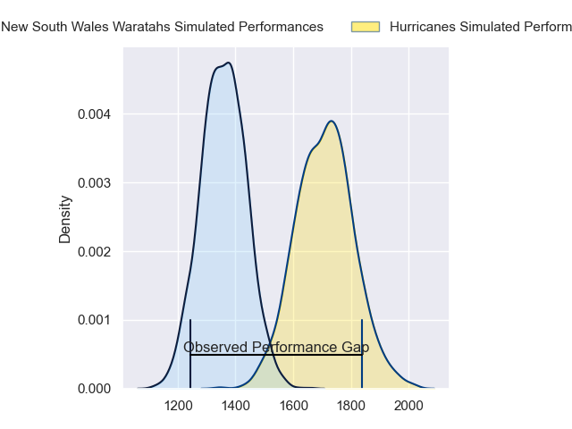
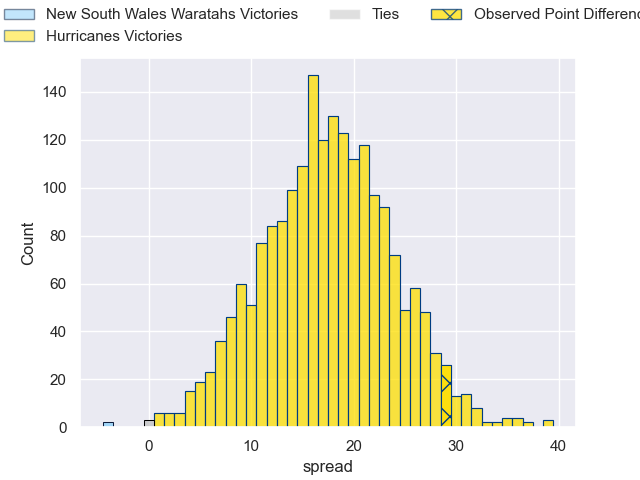
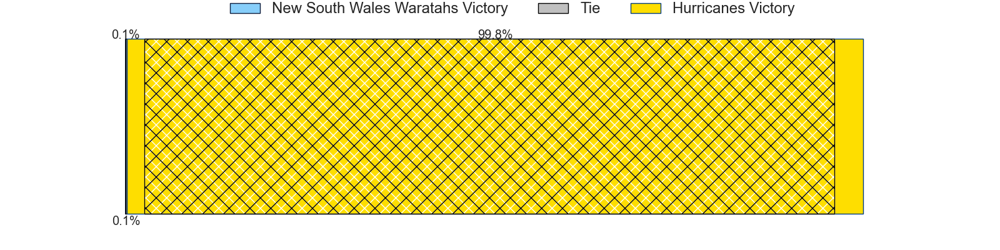
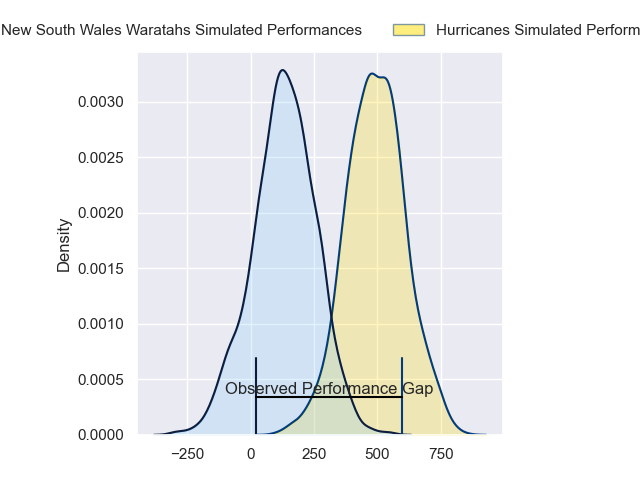
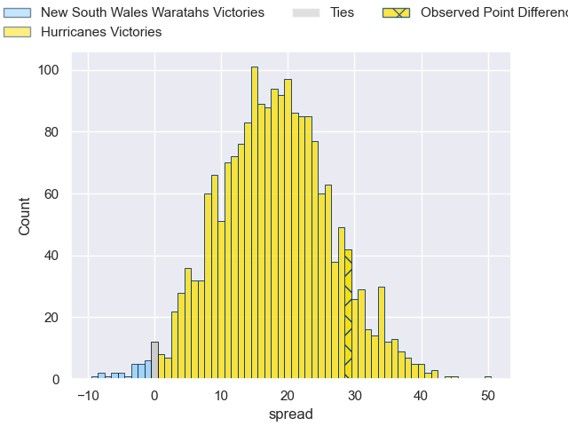
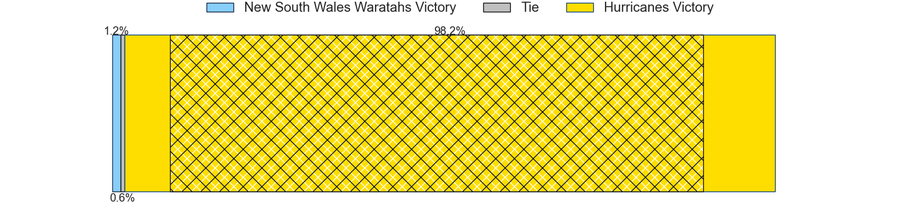

---  
layout: page  
title: New South Wales Waratahs at Hurricanes; 12-41  
date: 2024-05-03 18:00:00 -0500  
categories: "Super Rugby Pacific 2024" match review  
---
# New South Wales Waratahs at Hurricanes; 12-41

# Club Level Predictions

The first set of predictions treats a club as the smallest object, as the club develops its members, organizes a gameplan, and deploys its players as needed for each match. This club model has a prediction of 0.877, which translates to predicting Hurricanes to win by 17.6.

Our Over/Under is 72.5 - and combined with the spread above, we have a predicted scoreline of 27 to 45

Each club has a rating and a rating deviation (similar to a Glicko rating), and expected performances can be generated. This allows for simulated matches and spreads like the ones below.
## Projected Performances - Club Model

## Projected Spreads - Club Model

## Projected Results - Club Model

# Player Level Predictions

Treating teams instead as an entity made up of the currently active players, I have ratings for each player in an altogether different system. These can be combined to form team ratings once teamsheets are announced, weighting starters a bit higher than the reserves. After the match is played, players can be weighted by their minutes on the field, allowing for an accurate measure of the team's composition. With these compiled team ratings, we can make predictions, measure inaccuracy, and update the individual player ratings.
## Prediction without Player Minutes: Hurricanes by 20.6

Hurricanes by 16.1 on a neutral pitch

## Projected Performances - Player Model

## Projected Spreads - Player Model

## Projected Results - Player Model

|   Away Minutes | Away Player              |   Away Percentile |   Number |   Home Percentile | Home Player          |   Home Minutes |
|---------------:|:-------------------------|------------------:|---------:|------------------:|:---------------------|---------------:|
|             50 | Hayden Thompson-Stringer |             92.53 |        1 |             91.06 | Pouri Rakete-Stones  |             56 |
|             50 | Julian Heaven            |             25.75 |        2 |             80.9  | Kianu Kereru-Symes   |             56 |
|             64 | Harry Johnson-Holmes     |             56.6  |        3 |             94.83 | Tyrel Lomax          |             41 |
|             80 | Hugh Sinclair            |             12.13 |        4 |             77.96 | Justin Sangster      |             80 |
|             80 | Fergus Lee-Warner        |             19.41 |        5 |             97.17 | Isaia Walker-Leawere |             50 |
|             64 | Lachlan Swinton          |             13.24 |        6 |             88.87 | Devan Flanders       |             80 |
|             80 | Hunter Ward              |             28.39 |        7 |             95.29 | Peter Lakai          |             80 |
|             80 | Langi Gleeson            |             63.7  |        8 |              1.3  | Brayden Iose         |             56 |
|             50 | Jake Gordon              |             85.77 |        9 |             95.55 | Richard Judd         |             62 |
|             64 | Will Harrison            |              2.59 |       10 |             21.17 | Brett Cameron        |             80 |
|             80 | Dylan Pietsch            |             79.86 |       11 |             38.72 | Bailyn Sullivan      |             56 |
|             72 | Lalakai Foketi           |             73    |       12 |             87.45 | Riley Higgins        |             80 |
|             80 | Joey Walton              |             81.33 |       13 |             95.57 | Billy Proctor        |             67 |
|             80 | Triston Reilly           |             54.6  |       14 |             90.42 | Joshua Moorby        |             80 |
|             80 | Mark Nawaqanitawase      |             22.44 |       15 |             95.94 | Ruben Love           |             80 |
|             30 | Jay Fonokalafi           |            nan    |       16 |            nan    | Raymond Tuputupu     |             24 |
|             30 | Lewis Ponini             |            nan    |       17 |             96.88 | Xavier Numia         |             24 |
|             16 | Bradley Amituanai        |            nan    |       18 |             51.11 | Pasilio Tosi         |             39 |
|              8 | Miles Amatosero          |              3.74 |       19 |             52.58 | Ben Grant            |             30 |
|             16 | Charlie Gamble           |             68.91 |       20 |             93.38 | Du'Plessis Kirifi    |             24 |
|             30 | Jack Grant               |            nan    |       21 |             97.69 | TJ Perenara          |             18 |
|             16 | Tane Edmed               |             28.94 |       22 |             96.62 | Jordie Barrett       |             13 |
|             24 | Vuate Karawalevu         |            nan    |       23 |             87.51 | Salesi Rayasi        |             24 |

