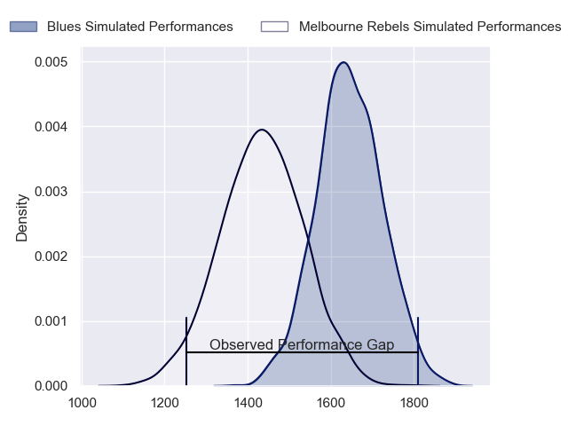
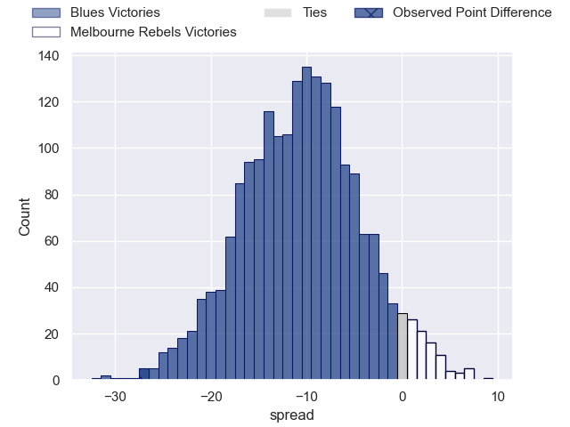
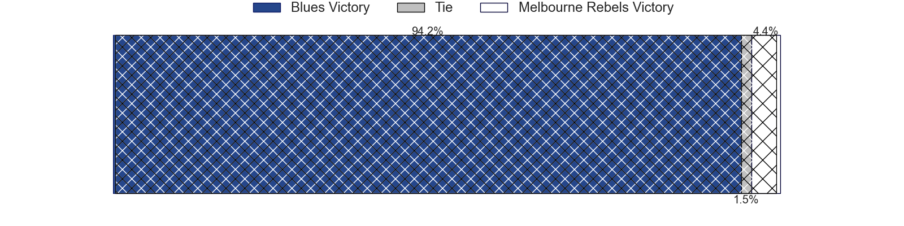
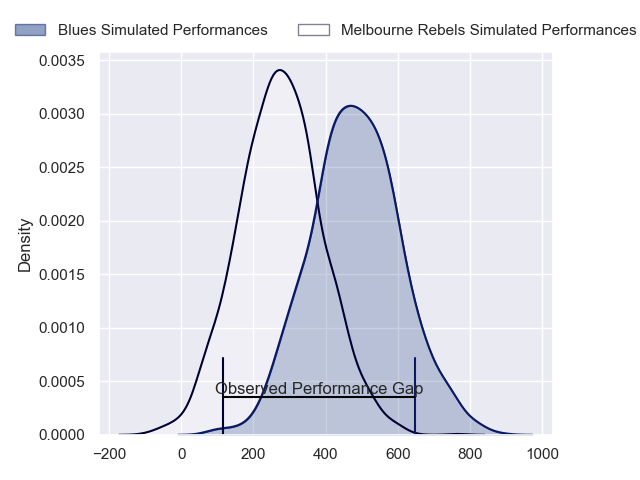
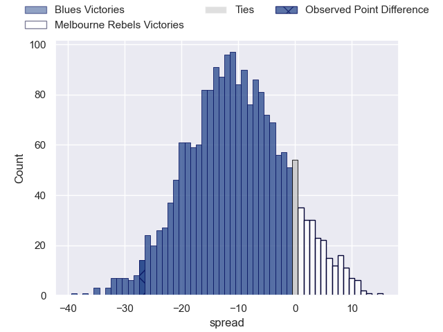
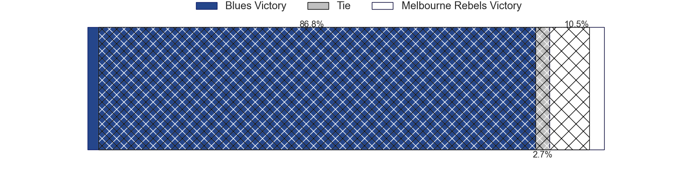

---  
layout: page  
title: Blues at Melbourne Rebels; 38-11  
date: 2024-05-03 18:00:00 -0500  
categories: "Super Rugby Pacific 2024" match review  
---
# Blues at Melbourne Rebels; 38-11

# Club Level Predictions

The first set of predictions treats a club as the smallest object, as the club develops its members, organizes a gameplan, and deploys its players as needed for each match. This club model has a prediction of 0.236, which translates to predicting Blues to win by 10.5.

Our Over/Under is 66.5 - and combined with the spread above, we have a predicted scoreline of 39 to 28

Each club has a rating and a rating deviation (similar to a Glicko rating), and expected performances can be generated. This allows for simulated matches and spreads like the ones below.
## Projected Performances - Club Model

## Projected Spreads - Club Model

## Projected Results - Club Model

# Player Level Predictions

Treating teams instead as an entity made up of the currently active players, I have ratings for each player in an altogether different system. These can be combined to form team ratings once teamsheets are announced, weighting starters a bit higher than the reserves. After the match is played, players can be weighted by their minutes on the field, allowing for an accurate measure of the team's composition. With these compiled team ratings, we can make predictions, measure inaccuracy, and update the individual player ratings.
## Prediction without Player Minutes: Blues by 9.3

Blues by 12.9 on a neutral pitch

## Projected Performances - Player Model

## Projected Spreads - Player Model

## Projected Results - Player Model

|   Away Minutes | Away Player        |   Away Percentile |   Number |   Home Percentile | Home Player         |   Home Minutes |
|---------------:|:-------------------|------------------:|---------:|------------------:|:--------------------|---------------:|
|             63 | Ofa Tu'ungafasi    |             99.1  |        1 |             44.95 | Isaac Aedo Kailea   |             54 |
|             63 | Ricky Riccitelli   |             88.17 |        2 |             46.5  | Jordan Uelese       |             67 |
|             48 | PJ Sheck           |             53.73 |        3 |             96.06 | Taniela Tupou       |             54 |
|             80 | Patrick Tuipulotu  |             95.65 |        4 |             51.06 | Angelo Smith        |             48 |
|             41 | Laghlan McWhannell |             96.16 |        5 |             61.88 | Josh Canham         |             80 |
|             61 | Anton Segner       |             69.71 |        6 |             16.05 | Josh Kemeny         |             80 |
|             80 | Dalton Papalii     |             99.1  |        7 |             23.07 | Vaiolini Ekuasi     |             64 |
|             80 | Hoskins Sotutu     |             96.3  |        8 |              4.57 | Rob Leota           |             74 |
|             72 | Taufa Funaki       |             29.84 |        9 |             96.27 | Ryan Louwrens       |             79 |
|             80 | Harry Plummer      |             92.67 |       10 |             64.87 | Carter Gordon       |             80 |
|             80 | Caleb Clarke       |             66.09 |       11 |             64.44 | Darby Lancaster     |             80 |
|             63 | AJ Lam             |             78.61 |       12 |             56.59 | David Feliuai       |             30 |
|             41 | Rieko Ioane        |             88.51 |       13 |             73.34 | Matt Proctor        |             31 |
|             80 | Mark Tele'a        |             80.62 |       14 |             49.9  | Lachie Anderson     |             80 |
|             80 | Cole Forbes        |             74.25 |       15 |             71.24 | Andrew Kellaway     |             80 |
|             17 | Kurt Eklund        |             90.67 |       16 |            nan    | Ethan Dobbins       |             13 |
|             17 | Marcel Renata      |             79.49 |       17 |             89.34 | Matt Gibbon         |             26 |
|             32 | Angus Ta'avao      |             96.47 |       18 |             56.28 | Sam Talakai         |             26 |
|             39 | Sam Darry          |             39.03 |       19 |             71.96 | Tuaina Taii Tualima |             32 |
|             19 | Cameron Suafoa     |             66.94 |       20 |             63.69 | Maciu Nabolakasi    |             22 |
|              8 | Sam Nock           |             74.78 |       21 |             39.96 | Jack Maunder        |              1 |
|             17 | Corey Evans        |             77.77 |       22 |             27.68 | Jake Strachan       |             49 |
|             39 | Bryce Heem         |             98.63 |       23 |             63.65 | Nick Jooste         |             50 |

