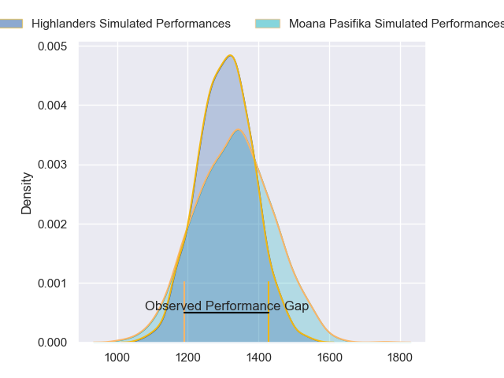
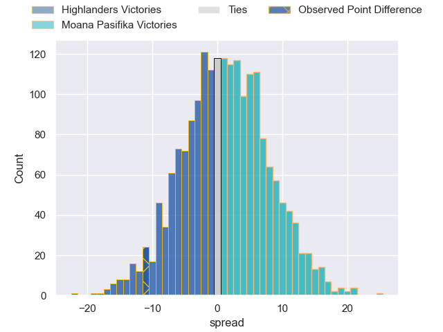
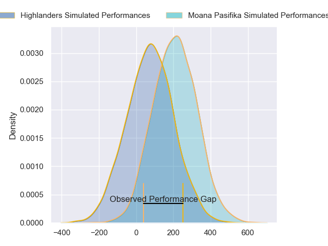
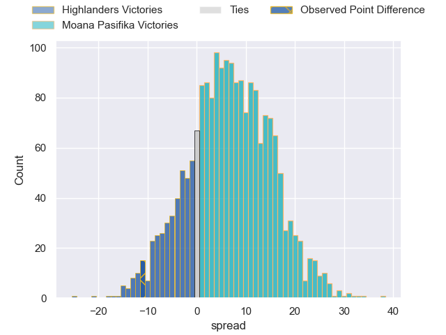
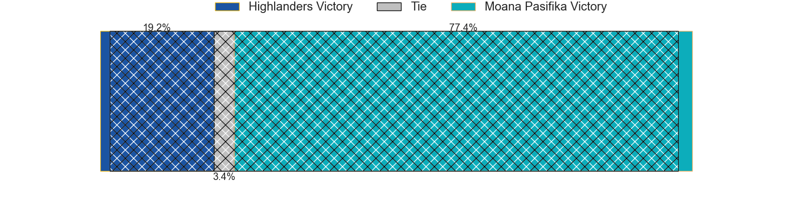

---  
layout: page  
title: Highlanders at Moana Pasifika; 28-17  
date: 2024-05-03 18:00:00 -0500  
categories: "Super Rugby Pacific 2024" match review  
---
# Highlanders at Moana Pasifika; 28-17

# Club Level Predictions

The first set of predictions treats a club as the smallest object, as the club develops its members, organizes a gameplan, and deploys its players as needed for each match. This club model has a prediction of 0.538, which translates to predicting Moana Pasifika to win by 1.4.

Our Over/Under is 47.5 - and combined with the spread above, we have a predicted scoreline of 23 to 25

Each club has a rating and a rating deviation (similar to a Glicko rating), and expected performances can be generated. This allows for simulated matches and spreads like the ones below.
## Projected Performances - Club Model

## Projected Spreads - Club Model

## Projected Results - Club Model

# Player Level Predictions - Version 2

Treating teams instead as an entity made up of the currently active players, I have ratings for each player in an altogether different system. These can be combined to form team ratings once teamsheets are announced, weighting starters a bit higher than the reserves. After the match is played, players can be weighted by their minutes on the field, allowing for an accurate measure of the team's composition. With these compiled team ratings, we can make predictions, measure inaccuracy, and update the individual player ratings.
## Prediction without Player Minutes: Moana Pasifika by 7.5

Moana Pasifika by 5.2 on a neutral pitch

## Projected Performances - Player Model

## Projected Spreads - Player Model

## Projected Results - Player Model

|   Away Minutes | Away Player                   |   Away Percentile |   Number |   Home Percentile | Home Player           |   Home Minutes |
|---------------:|:------------------------------|------------------:|---------:|------------------:|:----------------------|---------------:|
|             56 | Dan Lienert-Brown             |             18.71 |        1 |             14.69 | Abraham Pole          |             56 |
|             69 | Henry Bell                    |             25.77 |        2 |              4.09 | Samiuela Moli         |             52 |
|             46 | Saula Ma'u                    |             30.56 |        3 |             44.37 | Sione Mafileo         |             56 |
|             80 | Mitchell Dunshea              |             83.98 |        4 |             88.96 | Tom Savage            |             80 |
|             59 | Fabian Holland                |             70.87 |        5 |             16.5  | Allan Craig           |             52 |
|             63 | Oliver Haig                   |             54.96 |        6 |             80.05 | Jacob Norris          |             80 |
|             80 | Sean Withy                    |             13.14 |        7 |             84.71 | Sione Havili Talitui  |             80 |
|             67 | Billy Harmon                  |             56.27 |        8 |             10.23 | Lotu Inisi            |             52 |
|             70 | Folau Fakatava                |             55.11 |        9 |             44.04 | Jonathan Taumateine   |              2 |
|             80 | Cameron Millar                |             59.01 |       10 |             74.15 | Christian Leali'ifano |             80 |
|             52 | Connor Garden-Bachop          |             49.36 |       11 |              4.8  | Fine Inisi            |             80 |
|             69 | Jake Te Hiwi                  |             18.06 |       12 |             96.51 | Julian Savea          |             59 |
|             80 | Tanielu Tele'a                |             43.71 |       13 |             18.8  | Henry Taefu           |             80 |
|             80 | Timoci Tavatavanawai          |             22.11 |       14 |              4.33 | Viliami Fine          |             41 |
|             80 | Jacob Ratumaitavuki-Kneepkens |             94.97 |       15 |             18.84 | William Havili        |             80 |
|             11 | Jack Taylor                   |             48.88 |       16 |             57.06 | Sama Malolo           |             28 |
|             24 | Ayden Johnstone               |             93.54 |       17 |            nan    | Sateki Latu           |             24 |
|             34 | Jermaine Ainsley              |             35.95 |       18 |             82.96 | Sekope Kepu           |             24 |
|             21 | Will Tucker                   |             14.2  |       19 |             34.95 | Ola Tauelangi         |             28 |
|             30 | Nikora Broughton              |             23.02 |       20 |             81.59 | Solomone Funaki       |             28 |
|             10 | James Arscott                 |              6.38 |       21 |              3.4  | Ere Enari             |             78 |
|             11 | Sam Gilbert                   |             13.57 |       22 |              8.04 | Danny Toala           |             21 |
|             28 | Martin Bogado                 |             49.24 |       23 |             90.41 | Neria Fomai           |             39 |

