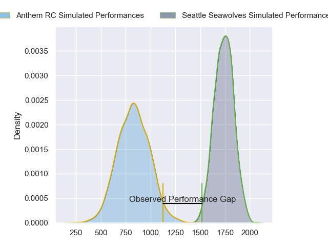
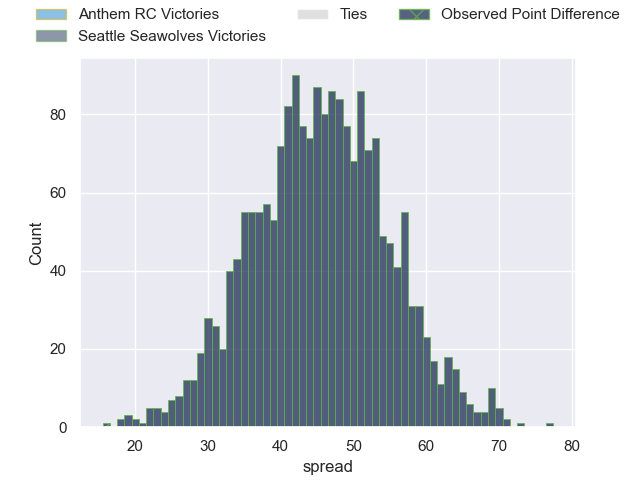
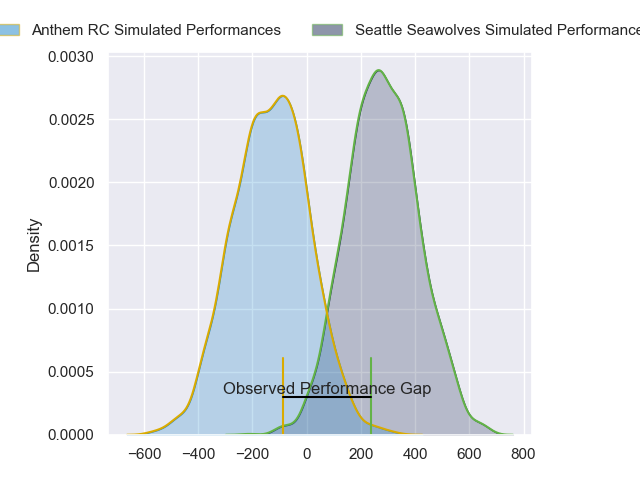
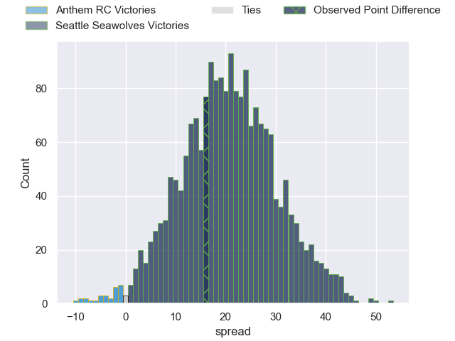
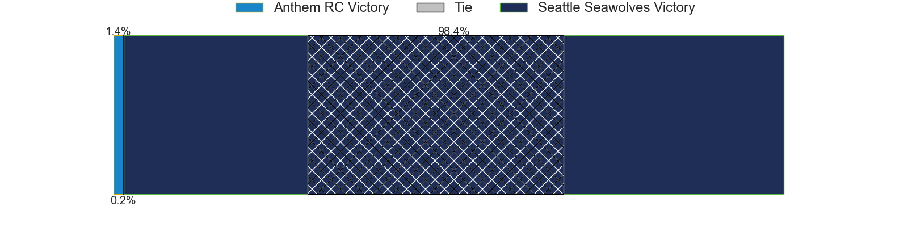

---  
layout: page  
title: Anthem RC at Seattle Seawolves; 13-29  
date: 2024-05-03 18:00:00 -0500  
categories: "Major League Rugby 2024" match review  
---
# Anthem RC at Seattle Seawolves; 13-29

# Club Level Predictions

The first set of predictions treats a club as the smallest object, as the club develops its members, organizes a gameplan, and deploys its players as needed for each match. This club model has a prediction of 0.991, which translates to predicting Seattle Seawolves to win by 45.4.

Our Over/Under is 78.5 - and combined with the spread above, we have a predicted scoreline of 17 to 62

Each club has a rating and a rating deviation (similar to a Glicko rating), and expected performances can be generated. This allows for simulated matches and spreads like the ones below.
## Projected Performances - Club Model

## Projected Spreads - Club Model

## Projected Results - Club Model

# Player Level Predictions

Treating teams instead as an entity made up of the currently active players, I have ratings for each player in an altogether different system. These can be combined to form team ratings once teamsheets are announced, weighting starters a bit higher than the reserves. After the match is played, players can be weighted by their minutes on the field, allowing for an accurate measure of the team's composition. With these compiled team ratings, we can make predictions, measure inaccuracy, and update the individual player ratings.
## Prediction without Player Minutes: Seattle Seawolves by 21.9

Seattle Seawolves by 19.2 on a neutral pitch

## Projected Performances - Player Model

## Projected Spreads - Player Model

## Projected Results - Player Model

|   Away Minutes | Away Player           |   Away Percentile |   Number |   Home Percentile | Home Player       |   Home Minutes |
|---------------:|:----------------------|------------------:|---------:|------------------:|:------------------|---------------:|
|             80 | Jake Turnbull         |              2.46 |        1 |             63.49 | Dewald Donald     |             80 |
|             80 | Connor Robinson       |             18.77 |        2 |             54.65 | Daquan Perry      |             80 |
|             80 | Joe Apikotoa          |             26.17 |        3 |             54.47 | Oli Kilifi        |             80 |
|             80 | James Rivers          |              6.07 |        4 |             51.67 | Taylor Krumrei    |             80 |
|             80 | Reagan Leslie         |              5.26 |        5 |             41.66 | Mahonri Ngakuru   |             80 |
|             80 | Shneil Singh          |              6.02 |        6 |             84.75 | Charles Elton     |             80 |
|             80 | Joe Basser            |              5.22 |        7 |             53.86 | Kara Pryor        |             80 |
|             80 | Dylan Fortune         |             13.04 |        8 |             75.87 | Riekert Hattingh  |             80 |
|             80 | Conor Mcmanus         |              8.72 |        9 |             54.63 | Ryan Rees         |             80 |
|             80 | Cliven Loubser        |             44.92 |       10 |             66.52 | Sam Windsor       |             80 |
|             80 | Te Rangatira Waitokia |              4.94 |       11 |             79.19 | Jade Stighling    |             80 |
|             80 | Junior Gafa           |              8.76 |       12 |             90.93 | Tavite Lopeti     |             80 |
|             80 | Dom Iacovino          |             38.08 |       13 |             57.38 | Tevita Kuridrani  |             80 |
|             80 | Cael Hodgson          |              4.74 |       14 |             56.24 | Conner Mooneyham  |             80 |
|             80 | Tomasi Alosio         |             36.11 |       15 |             52.99 | Duncan Matthews   |             80 |
|              0 | Jack Manzo            |             21.26 |       16 |             88.54 | Joe Taufete'E     |              0 |
|              0 | Dan Hanson            |            nan    |       17 |             79.74 | Cameron Orr       |              0 |
|              0 | Stephan Bernal-Wendt  |             16.57 |       18 |             61.53 | Chance Wenglewski |              0 |
|              0 | Lucas Gramlick        |             24.97 |       19 |            nan    | Isaia Lotawa      |              0 |
|              0 | Graeme Pedegana       |            nan    |       20 |             61.08 | Huw Taylor        |              0 |
|              0 | Siaosi Nai            |              9.25 |       21 |             83.99 | Jp Smith          |              0 |
|              0 | Shane Barry           |              3.21 |       22 |             76.89 | Mack Mason        |              0 |
|              0 | Tyren Al-Jiboori      |              2.9  |       23 |             68.25 | Lauina Futi       |              0 |

