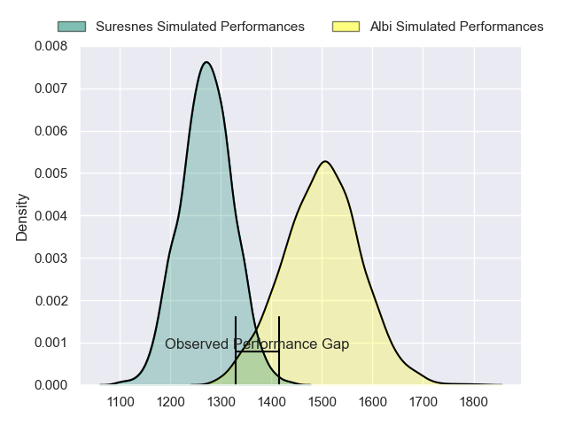
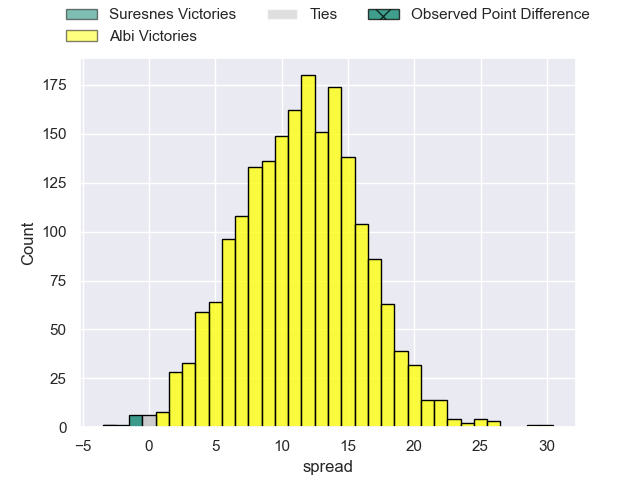
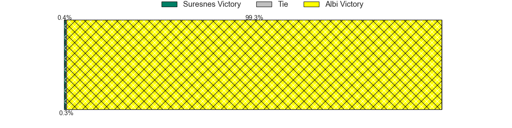
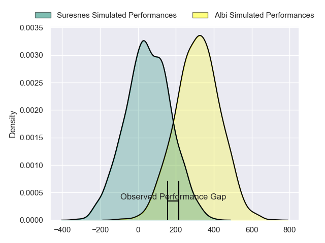
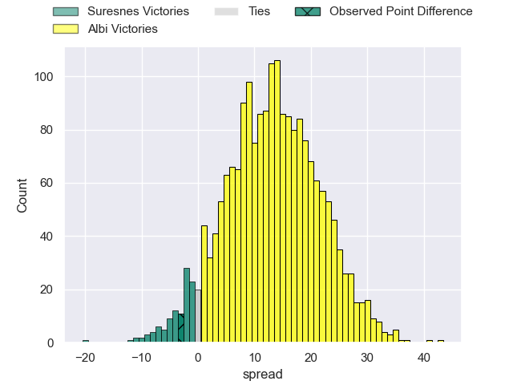
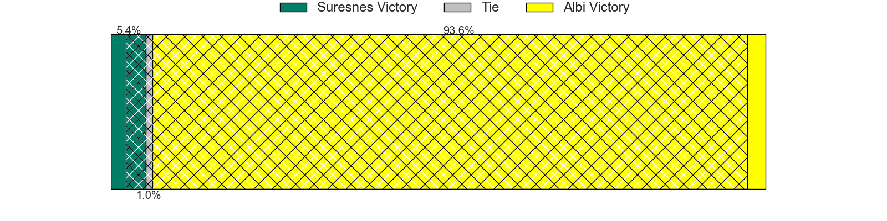

---  
layout: page  
title: Suresnes at Albi; 21-18  
date: 2024-05-04 18:00:00 -0500  
categories: "Nationale 2023" match review  
---
# Suresnes at Albi; 21-18

# Club Level Predictions

The first set of predictions treats a club as the smallest object, as the club develops its members, organizes a gameplan, and deploys its players as needed for each match. This club model has a prediction of 0.781, which translates to predicting Albi to win by 11.2.

Our Over/Under is 45.5 - and combined with the spread above, we have a predicted scoreline of 17 to 28

Each club has a rating and a rating deviation (similar to a Glicko rating), and expected performances can be generated. This allows for simulated matches and spreads like the ones below.
## Projected Performances - Club Model

## Projected Spreads - Club Model

## Projected Results - Club Model

# Player Level Predictions

Treating teams instead as an entity made up of the currently active players, I have ratings for each player in an altogether different system. These can be combined to form team ratings once teamsheets are announced, weighting starters a bit higher than the reserves. After the match is played, players can be weighted by their minutes on the field, allowing for an accurate measure of the team's composition. With these compiled team ratings, we can make predictions, measure inaccuracy, and update the individual player ratings.
## Prediction without Player Minutes: Albi by 13.8

Albi by 6.8 on a neutral pitch

## Projected Performances - Player Model

## Projected Spreads - Player Model

## Projected Results - Player Model

|   Away Minutes | Away Player             |   Away Percentile |   Number |   Home Percentile | Home Player             |   Home Minutes |
|---------------:|:------------------------|------------------:|---------:|------------------:|:------------------------|---------------:|
|             54 | Elias Coulibaly         |             92.45 |        1 |             63.66 | Antoine Soave           |             59 |
|             54 | Jean-Étienne Lesueur    |             16.94 |        2 |             20.43 | Arthur Castant          |             54 |
|             54 | Leandro Mario Assi      |             52.58 |        3 |             67.51 | Jean Baptiste De Clercq |             63 |
|             80 | Christopher van Leeuwen |              9.4  |        4 |             38.32 | Mohsen Essid            |             61 |
|             64 | Yakine Djebarri         |             48.13 |        5 |              4.45 | Jacques Engelbrecht     |             80 |
|             64 | Damien Bozic            |             74.12 |        6 |             18.15 | Pierre Roussel          |             80 |
|             80 | Wian Vosloo             |             59.48 |        7 |             22.97 | Lucas Guillaume         |             52 |
|             80 | Jean-Baptiste Lachaise  |             66.96 |        8 |             49.57 | Camille Jarreau         |             80 |
|             72 | Théo Bachiri            |             11.03 |        9 |             75.98 | Gilen Queheille         |             46 |
|             80 | Jean Chezeau            |             69.11 |       10 |             77.11 | Benjamin Pehau          |             61 |
|             80 | Faraj Fartass           |             85.48 |       11 |             11.52 | Sean Robinson           |             72 |
|             54 | Petero Tuwai            |             72.68 |       12 |             53.59 | Gabriel Aviragnet       |             80 |
|             80 | Victor Barnier          |             82.28 |       13 |             78.9  | Baptiste Couchinave     |             80 |
|             62 | Alexis Clement          |             21.1  |       14 |             83.83 | Simon Hartmann          |             80 |
|             80 | Thomas Baudy            |              9.62 |       15 |             69.23 | Paul Clergue            |             80 |
|             26 | Lucas Dycke             |              1.72 |       16 |             46.02 | Lucas Pindor            |             21 |
|             26 | Anthony Bajart          |             30.23 |       17 |             88.37 | Romain Maurice          |             26 |
|             26 | Guiterembi Vickos       |             35.36 |       18 |             27.32 | Simon Renaud            |             17 |
|             16 | Marvin Woki             |             75.23 |       19 |             17.49 | Dion Evrard Oulai       |             19 |
|             16 | Florian Desbordes       |             23.97 |       20 |             63.69 | Simon Meka              |             28 |
|              8 | Thomas Lacroix          |             48.04 |       21 |             90.04 | Théo Vidal              |             19 |
|             26 | JJ Taulagi              |             13.82 |       22 |             26.16 | Titouan Pouzoullic      |             34 |
|             18 | Tanguy Lacoste          |             76.67 |       23 |             62.05 | Tim Giresse             |              8 |

