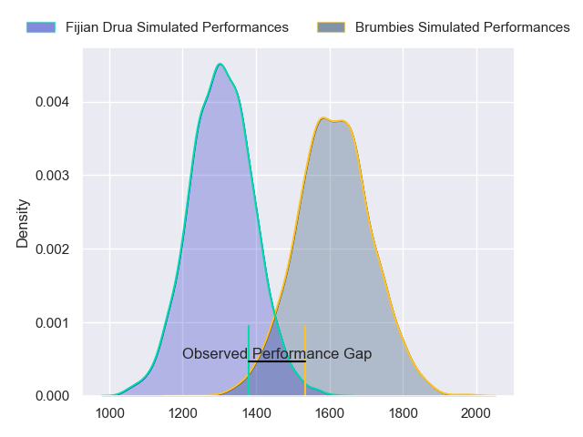
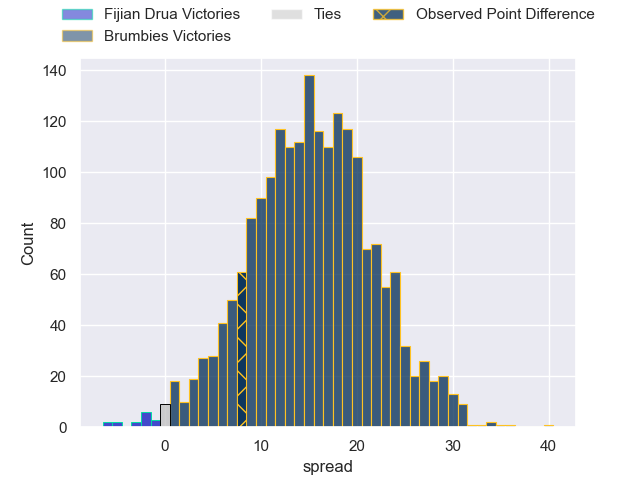
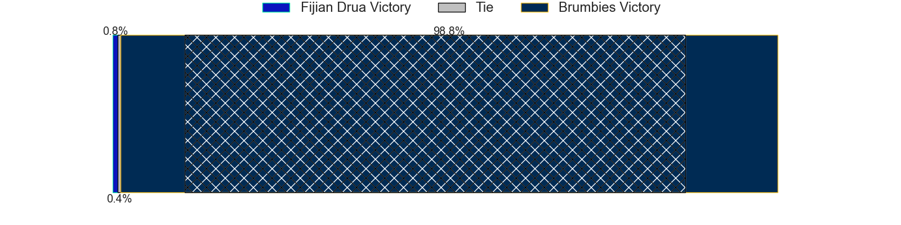
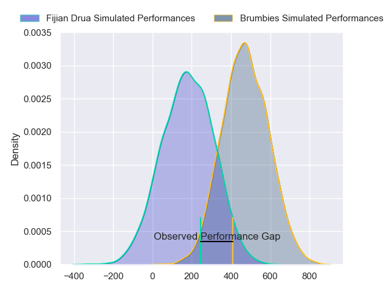
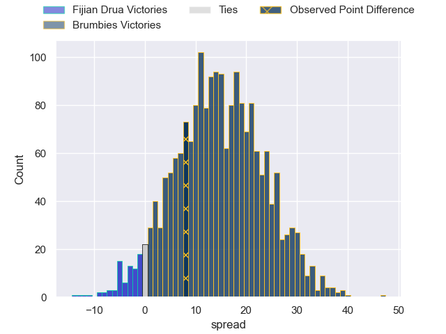

---  
layout: page  
title: Fijian Drua at Brumbies; 20-28  
date: 2024-05-04 18:00:00 -0500  
categories: "Super Rugby Pacific 2024" match review  
---
# Fijian Drua at Brumbies; 20-28

# Club Level Predictions

The first set of predictions treats a club as the smallest object, as the club develops its members, organizes a gameplan, and deploys its players as needed for each match. This club model has a prediction of 0.844, which translates to predicting Brumbies to win by 15.2.

Our Over/Under is 43.5 - and combined with the spread above, we have a predicted scoreline of 14 to 29

Each club has a rating and a rating deviation (similar to a Glicko rating), and expected performances can be generated. This allows for simulated matches and spreads like the ones below.
## Projected Performances - Club Model

## Projected Spreads - Club Model

## Projected Results - Club Model

# Player Level Predictions - Version 2

Treating teams instead as an entity made up of the currently active players, I have ratings for each player in an altogether different system. These can be combined to form team ratings once teamsheets are announced, weighting starters a bit higher than the reserves. After the match is played, players can be weighted by their minutes on the field, allowing for an accurate measure of the team's composition. With these compiled team ratings, we can make predictions, measure inaccuracy, and update the individual player ratings.
## Prediction without Player Minutes: Brumbies by 16.2

Brumbies by 11.5 on a neutral pitch

## Projected Performances - Player Model

## Projected Spreads - Player Model

## Projected Results - Player Model

|   Away Minutes | Away Player             |   Away Percentile |   Number |   Home Percentile | Home Player      |   Home Minutes |
|---------------:|:------------------------|------------------:|---------:|------------------:|:-----------------|---------------:|
|             72 | Haereiti Hetet          |             93.24 |        1 |             93.63 | James Slipper    |             36 |
|             60 | Tevita Ikanivere        |             89.57 |        2 |             84.66 | Connal McInerney |             61 |
|             72 | Mesake Doge             |             39.37 |        3 |             95.69 | Allan Alaalatoa  |             61 |
|             61 | Mesake Vocevoce         |             68.81 |        4 |             50.49 | Nick Frost       |             80 |
|             80 | Isoa Nasilasila         |             75.36 |        5 |             73.42 | Tom Hooper       |             61 |
|             71 | Vilive Miramira         |             64.04 |        6 |             83.03 | Jahrome Brown    |             80 |
|             80 | Kitione Salawa          |             11.95 |        7 |             57.23 | Rory Scott       |             51 |
|             80 | Meli Derenalagi         |             35.29 |        8 |             96.68 | Rob Valetini     |             80 |
|             50 | Peni Matawalu           |             62.13 |        9 |             24.68 | Harrison Goddard |             58 |
|             80 | Isaiah Armstrong-Ravula |             38.12 |       10 |             84.07 | Noah Lolesio     |             80 |
|             80 | Taniela Rakuro          |             46.78 |       11 |             90.76 | Ollie Sapsford   |             80 |
|             68 | Michael Naitokani       |             38.85 |       12 |             60.4  | Tamati Tua       |             79 |
|             80 | Iosefo Masi             |             77.33 |       13 |             78.58 | Len Ikitau       |             80 |
|             75 | Iliesa Junior Ratuva    |             49.94 |       14 |             92.51 | Andy Muirhead    |             80 |
|             80 | Selestino Ravutaumada   |             87.44 |       15 |             71.36 | Tom Wright       |             80 |
|             20 | Mesu Dolokoto           |             38.45 |       16 |            nan    | Liam Bowron      |             19 |
|              0 | Livai Natave            |             40.06 |       17 |            nan    | Harry Vella      |             44 |
|              8 | Samu Tawake             |            nan    |       18 |             32.62 | Sefo Kautai      |             29 |
|             19 | Ratu Rotuisolia         |             41.14 |       19 |             63.96 | Darcy Swain      |             19 |
|              9 | Motikiai Murray         |            nan    |       20 |             52.21 | Luke Reimer      |             19 |
|             30 | Simione Kuruvoli        |             39.57 |       21 |             74.47 | Ryan Lonergan    |             22 |
|             12 | Kemu Valetini           |             44.46 |       22 |            nan    | Declan Meredith  |              0 |
|              5 | Epeli Momo              |             21.64 |       23 |             50.19 | Hudson Creighton |              1 |

