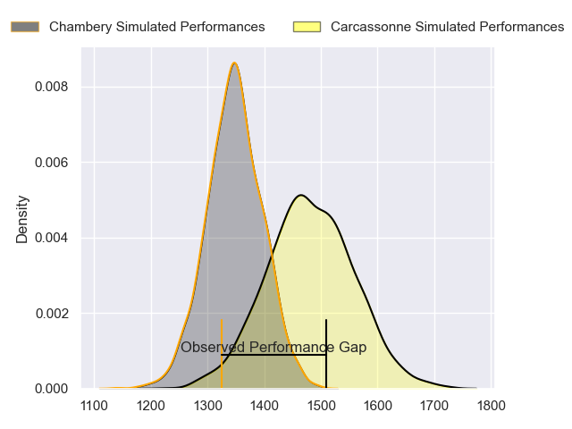
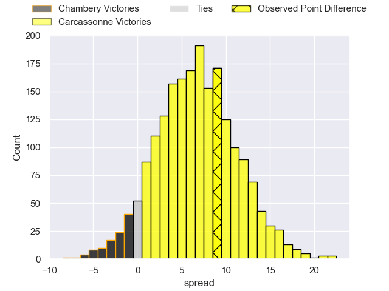
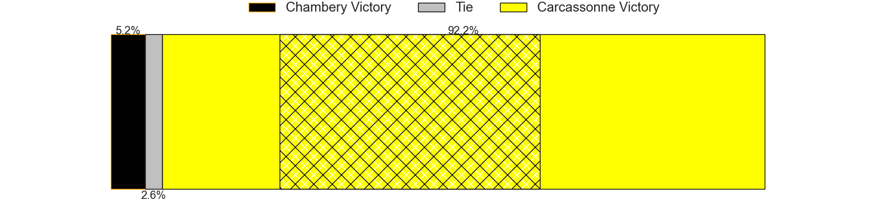
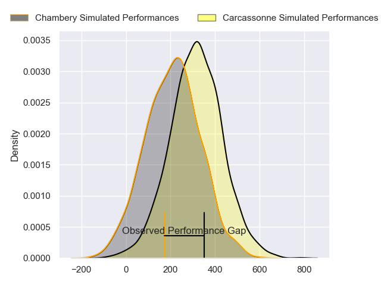
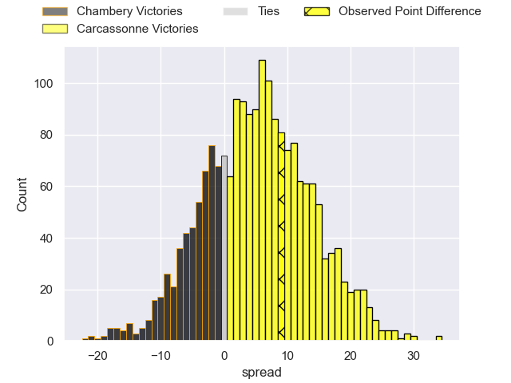
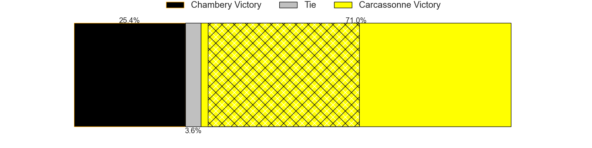

---  
layout: page  
title: Chambery at Carcassonne; 10-19  
date: 2024-05-04 18:00:00 -0500  
categories: "Nationale 2023" match review  
---
# Chambery at Carcassonne; 10-19

# Club Level Predictions

The first set of predictions treats a club as the smallest object, as the club develops its members, organizes a gameplan, and deploys its players as needed for each match. This club model has a prediction of 0.684, which translates to predicting Carcassonne to win by 6.8.

Our Over/Under is 41.5 - and combined with the spread above, we have a predicted scoreline of 18 to 24

Each club has a rating and a rating deviation (similar to a Glicko rating), and expected performances can be generated. This allows for simulated matches and spreads like the ones below.
## Projected Performances - Club Model

## Projected Spreads - Club Model

## Projected Results - Club Model

# Player Level Predictions

Treating teams instead as an entity made up of the currently active players, I have ratings for each player in an altogether different system. These can be combined to form team ratings once teamsheets are announced, weighting starters a bit higher than the reserves. After the match is played, players can be weighted by their minutes on the field, allowing for an accurate measure of the team's composition. With these compiled team ratings, we can make predictions, measure inaccuracy, and update the individual player ratings.
## Prediction without Player Minutes: Carcassonne by 4.9

Chambery by 1.1 on a neutral pitch

## Projected Performances - Player Model

## Projected Spreads - Player Model

## Projected Results - Player Model

|   Away Minutes | Away Player                  |   Away Percentile |   Number |   Home Percentile | Home Player           |   Home Minutes |
|---------------:|:-----------------------------|------------------:|---------:|------------------:|:----------------------|---------------:|
|             60 | Nugzar Somkhishvili          |             79.16 |        1 |             97.54 | Andrei Ursache        |             64 |
|             63 | Gauthier Brute de Remur      |             85.88 |        2 |             85.71 | Raphael Carbou        |             64 |
|             63 | Giorgi Pertaia               |             87.69 |        3 |             19.28 | Nikoloz Narmania      |             49 |
|             60 | Ahmed Tidiane Kane           |             64.51 |        4 |             71.18 | Romain Manchia        |             80 |
|             80 | Fabien Witz                  |             64.61 |        5 |             63.9  | Romain Guyot          |             49 |
|             80 | Taniela Matakaiongo          |             39.22 |        6 |              8.12 | Valentin Sese         |             80 |
|             60 | Thomas Coignat               |             77.73 |        7 |             90.87 | Etienne Herjean       |             80 |
|             80 | Tui Uru                      |             81.74 |        8 |             70.65 | Shaun Adendorff       |             60 |
|             72 | Thibault Dufau               |             71.71 |        9 |              1.07 | Martin Landajo        |             46 |
|             72 | Victor Pisano                |             47.73 |       10 |             70.41 | Gabin Michet          |             69 |
|             51 | Arthur Nennig                |             75.41 |       11 |             96.42 | Clement Egiziano      |             80 |
|             80 | Bastien Reymond              |             70.89 |       12 |             81.86 | Jordan Puletua        |             80 |
|             80 | Emmanuel Vaitulukina         |             79.32 |       13 |             10.55 | Mathys Barka          |             80 |
|             80 | Paul Baptiste Florent Altier |             45.3  |       14 |             15    | Sakiusa Bureitakiyaca |             80 |
|             80 | Jules Dorrival               |             45.51 |       15 |             94.23 | Maxime Gianet         |             80 |
|             20 | Géraud Clermont              |             58.08 |       16 |             34.7  | Florent Lorenzon      |             16 |
|             17 | Enzo Bailly                  |             53.81 |       17 |             62.79 | Luka Petriashvili     |             16 |
|             20 | Corentin Astier              |             47.52 |       18 |             90.48 | Fabien Lorenzon       |             31 |
|             20 | Colin Lebian                 |             64.29 |       19 |             46.01 | Clément Fontaine      |             31 |
|              8 | Hugo Deschaux                |             20.46 |       20 |             40.82 | Ferdinand Dreno       |             20 |
|              8 | Clément Pérusin              |            nan    |       21 |             66.73 | Gaetan Pichon         |             34 |
|             29 | Va'aufauese Apelu Maliko     |             44.05 |       22 |             75.85 | Damien Añon           |             11 |
|             17 | Luka Begic                   |             18.44 |       23 |            nan    | nan                   |            nan |

