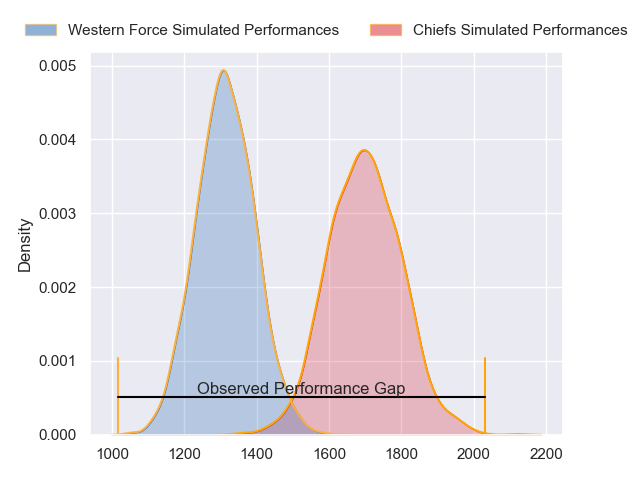
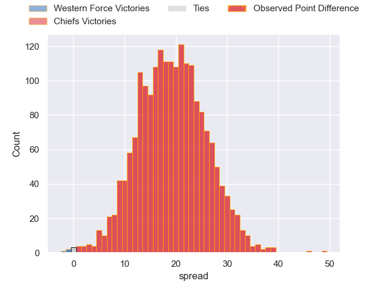
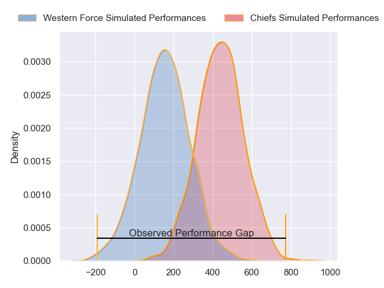
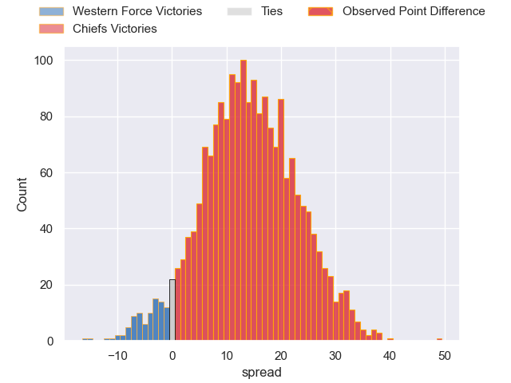
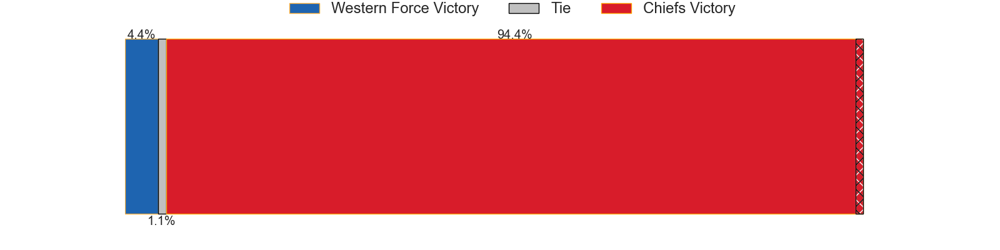

---  
layout: page  
title: Western Force at Chiefs; 7-56  
date: 2024-05-04 18:00:00 -0500  
categories: "Super Rugby Pacific 2024" match review  
---
# Western Force at Chiefs; 7-56

# Club Level Predictions

The first set of predictions treats a club as the smallest object, as the club develops its members, organizes a gameplan, and deploys its players as needed for each match. This club model has a prediction of 0.897, which translates to predicting Chiefs to win by 19.4.

Our Over/Under is 45.5 - and combined with the spread above, we have a predicted scoreline of 13 to 32

Each club has a rating and a rating deviation (similar to a Glicko rating), and expected performances can be generated. This allows for simulated matches and spreads like the ones below.
## Projected Performances - Club Model

## Projected Spreads - Club Model

## Projected Results - Club Model

# Player Level Predictions - Version 2

Treating teams instead as an entity made up of the currently active players, I have ratings for each player in an altogether different system. These can be combined to form team ratings once teamsheets are announced, weighting starters a bit higher than the reserves. After the match is played, players can be weighted by their minutes on the field, allowing for an accurate measure of the team's composition. With these compiled team ratings, we can make predictions, measure inaccuracy, and update the individual player ratings.
## Prediction without Player Minutes: Chiefs by 18.8

Chiefs by 14.1 on a neutral pitch

## Projected Performances - Player Model

## Projected Spreads - Player Model

## Projected Results - Player Model

|   Away Minutes | Away Player           |   Away Percentile |   Number |   Home Percentile | Home Player          |   Home Minutes |
|---------------:|:----------------------|------------------:|---------:|------------------:|:---------------------|---------------:|
|             54 | Josh Bartlett         |             30.85 |        1 |             98.04 | Aidan Ross           |             58 |
|             61 | Tom Horton            |             47.03 |        2 |             81.39 | Bradley Slater       |             66 |
|             61 | Santiago Medrano      |              4.7  |        3 |             84.43 | George Dyer          |             66 |
|             54 | Tom Franklin          |             90.05 |        4 |             93.2  | Naitoa Ah Kuoi       |             28 |
|             80 | Jeremy Williams       |             16.99 |        5 |             91.14 | Tupou Vaa'i          |             80 |
|             69 | Will Harris           |             62.84 |        6 |             93.79 | Samipeni Finau       |             23 |
|             80 | Carlo Tizzano         |             10.99 |        7 |             53.41 | Kaylum Boshier       |             80 |
|             80 | Reed Prinsep          |             84.4  |        8 |             40.66 | Wallace Sititi       |             58 |
|             51 | Issak Fines-Leleiwasa |             35.74 |        9 |             71.91 | Cortez Ratima        |             61 |
|             69 | Ben Donaldson         |             48.3  |       10 |             97.91 | Damian McKenzie      |             58 |
|             61 | Chase Tiatia          |             72.51 |       11 |             76.37 | Daniel Rona          |             80 |
|             80 | Hamish Stewart        |             77.09 |       12 |             88.79 | Quinn Tupaea         |             80 |
|             80 | Sam Spink             |             22.54 |       13 |             91.78 | Anton Lienert-Brown  |             80 |
|             80 | Bayley Kuenzle        |              5.96 |       14 |             91.81 | Emoni Narawa         |             80 |
|             80 | Kurtley Beale         |             93.72 |       15 |             46.48 | Etene Nanai-Seturo   |             80 |
|             19 | Feleti Kaitu'u        |             27.61 |       16 |             69.33 | Tyrone Thompson      |             14 |
|             26 | Marley Pearce         |             26.64 |       17 |             79.24 | Ollie Norris         |             22 |
|             19 | Tiaan Tauakipulu      |            nan    |       18 |            nan    | Kauvaka Kaivelata    |             14 |
|             26 | Izack Rodda           |             82.77 |       19 |             14.68 | Manaaki Selby-Rickit |             52 |
|             11 | Michael Wells         |              2.27 |       20 |             90.32 | Luke Jacobson        |             22 |
|             29 | Henry Robertson       |            nan    |       21 |             32.14 | Simon Parker         |             57 |
|             11 | Max Burey             |              6.28 |       22 |             37.45 | Xavier Roe           |             19 |
|             19 | Henry O'Donnell       |            nan    |       23 |             45.73 | Josh Ioane           |             22 |

