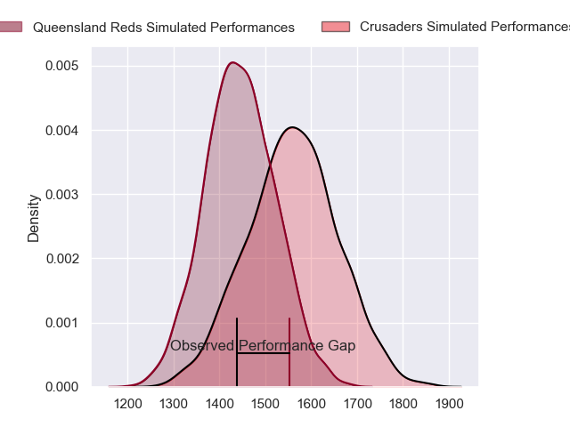
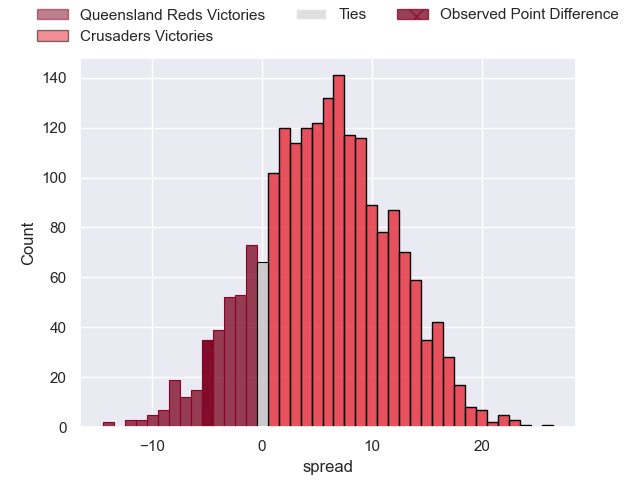
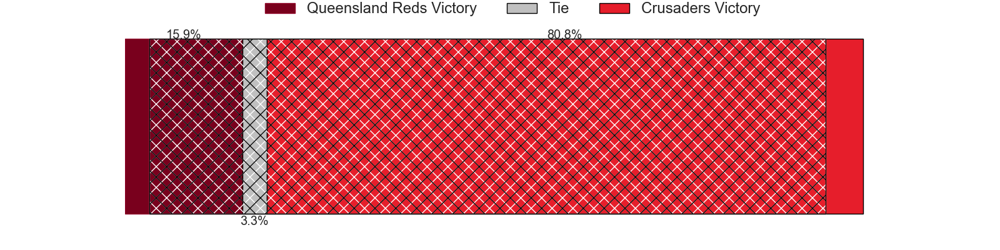
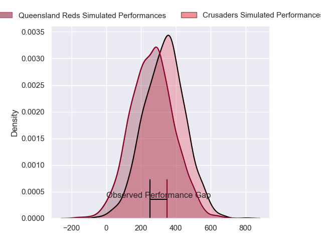
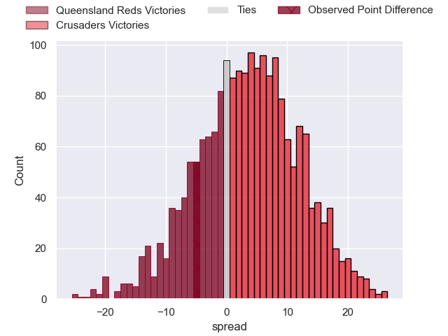
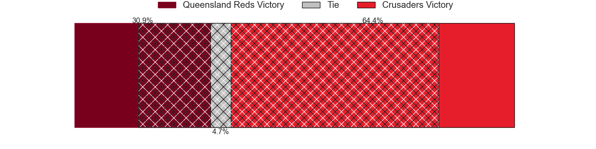

---  
layout: page  
title: Queensland Reds at Crusaders; 33-28  
date: 2024-05-04 18:00:00 -0500  
categories: "Super Rugby Pacific 2024" match review  
---
# Queensland Reds at Crusaders; 33-28

# Club Level Predictions

The first set of predictions treats a club as the smallest object, as the club develops its members, organizes a gameplan, and deploys its players as needed for each match. This club model has a prediction of 0.666, which translates to predicting Crusaders to win by 6.2.

Our Over/Under is 53.5 - and combined with the spread above, we have a predicted scoreline of 24 to 30

Each club has a rating and a rating deviation (similar to a Glicko rating), and expected performances can be generated. This allows for simulated matches and spreads like the ones below.
## Projected Performances - Club Model

## Projected Spreads - Club Model

## Projected Results - Club Model

# Player Level Predictions

Treating teams instead as an entity made up of the currently active players, I have ratings for each player in an altogether different system. These can be combined to form team ratings once teamsheets are announced, weighting starters a bit higher than the reserves. After the match is played, players can be weighted by their minutes on the field, allowing for an accurate measure of the team's composition. With these compiled team ratings, we can make predictions, measure inaccuracy, and update the individual player ratings.
## Prediction without Player Minutes: Crusaders by 6.6

Crusaders by 2.3 on a neutral pitch

## Projected Performances - Player Model

## Projected Spreads - Player Model

## Projected Results - Player Model

|   Away Minutes | Away Player               |   Away Percentile |   Number |   Home Percentile | Home Player          |   Home Minutes |
|---------------:|:--------------------------|------------------:|---------:|------------------:|:---------------------|---------------:|
|             52 | Peni Ravai Kovekalou      |             58.33 |        1 |              6.89 | George Bower         |             66 |
|             61 | Matt Faessler             |             77    |        2 |             88.83 | Brodie McAlister     |             20 |
|             52 | Jeff Toomaga-Allen        |             94.26 |        3 |              1.31 | Fletcher Newell      |             66 |
|             80 | Ryan Smith                |             46.01 |        4 |             94.64 | Scott Barrett        |             14 |
|             66 | Angus Blyth               |             93.23 |        5 |             90.6  | Quinten Strange      |             80 |
|             80 | Liam Wright               |             97.29 |        6 |             80.04 | Cullen Grace         |             80 |
|             67 | Fraser McReight           |             94.48 |        7 |             66    | Corey Kellow         |             80 |
|             80 | Harry Wilson              |             68.91 |        8 |             36.09 | Christian Lio-Willie |             41 |
|             61 | Kalani Thomas             |             67.67 |        9 |             87.74 | Mitchell Drummond    |             53 |
|             80 | Lawson Creighton          |             17.24 |       10 |             93.32 | David Havili         |             80 |
|             80 | Mac Grealy                |             87.6  |       11 |             82.27 | Sevu Reece           |             80 |
|             80 | Hunter Paisami            |             79.35 |       12 |             62.91 | Dallas McLeod        |             80 |
|             80 | Josh Flook                |             44.15 |       13 |             68.6  | Levi Aumua           |             66 |
|             70 | Tim Ryan                  |             51.36 |       14 |             82.85 | Johnny McNicholl     |             80 |
|             80 | Jock Campbell             |             71.03 |       15 |             75.32 | Leigh Halfpenny      |             44 |
|             19 | Josh Nasser               |            nan    |       16 |              9    | George Bell          |             60 |
|             28 | Sef Fa'agase              |             76.78 |       17 |             45.04 | Joe Moody            |             14 |
|             28 | Zane Nonggorr             |             80.07 |       18 |             76.54 | Owen Franks          |             14 |
|             14 | Connor Vest               |             43.28 |       19 |             31.24 | Jamie Hannah         |             66 |
|             13 | John Bryant               |             49.35 |       20 |             60.68 | Tom Christie         |             39 |
|             19 | Louis Werchon             |            nan    |       21 |             64.83 | Noah Hotham          |             27 |
|              0 | Harry McLaughlin-Phillips |             56.47 |       22 |             52.37 | Rivez Reihana        |             14 |
|             10 | Suliasi Vunivalu          |             47.19 |       23 |             11.37 | Chay Fihaki          |             36 |

