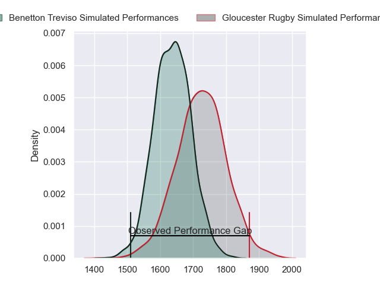
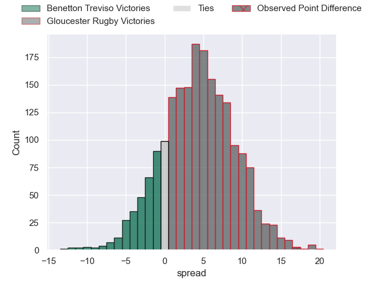
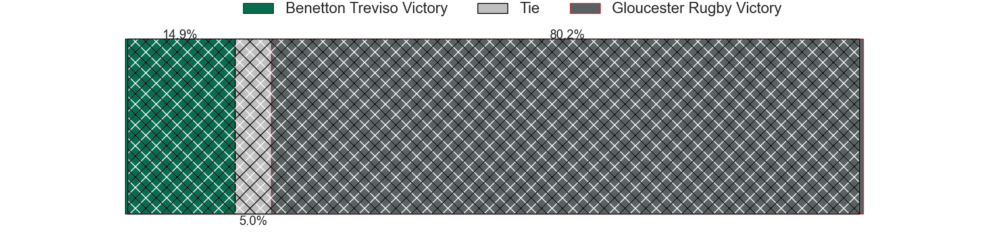
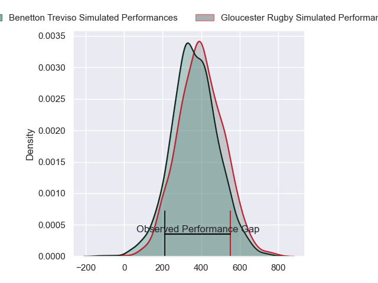
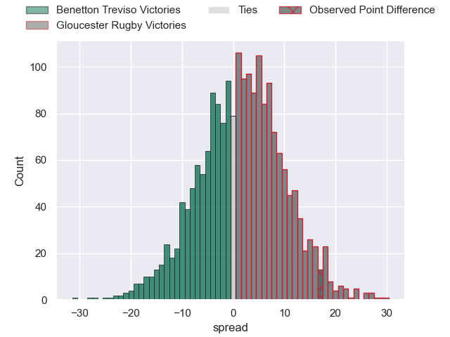
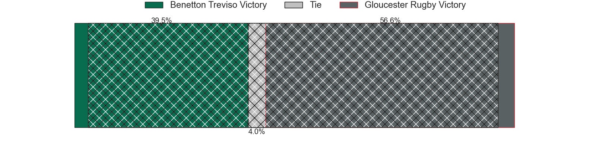

---  
layout: page  
title: Benetton Treviso at Gloucester Rugby; 23-40  
date: 2024-05-04 18:00:00 -0500  
categories: "European Rugby Challenge Cup 2023" match review  
---
# Benetton Treviso at Gloucester Rugby; 23-40

# Club Level Predictions

The first set of predictions treats a club as the smallest object, as the club develops its members, organizes a gameplan, and deploys its players as needed for each match. This club model has a prediction of 0.617, which translates to predicting Gloucester Rugby to win by 4.2.

Our Over/Under is 51.5 - and combined with the spread above, we have a predicted scoreline of 24 to 28

Each club has a rating and a rating deviation (similar to a Glicko rating), and expected performances can be generated. This allows for simulated matches and spreads like the ones below.
## Projected Performances - Club Model

## Projected Spreads - Club Model

## Projected Results - Club Model

# Player Level Predictions

Treating teams instead as an entity made up of the currently active players, I have ratings for each player in an altogether different system. These can be combined to form team ratings once teamsheets are announced, weighting starters a bit higher than the reserves. After the match is played, players can be weighted by their minutes on the field, allowing for an accurate measure of the team's composition. With these compiled team ratings, we can make predictions, measure inaccuracy, and update the individual player ratings.
## Prediction without Player Minutes: Gloucester Rugby by 1.2

Benetton Treviso by 7.1 on a neutral pitch

## Projected Performances - Player Model

## Projected Spreads - Player Model

## Projected Results - Player Model

|   Away Minutes | Away Player        |   Away Percentile |   Number |   Home Percentile | Home Player         |   Home Minutes |
|---------------:|:-------------------|------------------:|---------:|------------------:|:--------------------|---------------:|
|             65 | Thomas Gallo       |             89.25 |        1 |             12.06 | Mayco Vivas         |             45 |
|             45 | Giacomo Nicotera   |             97.83 |        2 |             78.5  | Sebastian Blake     |             45 |
|             54 | Simone Ferrari     |             95.24 |        3 |             90.57 | Kirill Gotovtsev    |             63 |
|             41 | Scott Scrafton     |             60.36 |        4 |             76.14 | Freddie Clarke      |             80 |
|             60 | Eli Snyman         |             75.63 |        5 |             84.33 | Freddie Thomas      |             63 |
|             49 | Sebastian Negri    |             87.66 |        6 |             90.67 | Ruan Ackermann      |             68 |
|             80 | Michele Lamaro     |             96.29 |        7 |             61.58 | Lewis Ludlow        |             80 |
|             80 | Toa Halafihi       |             65.43 |        8 |             50.43 | Zach Mercer         |             80 |
|             49 | Alessandro Garbisi |             70.16 |        9 |             86.68 | Caolan Englefield   |             71 |
|             68 | Tomas Albornoz     |             78.23 |       10 |             98.49 | Adam Hastings       |             80 |
|             80 | Onisi Ratave       |             27.91 |       11 |             81.78 | Ollie Thorley       |             80 |
|             80 | Juan Ignacio Brex  |             93.26 |       12 |             46.15 | Sebastien Atkinson  |             80 |
|             80 | Tommaso Menoncello |             85.56 |       13 |             77.03 | Chris Harris        |             80 |
|             80 | Ignacio Mendy      |             12.98 |       14 |             58.62 | Jonny May           |             80 |
|             80 | Rhyno Smith        |             87.55 |       15 |             51.5  | Josh Hathaway       |             80 |
|             35 | Gianmarco Lucchesi |             87.67 |       16 |             79.83 | Santiago Socino     |             35 |
|             13 | Mirco Spagnolo     |             56.44 |       17 |             19.2  | Jamal Ford-Robinson |             35 |
|             28 | Giosue Zilocchi    |             72.19 |       18 |             45.45 | Ciaran Knight       |             17 |
|             39 | Niccolo Cannone    |             68.05 |       19 |             90.17 | Albert Tuisue       |             17 |
|             20 | Edoardo Iachizzi   |             72.19 |       20 |             64.09 | Jack Clement        |             12 |
|             31 | Alessandro Izekor  |             50.95 |       21 |              8.35 | Stephen Varney      |              9 |
|             31 | Andy Uren          |             13.68 |       22 |             58.41 | Charlie Atkinson    |              0 |
|             12 | Leonardo Marin     |             69.28 |       23 |             59.21 | Alex Hearle         |              0 |

