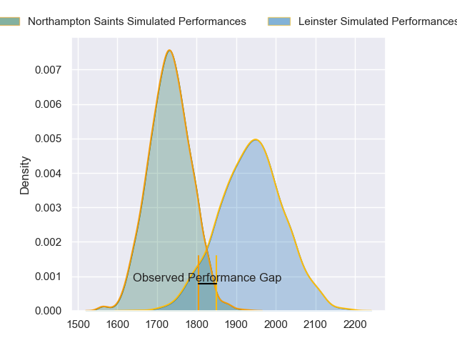
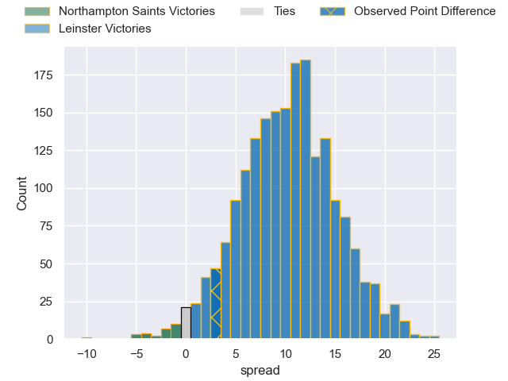
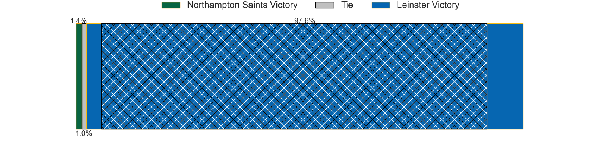
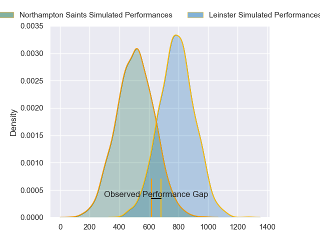
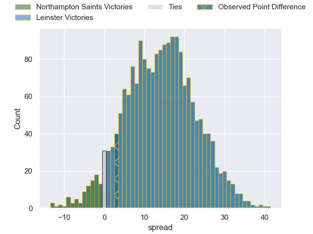
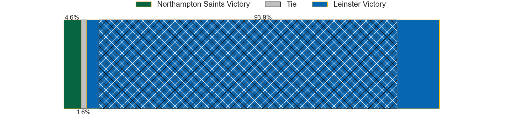

---  
layout: page  
title: Northampton Saints at Leinster; 17-20  
date: 2024-05-04 18:00:00 -0500  
categories: "European Rugby Champions Cup 2023" match review  
---
# Northampton Saints at Leinster; 17-20

# Club Level Predictions

The first set of predictions treats a club as the smallest object, as the club develops its members, organizes a gameplan, and deploys its players as needed for each match. This club model has a prediction of 0.761, which translates to predicting Leinster to win by 10.2.

Our Over/Under is 53.5 - and combined with the spread above, we have a predicted scoreline of 22 to 32

Each club has a rating and a rating deviation (similar to a Glicko rating), and expected performances can be generated. This allows for simulated matches and spreads like the ones below.
## Projected Performances - Club Model

## Projected Spreads - Club Model

## Projected Results - Club Model

# Player Level Predictions - Version 2

Treating teams instead as an entity made up of the currently active players, I have ratings for each player in an altogether different system. These can be combined to form team ratings once teamsheets are announced, weighting starters a bit higher than the reserves. After the match is played, players can be weighted by their minutes on the field, allowing for an accurate measure of the team's composition. With these compiled team ratings, we can make predictions, measure inaccuracy, and update the individual player ratings.
## Prediction without Player Minutes: Leinster by 17.6

Leinster by 11.3 on a neutral pitch

## Projected Performances - Player Model

## Projected Spreads - Player Model

## Projected Results - Player Model

|   Away Minutes | Away Player         |   Away Percentile |   Number |   Home Percentile | Home Player         |   Home Minutes |
|---------------:|:--------------------|------------------:|---------:|------------------:|:--------------------|---------------:|
|             55 | Alex Waller         |             98.24 |        1 |             92.07 | Andrew Porter       |             72 |
|             58 | Curtis Langdon      |             92.23 |        2 |             73.21 | Dan Sheehan         |             53 |
|             58 | Trevor Davison      |              3.92 |        3 |             97.36 | Tadhg Furlong       |             61 |
|             69 | Alex Moon           |             96.97 |        4 |             93.57 | Ross Molony         |             53 |
|             80 | Alex Coles          |             34.59 |        5 |             84.34 | Joe McCarthy        |             80 |
|             80 | Courtney Lawes      |             98.21 |        6 |             86.74 | Ryan Baird          |             80 |
|             65 | Sam Graham          |             98.92 |        7 |             98.33 | Josh van der Flier  |             53 |
|             80 | Juarno Augustus     |             71.1  |        8 |             95.14 | Caelan Doris        |             80 |
|             69 | Alex Mitchell       |             95.96 |        9 |             96.38 | Jamison Gibson-Park |             80 |
|             80 | Fin Smith           |             83.81 |       10 |             95.56 | Ross Byrne          |             80 |
|             69 | George Hendy        |             88.77 |       11 |            100    | James Lowe          |             80 |
|             80 | Fraser Dingwall     |             92.9  |       12 |             90.16 | Jamie Osborne       |             80 |
|             80 | Tommy Freeman       |             96.76 |       13 |             90.41 | Robbie Henshaw      |             80 |
|             80 | James Ramm          |             77.19 |       14 |             90.64 | Jordan Larmour      |             73 |
|             80 | George Furbank      |             95.98 |       15 |             50.5  | Ciaran Frawley      |             80 |
|             22 | Joel Matavesi       |            nan    |       16 |             93.66 | Ronan Kelleher      |             27 |
|             25 | Emmanuel Iyogun     |             44.86 |       17 |             92.56 | Cian Healy          |              8 |
|             22 | Elliot Millar-Mills |             63.86 |       18 |             93.83 | Michael Ala'alatoa  |             19 |
|             11 | Temo Mayanavanua    |             90.41 |       19 |             67.72 | Jason Jenkins       |             27 |
|             15 | Angus Scott-Young   |             56.99 |       20 |             98.72 | Jack Conan          |             27 |
|             11 | Tom James           |             20.64 |       21 |             98.51 | Luke McGrath        |              0 |
|              0 | Tom Litchfield      |             55.92 |       22 |             85.38 | Harry Byrne         |              0 |
|             11 | Tom Seabrook        |              6.9  |       23 |             92.05 | Jimmy O'Brien       |              7 |

