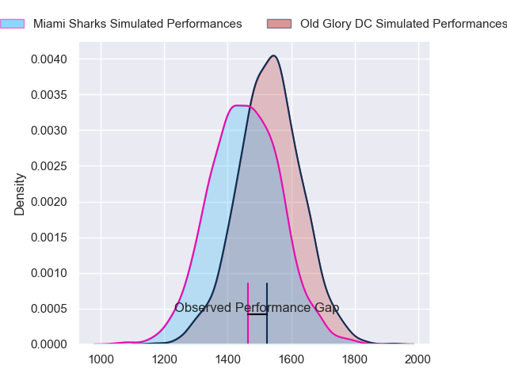
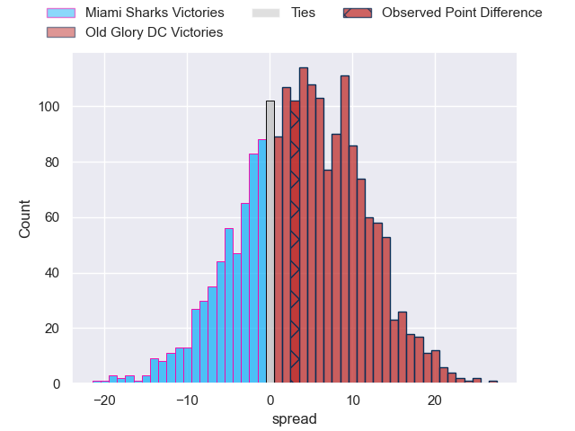
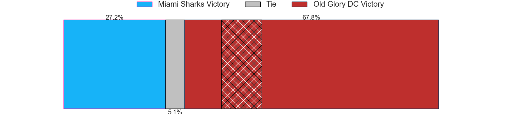
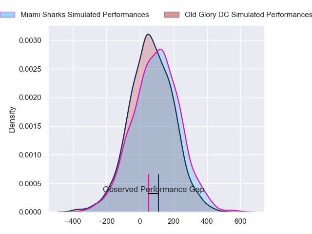
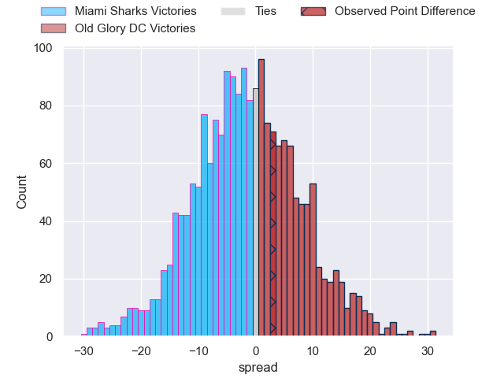
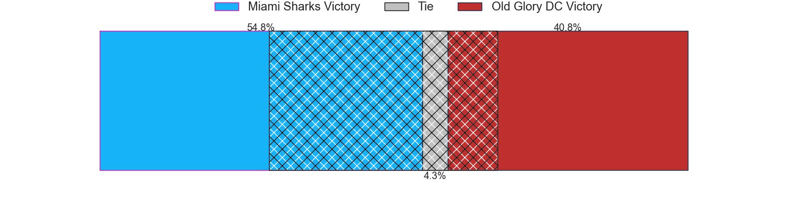

---  
layout: page  
title: Miami Sharks at Old Glory DC; 10-13  
date: 2024-05-04 18:00:00 -0500  
categories: "Major League Rugby 2024" match review  
---
# Miami Sharks at Old Glory DC; 10-13

# Club Level Predictions

The first set of predictions treats a club as the smallest object, as the club develops its members, organizes a gameplan, and deploys its players as needed for each match. This club model has a prediction of 0.604, which translates to predicting Old Glory DC to win by 3.9.

Our Over/Under is 60.5 - and combined with the spread above, we have a predicted scoreline of 28 to 32

Each club has a rating and a rating deviation (similar to a Glicko rating), and expected performances can be generated. This allows for simulated matches and spreads like the ones below.
## Projected Performances - Club Model

## Projected Spreads - Club Model

## Projected Results - Club Model

# Player Level Predictions

Treating teams instead as an entity made up of the currently active players, I have ratings for each player in an altogether different system. These can be combined to form team ratings once teamsheets are announced, weighting starters a bit higher than the reserves. After the match is played, players can be weighted by their minutes on the field, allowing for an accurate measure of the team's composition. With these compiled team ratings, we can make predictions, measure inaccuracy, and update the individual player ratings.
## Prediction without Player Minutes: Miami Sharks by 1.0

Miami Sharks by 3.6 on a neutral pitch

## Projected Performances - Player Model

## Projected Spreads - Player Model

## Projected Results - Player Model

|   Away Minutes | Away Player         |   Away Percentile |   Number |   Home Percentile | Home Player              |   Home Minutes |
|---------------:|:--------------------|------------------:|---------:|------------------:|:-------------------------|---------------:|
|             80 | Jonas Petrakopoulos |             55.13 |        1 |             13.95 | Jack Iscaro              |             80 |
|             80 | Sean Mcnulty        |             45.02 |        2 |             31.73 | Martín Vaca              |             80 |
|             80 | Tevita Sole         |             23.79 |        3 |             68.99 | Stevie Longwell          |             80 |
|             80 | Stan Van Den Hoven  |             49.34 |        4 |             36.2  | Rob Harley               |             80 |
|             80 | Michael Etete       |             27.4  |        5 |             43.88 | Tevita Naqali            |             80 |
|             80 | Dan Pryor           |             15.85 |        6 |             52.96 | Jamason Fa'Anana-Schultz |             80 |
|             80 | Rick Rose           |             30.09 |        7 |             20.76 | Cory Gilliland-Daniel    |             80 |
|             80 | Manuel Ardao        |             73.91 |        8 |             40    | Lautaro Bavaro           |             80 |
|             80 | Tomas Inciarte      |             28.11 |        9 |             59.61 | Ethan Mcveigh            |             80 |
|             80 | Santiago Videla     |             18.14 |       10 |             50.97 | Gradyn Bowd              |             80 |
|             80 | Michael Hand        |             51.4  |       11 |             46.08 | Axel Muller              |             80 |
|             80 | Nick Grigg          |             32.38 |       12 |              2    | Tommaso Boni             |             80 |
|             80 | Guiseppe Du Toit    |             46.52 |       13 |             41.67 | Willie Talataina-Mu      |             80 |
|             80 | Marcos Young        |             27.98 |       14 |             28.36 | Perry Humphreys          |             80 |
|             80 | Felipe Etcheverry   |             70.3  |       15 |             28.85 | Damien Hoyland           |             80 |
|              0 | Alex Glover         |            nan    |       16 |            nan    | Koikoi Nelligan          |              0 |
|              0 | Rob Evans           |             16.9  |       17 |             54.63 | Quentin Newcomer         |              0 |
|              0 | Alec Mcdonnell      |             42.49 |       18 |             44.38 | Cali Martinez            |              0 |
|              0 | David Beach         |            nan    |       19 |             56.02 | Bill Whiteside           |              0 |
|              0 | Chase Schor-Haskin  |            nan    |       20 |             59.68 | Brady Daniel             |              0 |
|              0 | Nicolás Elewaut     |            nan    |       21 |             31.49 | Connor Buckley           |              0 |
|              0 | Eric Naposki        |             39.4  |       22 |             31.32 | Jason Robertson          |              0 |
|              0 | Avery Oitomen       |             34.37 |       23 |             59.49 | John Powers              |              0 |

