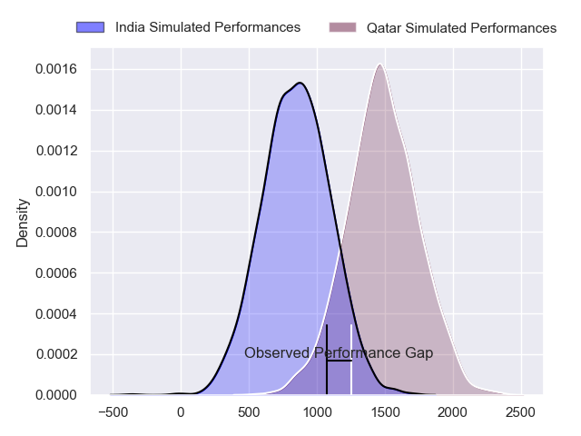
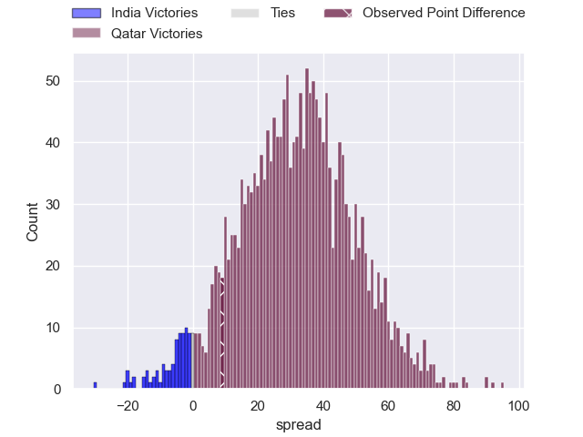

---  
layout: page  
title: India at Qatar; 25-34  
date: 2024-05-04 18:00:00 -0500  
categories: "International Test Match 2024" match review  
---
# India at Qatar; 25-34

# Club Level Predictions

The first set of predictions treats a club as the smallest object, as the club develops its members, organizes a gameplan, and deploys its players as needed for each match. This club model has a prediction of 0.945, which translates to predicting Qatar to win by 31.6.

Our Over/Under is 45.5 - and combined with the spread above, we have a predicted scoreline of 7 to 38

Each club has a rating and a rating deviation (similar to a Glicko rating), and expected performances can be generated. This allows for simulated matches and spreads like the ones below.
## Projected Performances - Club Model

## Projected Spreads - Club Model

## Projected Results - Club Model

