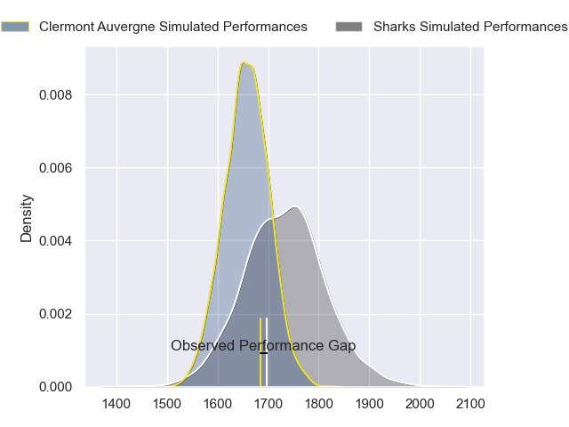
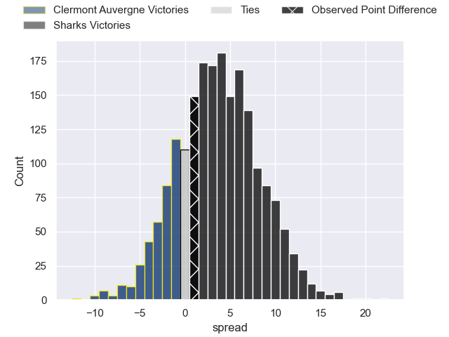
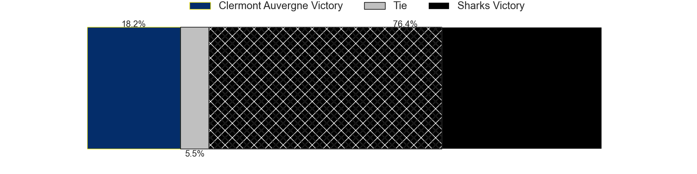
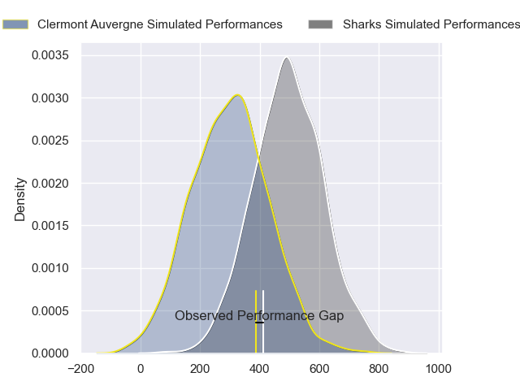
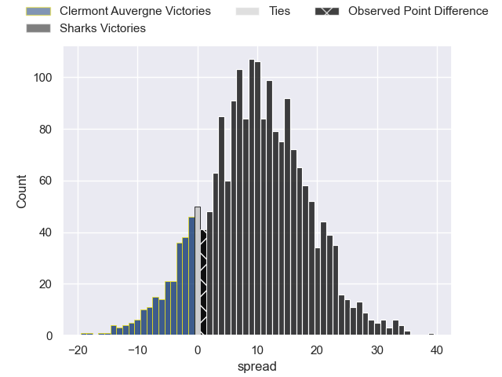
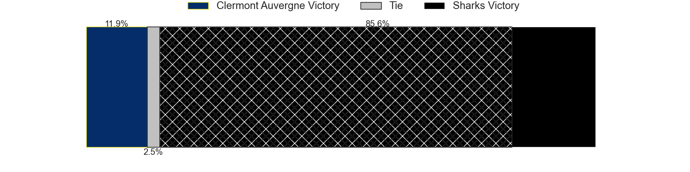

---  
layout: page  
title: Clermont Auvergne at Sharks; 31-32  
date: 2024-05-04 18:00:00 -0500  
categories: "European Rugby Challenge Cup 2023" match review  
---
# Clermont Auvergne at Sharks; 31-32

# Club Level Predictions

The first set of predictions treats a club as the smallest object, as the club develops its members, organizes a gameplan, and deploys its players as needed for each match. This club model has a prediction of 0.604, which translates to predicting Sharks to win by 3.7.

Our Over/Under is 61.5 - and combined with the spread above, we have a predicted scoreline of 29 to 33

Each club has a rating and a rating deviation (similar to a Glicko rating), and expected performances can be generated. This allows for simulated matches and spreads like the ones below.
## Projected Performances - Club Model

## Projected Spreads - Club Model

## Projected Results - Club Model

# Player Level Predictions

Treating teams instead as an entity made up of the currently active players, I have ratings for each player in an altogether different system. These can be combined to form team ratings once teamsheets are announced, weighting starters a bit higher than the reserves. After the match is played, players can be weighted by their minutes on the field, allowing for an accurate measure of the team's composition. With these compiled team ratings, we can make predictions, measure inaccuracy, and update the individual player ratings.
## Prediction without Player Minutes: Sharks by 11.5

Sharks by 7.1 on a neutral pitch

## Projected Performances - Player Model

## Projected Spreads - Player Model

## Projected Results - Player Model

|   Away Minutes | Away Player         |   Away Percentile |   Number |   Home Percentile | Home Player         |   Home Minutes |
|---------------:|:--------------------|------------------:|---------:|------------------:|:--------------------|---------------:|
|             80 | Giorgi Beria        |             49.06 |        1 |             99.67 | Ox Nche             |             65 |
|             75 | Etienne Fourcade    |             61.63 |        2 |             96.68 | Bongi Mbonambi      |             65 |
|             64 | Rabah Slimani       |             85.64 |        3 |             49.38 | Vincent Koch        |             65 |
|             80 | Rob Simmons         |             94.54 |        4 |             98.38 | Eben Etzebeth       |             80 |
|             41 | Tomas Lavanini      |             93.83 |        5 |             62.08 | Emile van Heerden   |              4 |
|             80 | Marcos Kremer       |             84.85 |        6 |             69.31 | James Venter        |             65 |
|             80 | Peceli Yato         |             34.2  |        7 |             86.26 | Vincent Tshituka    |             80 |
|             59 | Fritz Lee           |             93.26 |        8 |             49.35 | Phepsi Buthelezi    |             80 |
|             80 | Baptiste Jauneau    |             50.71 |        9 |             57.12 | Grant Williams      |             80 |
|             80 | Anthony Belleau     |             94.38 |       10 |             54.64 | Siya Masuku         |             80 |
|             72 | Joris Jurand        |             77.73 |       11 |             99.42 | Makazole Mapimpi    |             80 |
|             80 | Leon Darricarrere   |             68.57 |       12 |             47.47 | Ethan Hooker        |             26 |
|             80 | Julien Heriteau     |             64.87 |       13 |             85.55 | Lukhanyo Am         |             80 |
|             80 | Bautista Delguy     |             91.58 |       14 |             73.18 | Werner Kok          |             80 |
|             80 | Alex Newsome        |             80.98 |       15 |             90.6  | Aphelele Fassi      |             80 |
|              5 | Yohan Beheregaray   |             30.9  |       16 |             90.37 | Fez Mbatha          |             15 |
|              0 | Giorgi Dzmanashvili |            nan    |       17 |             45.2  | Ntuthuko Mchunu     |             15 |
|             16 | Cristian Ojovan     |             76.13 |       18 |             60.05 | Hanru Jacobs        |             15 |
|             39 | Thibaud Lanen       |             80.59 |       19 |             18.1  | Gerbrandt Grobler   |             76 |
|              0 | Killian Tixeront    |             65.2  |       20 |             48.95 | Jeandre Labuschagne |             15 |
|             21 | Pita Gus Sowakula   |             85.65 |       21 |              3.2  | Cameron Wright      |              0 |
|              0 | Theo Giral          |            nan    |       22 |             53.42 | Boeta Chamberlain   |              0 |
|              8 | Yerim Fall          |             29.82 |       23 |             59.07 | Francois Venter     |             54 |

