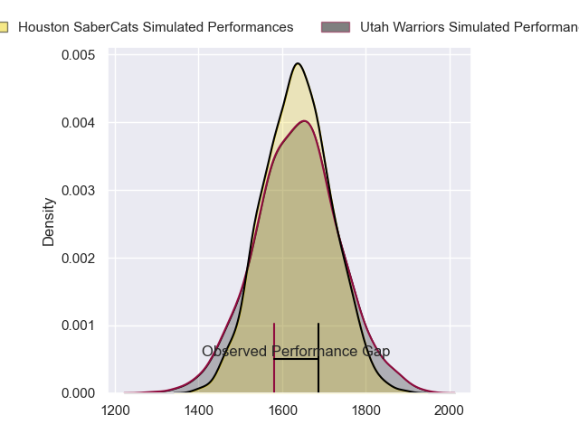
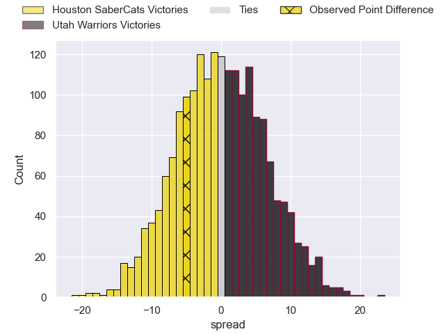
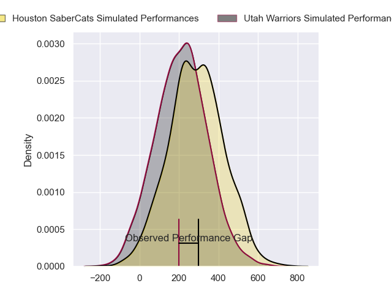
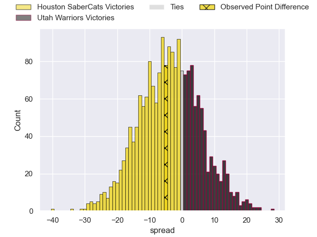
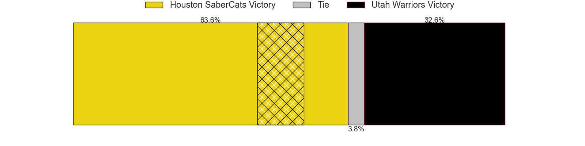

---  
layout: page  
title: Houston SaberCats at Utah Warriors; 29-24  
date: 2024-05-04 18:00:00 -0500  
categories: "Major League Rugby 2024" match review  
---
# Houston SaberCats at Utah Warriors; 29-24

# Club Level Predictions

The first set of predictions treats a club as the smallest object, as the club develops its members, organizes a gameplan, and deploys its players as needed for each match. This club model has a prediction of 0.498, which translates to predicting Houston SaberCats to win by 0.1.

Our Over/Under is 62.5 - and combined with the spread above, we have a predicted scoreline of 31 to 31

Each club has a rating and a rating deviation (similar to a Glicko rating), and expected performances can be generated. This allows for simulated matches and spreads like the ones below.
## Projected Performances - Club Model

## Projected Spreads - Club Model

## Projected Results - Club Model

# Player Level Predictions

Treating teams instead as an entity made up of the currently active players, I have ratings for each player in an altogether different system. These can be combined to form team ratings once teamsheets are announced, weighting starters a bit higher than the reserves. After the match is played, players can be weighted by their minutes on the field, allowing for an accurate measure of the team's composition. With these compiled team ratings, we can make predictions, measure inaccuracy, and update the individual player ratings.
## Prediction without Player Minutes: Houston SaberCats by 2.6

Houston SaberCats by 5.3 on a neutral pitch

## Projected Performances - Player Model

## Projected Spreads - Player Model

## Projected Results - Player Model

|   Away Minutes | Away Player        |   Away Percentile |   Number |   Home Percentile | Home Player         |   Home Minutes |
|---------------:|:-------------------|------------------:|---------:|------------------:|:--------------------|---------------:|
|             80 | Ezekiel Lindenmuth |             86.38 |        1 |             36.59 | Emerson Prior       |             80 |
|             80 | Seth Smith         |             61.3  |        2 |             59.14 | Nic Souchon         |             80 |
|             80 | Rob Cobb           |             67.27 |        3 |             71.78 | Paul Mullen         |             80 |
|             80 | Justin Basson      |             86.45 |        4 |             64.71 | Matt Jensen         |             80 |
|             80 | Nathan Den Hoedt   |             44.39 |        5 |             49.14 | Saia Uhila          |             80 |
|             80 | Keni Nasoqeqe      |             74.52 |        6 |             55.67 | Frank Lochore       |             80 |
|             80 | Emmanuel Albert    |             60.78 |        7 |             56.87 | Dylan Nel           |             80 |
|             80 | Ronan Murphy       |             78.48 |        8 |             67.17 | Thomas Tu'avao      |             80 |
|             80 | André Riaan Warner |             78.65 |        9 |             39.86 | Kieran Mcclea       |             80 |
|             80 | Aj Alatimu         |             55.94 |       10 |             52.05 | Joel Hodgson        |             80 |
|             80 | Line Latu          |             75.31 |       11 |             80.93 | Joe Mano            |             80 |
|             80 | Sam Hill           |             70.57 |       12 |             40.3  | Lopeti Aisea        |             80 |
|             80 | Tautalatasi Tasi   |             80.59 |       13 |             54.22 | Mika Kruse          |             80 |
|             80 | Christian Dyer     |             95.06 |       14 |             58.86 | Michael Manson      |             80 |
|             80 | Drew Wild          |             73.72 |       15 |             47.22 | Caleb Makene        |             80 |
|              0 | Brian Flamenco     |            nan    |       16 |             42.19 | Phil Bradford       |              0 |
|              0 | Frikkie De Beer    |            nan    |       17 |             63.25 | Franco Van Den Berg |              0 |
|              0 | Pono Davis         |            nan    |       18 |             54.96 | Angus Maclellan     |              0 |
|              0 | Tomiwa Agbongbon   |             29.35 |       19 |             39.72 | Onehunga Havili     |              0 |
|              0 | Johan Momsen       |             77.65 |       20 |             66.3  | Bailey Wilson       |              0 |
|              0 | Carlo De Nysschen  |            nan    |       21 |             49.29 | Zion Going          |              0 |
|              0 | Max Schumacher     |            nan    |       22 |             78.4  | Robbie Povey        |              0 |
|              0 | Dominic Akina      |             55.59 |       23 |             29.33 | Isaia Kruse         |              0 |

