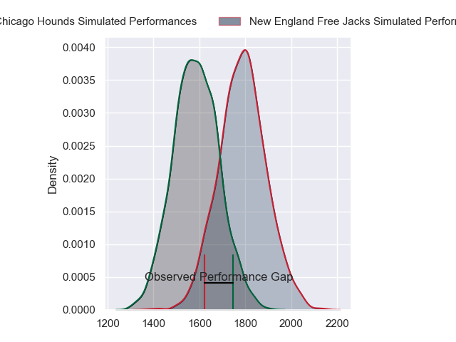
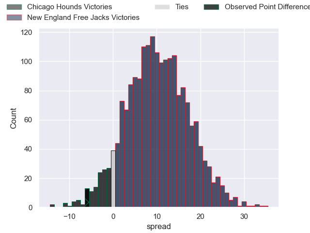
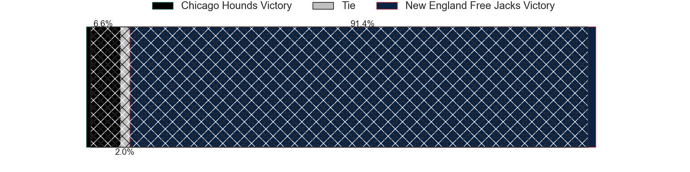
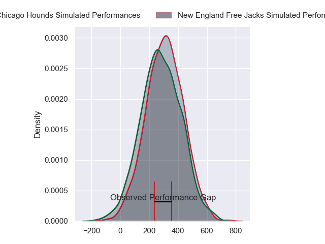
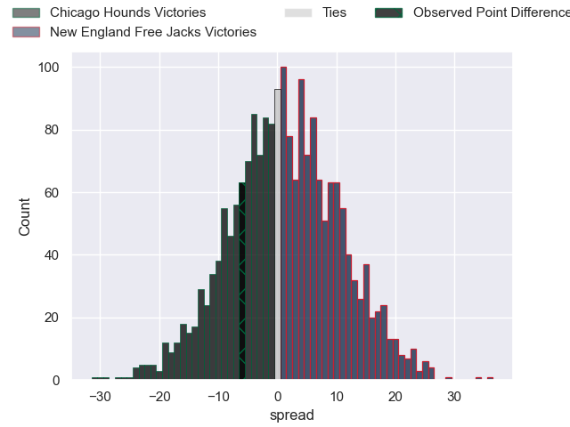

---  
layout: page  
title: Chicago Hounds at New England Free Jacks; 26-20  
date: 2024-05-05 18:00:00 -0500  
categories: "Major League Rugby 2024" match review  
---
# Chicago Hounds at New England Free Jacks; 26-20

# Club Level Predictions

The first set of predictions treats a club as the smallest object, as the club develops its members, organizes a gameplan, and deploys its players as needed for each match. This club model has a prediction of 0.747, which translates to predicting New England Free Jacks to win by 9.8.

Our Over/Under is 54.5 - and combined with the spread above, we have a predicted scoreline of 22 to 32

Each club has a rating and a rating deviation (similar to a Glicko rating), and expected performances can be generated. This allows for simulated matches and spreads like the ones below.
## Projected Performances - Club Model

## Projected Spreads - Club Model

## Projected Results - Club Model

# Player Level Predictions

Treating teams instead as an entity made up of the currently active players, I have ratings for each player in an altogether different system. These can be combined to form team ratings once teamsheets are announced, weighting starters a bit higher than the reserves. After the match is played, players can be weighted by their minutes on the field, allowing for an accurate measure of the team's composition. With these compiled team ratings, we can make predictions, measure inaccuracy, and update the individual player ratings.
## Prediction without Player Minutes: New England Free Jacks by 3.0

New England Free Jacks by 0.5 on a neutral pitch

## Projected Performances - Player Model

## Projected Spreads - Player Model

## Projected Results - Player Model

|   Away Minutes | Away Player     |   Away Percentile |   Number |   Home Percentile | Home Player             |   Home Minutes |
|---------------:|:----------------|------------------:|---------:|------------------:|:------------------------|---------------:|
|             80 | Charlie Abel    |             85.4  |        1 |             58.24 | Malakai Hala            |             80 |
|             80 | Dylan Fawsitt   |             99.33 |        2 |             64    | Andrew Quattrin         |             80 |
|             80 | Paddy Ryan      |             74.65 |        3 |             54.47 | John-Roy Jenkinson      |             80 |
|             80 | Mason Flesch    |              7.58 |        4 |             74.32 | Josh Larsen             |             80 |
|             80 | James Scott     |             85.14 |        5 |             53.19 | Jackson Thiebes         |             80 |
|             80 | Ben Landry      |             76.73 |        6 |             60.28 | Piers Von Dadelszen     |             80 |
|             80 | Maclean Jones   |             70.91 |        7 |             54.46 | Seta Baker              |             80 |
|             80 | Conall Boomer   |             55    |        8 |             77.61 | Martin Sigren           |             80 |
|             80 | Jason Higgins   |             77.09 |        9 |             72.47 | Cameron Nordli-Kelemeti |             80 |
|             80 | Adriaan Carelse |             66.16 |       10 |             70.04 | Jayson Potroz           |             80 |
|             80 | Nate Augspurger |             99.61 |       11 |             55.62 | Paula Balekana          |             80 |
|             80 | Bill Meakes     |             66.17 |       12 |             89.78 | Le Roux Malan           |             80 |
|             80 | Bryce Campbell  |             61.96 |       13 |             68.91 | Wayne Van Der Bank      |             80 |
|             80 | Noah Brown      |             74.32 |       14 |             55.81 | Mitch Jacobson          |             80 |
|             80 | Luke Carty      |             35.84 |       15 |             68.45 | Danyon Morgan-Puterangi |             80 |
|              0 | Janus Venter    |            nan    |       16 |            nan    | Mason Koch              |              0 |
|              0 | Fred Apulu      |             41.43 |       17 |             69.57 | Foster Dewitt           |              0 |
|              0 | Ignacio Peculo  |             87.86 |       18 |             69.65 | Kaleb Geiger            |              0 |
|              0 | George Merrick  |             48.33 |       19 |             59.76 | Kyle Baillie            |              0 |
|              0 | Luke White      |             13.48 |       20 |             55.87 | Cam Davidowicz          |              0 |
|              0 | Nick McCarthy   |             51.87 |       21 |            nan    | Holden Yungert          |              0 |
|              0 | Mark O'Keeffe   |             41.83 |       22 |             73.97 | Ben LeSage              |              0 |
|              0 | Cassh Maluia    |             36.78 |       23 |            nan    | Ethan Fryer             |              0 |

