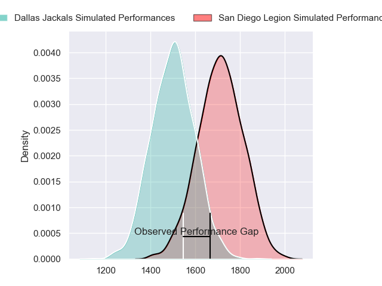
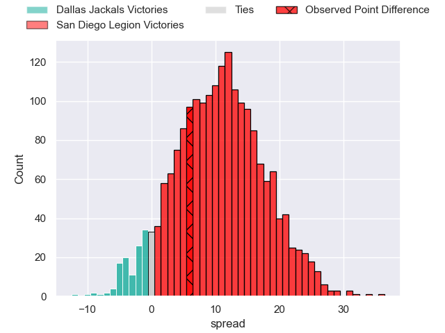
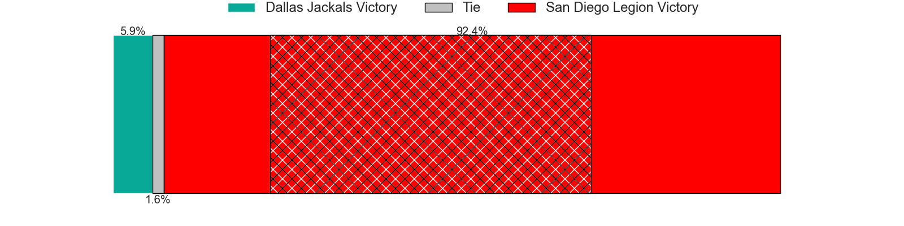
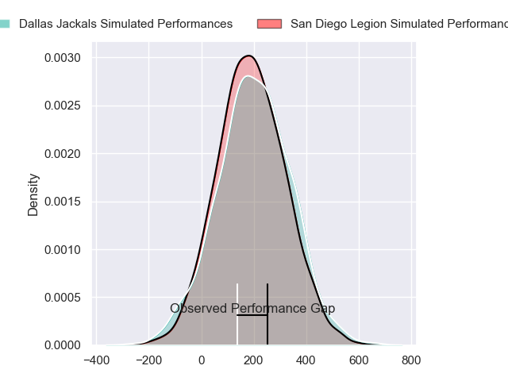
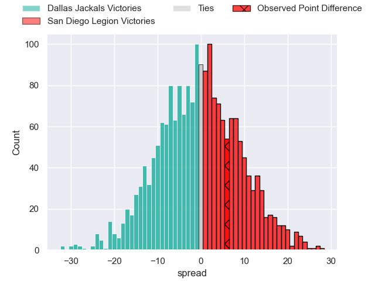

---  
layout: page  
title: Dallas Jackals at San Diego Legion; 24-30  
date: 2024-05-05 18:00:00 -0500  
categories: "Major League Rugby 2024" match review  
---
# Dallas Jackals at San Diego Legion; 24-30

# Club Level Predictions

The first set of predictions treats a club as the smallest object, as the club develops its members, organizes a gameplan, and deploys its players as needed for each match. This club model has a prediction of 0.766, which translates to predicting San Diego Legion to win by 10.8.

Our Over/Under is 58.5 - and combined with the spread above, we have a predicted scoreline of 24 to 35

Each club has a rating and a rating deviation (similar to a Glicko rating), and expected performances can be generated. This allows for simulated matches and spreads like the ones below.
## Projected Performances - Club Model

## Projected Spreads - Club Model

## Projected Results - Club Model

# Player Level Predictions

Treating teams instead as an entity made up of the currently active players, I have ratings for each player in an altogether different system. These can be combined to form team ratings once teamsheets are announced, weighting starters a bit higher than the reserves. After the match is played, players can be weighted by their minutes on the field, allowing for an accurate measure of the team's composition. With these compiled team ratings, we can make predictions, measure inaccuracy, and update the individual player ratings.
## Prediction without Player Minutes: San Diego Legion by 0.3

Dallas Jackals by 2.4 on a neutral pitch

## Projected Performances - Player Model

## Projected Spreads - Player Model

## Projected Results - Player Model

|   Away Minutes | Away Player         |   Away Percentile |   Number |   Home Percentile | Home Player          |   Home Minutes |
|---------------:|:--------------------|------------------:|---------:|------------------:|:---------------------|---------------:|
|             80 | Joaquín Horcada     |             71.62 |        1 |             51.35 | Payton Telea-Ilalio  |             80 |
|             80 | Dewald Kotze        |             65.33 |        2 |             46    | Cyrille Cama         |             80 |
|             80 | Juan Pablo Zeiss    |             67.02 |        3 |             70.71 | Luke Green           |             80 |
|             80 | Daemon Torres       |             67.24 |        4 |             46.92 | Jay Tuivaiti         |             80 |
|             80 | Lucas Bur           |             43.07 |        5 |             14.66 | Greg Peterson        |             80 |
|             80 | Jero Gomez Vara     |             68    |        6 |             78.13 | Vili Helu            |             80 |
|             80 | Makeen Alikhan      |             57.67 |        7 |             59.28 | Tupou Ma'Afu-Afungia |             80 |
|             80 | Ben Fry             |             40.65 |        8 |             68.48 | Tevita Tameilau      |             80 |
|             80 | Pit Imhoff          |             42.63 |        9 |             69.63 | Connor Tupai         |             80 |
|             80 | Martin Elias        |             65.09 |       10 |             75.86 | Lincoln Mcclutchie   |             80 |
|             80 | Jason Tidwell       |             57.27 |       11 |             73.64 | Ryan James           |             80 |
|             80 | Tomás Cubilla       |             34.46 |       12 |             55.74 | Ma'A Nonu            |             80 |
|             80 | Mitchell Richardson |             72.39 |       13 |             71.76 | Marcel Brache        |             80 |
|             80 | Tomy Malanos        |             70.45 |       14 |             62.11 | Tomas Aoake          |             80 |
|             80 | Vaughen Isaacs      |             38.41 |       15 |             48.5  | Alex Horan           |             80 |
|              0 | Connor Grindal      |            nan    |       16 |             40.83 | Chris Mickelson      |              0 |
|              0 | Jonah Auva'A        |            nan    |       17 |             41.67 | Djustice Sears-Duru  |              0 |
|              0 | Kyle Steeves        |            nan    |       18 |             52.42 | Darcy Breen          |              0 |
|              0 | Ronnie Mcelligott   |            nan    |       19 |            nan    | Brandon Harvey       |              0 |
|              0 | Cam Nelson          |            nan    |       20 |            nan    | Aminae Amiatu-Tanoi  |              0 |
|              0 | Brock Gallagher     |            nan    |       21 |             50.27 | Nick Boyer           |              0 |
|              0 | Marques Fuala'Au    |             50.25 |       22 |            nan    | Matt Giteau          |              0 |
|              0 | Nic Benn            |             63.86 |       23 |             51.07 | Mikey Te'O           |              0 |

