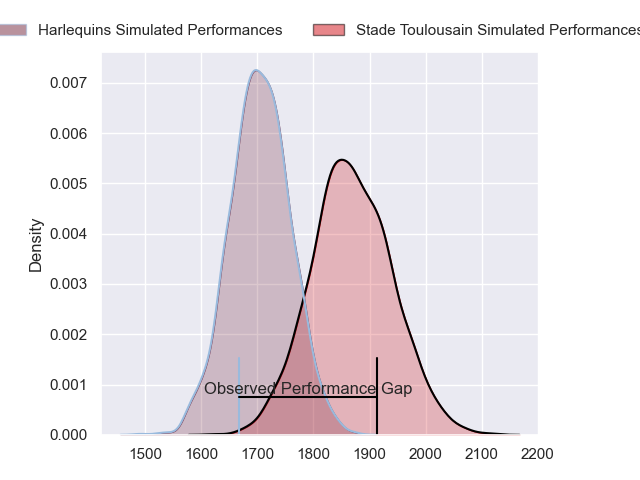
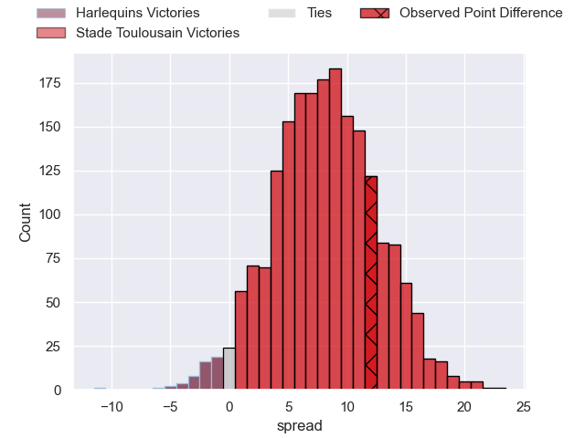
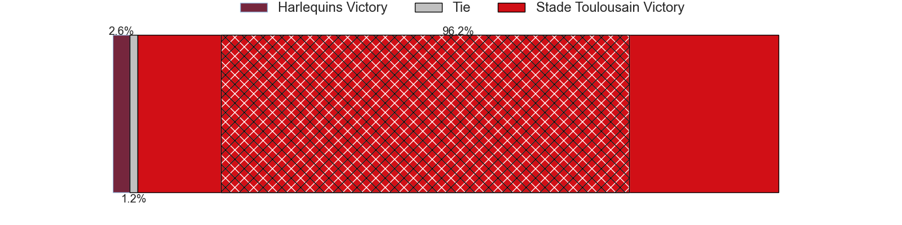
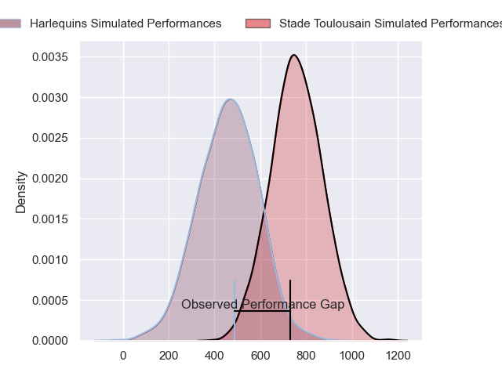
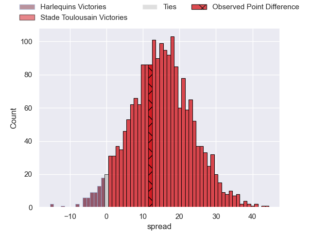
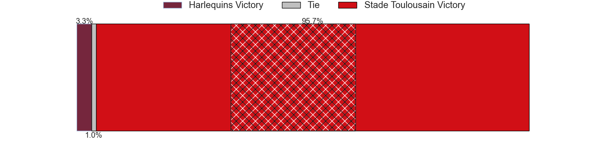

---  
layout: page  
title: Harlequins at Stade Toulousain; 26-38  
date: 2024-05-05 18:00:00 -0500  
categories: "European Rugby Champions Cup 2023" match review  
---
# Harlequins at Stade Toulousain; 26-38

# Club Level Predictions

The first set of predictions treats a club as the smallest object, as the club develops its members, organizes a gameplan, and deploys its players as needed for each match. This club model has a prediction of 0.717, which translates to predicting Stade Toulousain to win by 8.2.

Our Over/Under is 65.5 - and combined with the spread above, we have a predicted scoreline of 29 to 37

Each club has a rating and a rating deviation (similar to a Glicko rating), and expected performances can be generated. This allows for simulated matches and spreads like the ones below.
## Projected Performances - Club Model

## Projected Spreads - Club Model

## Projected Results - Club Model

# Player Level Predictions

Treating teams instead as an entity made up of the currently active players, I have ratings for each player in an altogether different system. These can be combined to form team ratings once teamsheets are announced, weighting starters a bit higher than the reserves. After the match is played, players can be weighted by their minutes on the field, allowing for an accurate measure of the team's composition. With these compiled team ratings, we can make predictions, measure inaccuracy, and update the individual player ratings.
## Prediction without Player Minutes: Stade Toulousain by 16.9

Stade Toulousain by 9.4 on a neutral pitch

## Projected Performances - Player Model

## Projected Spreads - Player Model

## Projected Results - Player Model

|   Away Minutes | Away Player               |   Away Percentile |   Number |   Home Percentile | Home Player         |   Home Minutes |
|---------------:|:--------------------------|------------------:|---------:|------------------:|:--------------------|---------------:|
|             51 | Fin Baxter                |             49.63 |        1 |             94.91 | Cyril Baille        |             61 |
|             79 | Jack Walker               |             29.57 |        2 |             93.19 | Peato Mauvaka       |             50 |
|             63 | Will Collier              |             94.34 |        3 |             95.32 | Dorian Aldegheri    |             61 |
|             72 | Irne Herbst               |             78.97 |        4 |             91.91 | Thibaud Flament     |             80 |
|             80 | Stephan Lewies            |             88.07 |        5 |             84.13 | Emmanuel Meafou     |             56 |
|             80 | Chandler Cunningham-South |             81.54 |        6 |             97.19 | Francois Cros       |             80 |
|             68 | Will Evans                |             83.15 |        7 |             93.28 | Jack Willis         |             72 |
|             80 | Alex Dombrandt            |             90    |        8 |             93.48 | Alexandre Roumat    |             80 |
|             63 | Danny Care                |             99.82 |        9 |             99.64 | Antoine Dupont      |             80 |
|             80 | Marcus Smith              |             89.85 |       10 |             94.6  | Romain Ntamack      |             80 |
|             80 | Cadan Murley              |             47.82 |       11 |             97.29 | Matthis Lebel       |             55 |
|             80 | Andre Esterhuizen         |             98.52 |       12 |             60.97 | Pita Ahki           |             80 |
|             76 | Luke Northmore            |             86.18 |       13 |             59.92 | Paul Costes         |             70 |
|             72 | Louis Lynagh              |             88.96 |       14 |             98.16 | Juan Cruz Mallia    |             80 |
|             80 | Tyrone Green              |             78.63 |       15 |            100    | Blair Kinghorn      |             80 |
|              8 | Sam Riley                 |             69.1  |       16 |             99    | Julien Marchand     |             30 |
|             29 | Joe Marler                |             98.03 |       17 |             59.89 | Rodrigue Neti       |             19 |
|             17 | Simon Kerrod              |             28.96 |       18 |             80.15 | Joel Merkler        |             19 |
|              8 | George Hammond            |             20.42 |       19 |             76.64 | Richie Arnold       |             24 |
|             12 | James Chisholm            |             92.17 |       20 |             71.61 | Mathis Castro       |              8 |
|             17 | Will Porter               |             33.27 |       21 |             46.98 | Paul Graou          |              0 |
|              1 | Jarrod Evans              |             88.98 |       22 |             16.24 | Santiago Chocobares |             10 |
|              4 | Oscar Beard               |             74.16 |       23 |             96.37 | Thomas Ramos        |             25 |

