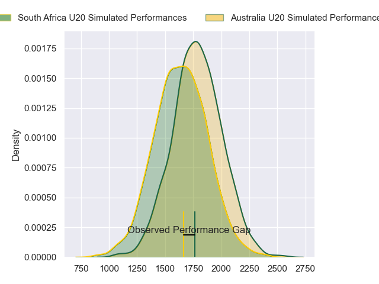
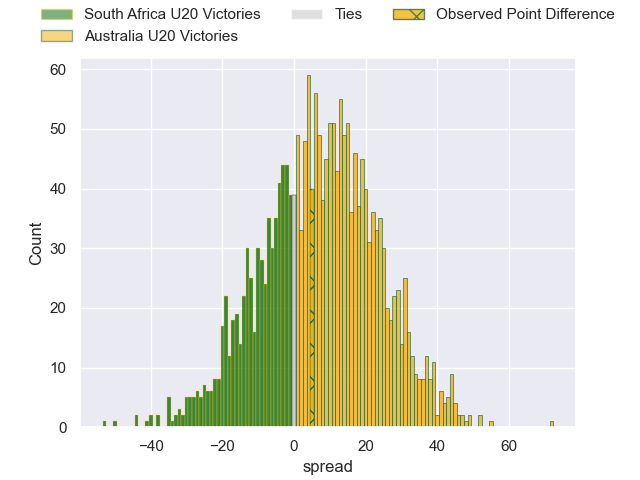
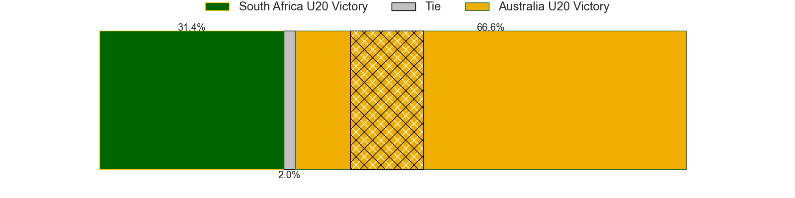
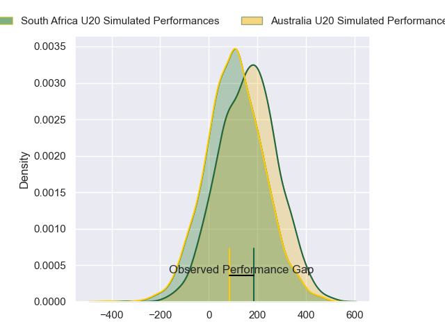
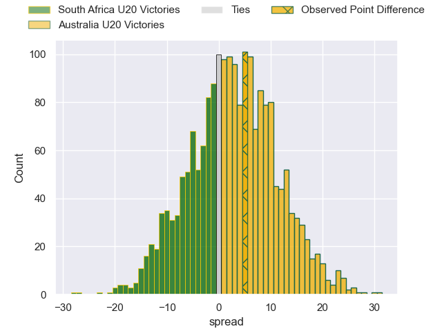
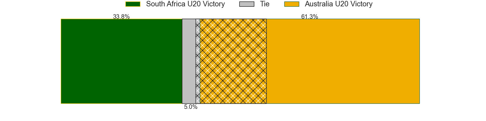

---  
layout: page  
title: South Africa U20 at Australia U20; 19-24  
date: 2024-05-07 18:00:00 -0500  
categories: "Rugby Championship U20 2024" match review  
---
# South Africa U20 at Australia U20; 19-24

# Club Level Predictions

The first set of predictions treats a club as the smallest object, as the club develops its members, organizes a gameplan, and deploys its players as needed for each match. This club model has a prediction of 0.654, which translates to predicting Australia U20 to win by 6.9.

Our Over/Under is 53.5 - and combined with the spread above, we have a predicted scoreline of 23 to 30

Each club has a rating and a rating deviation (similar to a Glicko rating), and expected performances can be generated. This allows for simulated matches and spreads like the ones below.
## Projected Performances - Club Model

## Projected Spreads - Club Model

## Projected Results - Club Model

# Player Level Predictions

Treating teams instead as an entity made up of the currently active players, I have ratings for each player in an altogether different system. These can be combined to form team ratings once teamsheets are announced, weighting starters a bit higher than the reserves. After the match is played, players can be weighted by their minutes on the field, allowing for an accurate measure of the team's composition. With these compiled team ratings, we can make predictions, measure inaccuracy, and update the individual player ratings.
## Prediction without Player Minutes: Australia U20 by 3.1

Australia U20 by 0.9 on a neutral pitch

## Projected Performances - Player Model

## Projected Spreads - Player Model

## Projected Results - Player Model

|   Away Minutes | Away Player               |   Away Percentile |   Number |   Home Percentile | Home Player         |   Home Minutes |
|---------------:|:--------------------------|------------------:|---------:|------------------:|:--------------------|---------------:|
|           80   | Mbasa Maqubela            |             42.82 |        1 |             83.92 | Angus Bell          |             57 |
|           32.5 | Ethan Bester              |             47.18 |        2 |             38.54 | Ottavio Tuipulotu   |             40 |
|           57   | Reno Hirst                |             42.74 |        3 |             38.97 | Nick Bloomfield     |             51 |
|           80   | Batho Hlekani             |             48.63 |        4 |             28.41 | Toby Macpherson     |             80 |
|           80   | JF van Heerden            |             38.22 |        5 |             47.12 | Ollie Mccrea        |             20 |
|           24   | Divan Fuller              |             40.52 |        6 |             37.91 | Ben Di Staso        |             80 |
|           52   | Keanu Coetsee             |             39.82 |        7 |             45.04 | Dane Sawers         |             80 |
|           52   | Tiaan Jacobs              |             43.91 |        8 |             25.22 | Jack Harley         |             80 |
|           73   | Asad Moos                 |             47.69 |        9 |             46.62 | Hwi Sharples        |             69 |
|           80   | Thurlon Williams          |             38.66 |       10 |             38.01 | Cullen Gray         |             54 |
|           32.5 | Litelihle Bester          |             45.4  |       11 |             42.59 | Angus Staniforth    |             80 |
|           65   | Philip-Albert Van Niekerk |             37.87 |       12 |             25.53 | Ronan Leahy         |             80 |
|           80   | Jurenzo Julius            |             41.35 |       13 |             42.72 | Frankie Goldsbrough |             80 |
|           80   | Joshua Boulle             |             44.43 |       14 |             48.21 | Kauri Tipene-Grace  |             64 |
|           40   | Michail Damon             |             40.38 |       15 |             25.21 | Shane Wilcox        |             80 |
|           15   | Cj Erasmus                |            nan    |       16 |             26.41 | Bryn Edwards        |             40 |
|           56   | Liyema Ntshanga           |            nan    |       17 |            nan    | Lington Ieli        |             23 |
|           23   | Casper Badenhorst         |            nan    |       18 |             25.59 | Tevita Alatini      |             29 |
|           28   | Adam De Waal              |             48.23 |       19 |             28.01 | Harvey Cordukes     |             60 |
|           28   | Thabang Mphafi            |            nan    |       20 |             20.46 | Joe Liddy           |              0 |
|            7   | Hassiem Pead              |            nan    |       21 |             24.91 | Doug Philipson      |             11 |
|           15   | Bruce Sherwood            |             42.3  |       22 |             24.19 | Joey Fowler         |             26 |
|           40   | Jc Mars                   |            nan    |       23 |            nan    | Divad Palu          |             16 |
|          nan   | nan                       |            nan    |       24 |            nan    |                     |              0 |

