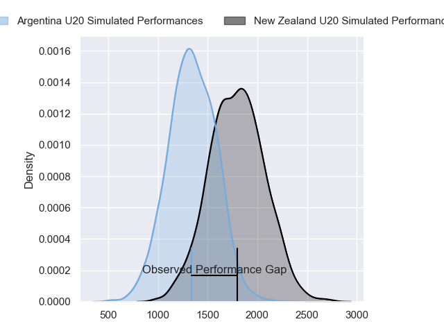
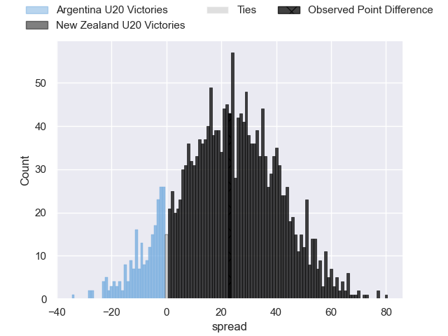
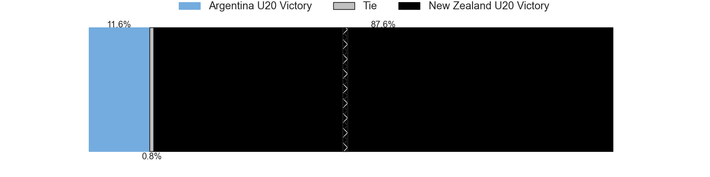
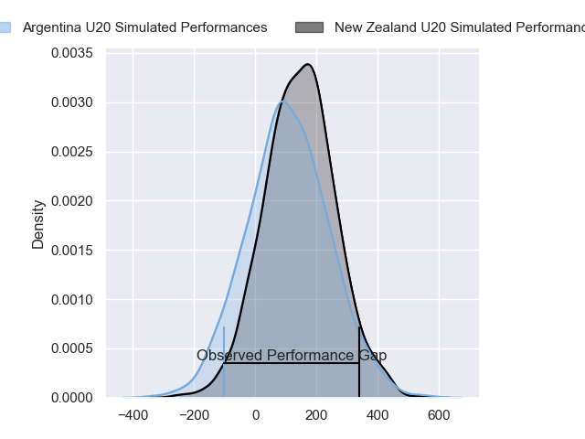
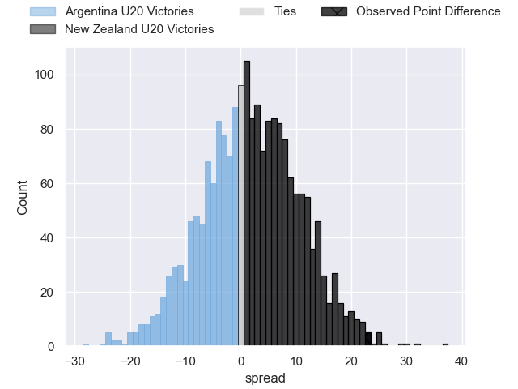
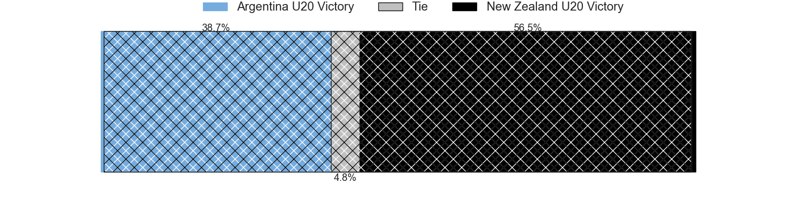

---  
layout: page  
title: Argentina U20 at New Zealand U20; 20-43  
date: 2024-05-07 18:00:00 -0500  
categories: "Rugby Championship U20 2024" match review  
---
# Argentina U20 at New Zealand U20; 20-43

# Club Level Predictions

The first set of predictions treats a club as the smallest object, as the club develops its members, organizes a gameplan, and deploys its players as needed for each match. This club model has a prediction of 0.889, which translates to predicting New Zealand U20 to win by 22.5.

Our Over/Under is 75.5 - and combined with the spread above, we have a predicted scoreline of 27 to 49

Each club has a rating and a rating deviation (similar to a Glicko rating), and expected performances can be generated. This allows for simulated matches and spreads like the ones below.
## Projected Performances - Club Model

## Projected Spreads - Club Model

## Projected Results - Club Model

# Player Level Predictions

Treating teams instead as an entity made up of the currently active players, I have ratings for each player in an altogether different system. These can be combined to form team ratings once teamsheets are announced, weighting starters a bit higher than the reserves. After the match is played, players can be weighted by their minutes on the field, allowing for an accurate measure of the team's composition. With these compiled team ratings, we can make predictions, measure inaccuracy, and update the individual player ratings.
## Prediction without Player Minutes: New Zealand U20 by 2.4

New Zealand U20 by 0.2 on a neutral pitch

## Projected Performances - Player Model

## Projected Spreads - Player Model

## Projected Results - Player Model

|   Away Minutes | Away Player           |   Away Percentile |   Number |   Home Percentile | Home Player            |   Home Minutes |
|---------------:|:----------------------|------------------:|---------:|------------------:|:-----------------------|---------------:|
|           21.5 | Estanislao Rodríguez  |             37.98 |        1 |             60.21 | Will Martin            |           61   |
|           56   | Juan Manuel Vivas     |             50.5  |        2 |             61.13 | Vernon Bason           |           61   |
|           80   | Gael Galván           |             31.09 |        3 |             52.91 | Joshua Smith           |           30.5 |
|           80   | Efraín Elías          |             34.28 |        4 |             63.7  | Cameron Christie       |           80   |
|           56   | Luciano Asevedo       |             42.37 |        5 |             56.83 | Liam Jack              |           49   |
|           80   | Julián Rossi          |             29.19 |        6 |             47.94 | Andrew Smith           |           30.5 |
|           80   | Agustín Sarelli       |             23.47 |        7 |             55.07 | Matt Lowe              |           61   |
|           80   | Juan Pedro Bernasconi |             46.3  |        8 |             55.43 | Malachi Wrampling-Alec |           80   |
|           80   | Tomás Di Biase        |             50.18 |        9 |             58.54 | Dylan Pledger          |           62   |
|           52   | Mateo Fossati         |             33.48 |       10 |             53.78 | Rico Simpson           |           63   |
|           80   | Timoteo Silva         |             32.14 |       11 |             56.15 | Frank Vaenuku          |           63   |
|           77   | Tomás Medina          |             27.74 |       12 |             56.75 | Tofuka Paongo          |           80   |
|           80   | Tomás Bocco           |             44.73 |       13 |             55.49 | Xavi Taele             |           80   |
|           77   | Gregorio Pérez Pardo  |             28.75 |       14 |             61.18 | King Maxwell           |           80   |
|           80   | Benjamín Elizalde     |             48.08 |       15 |             56.2  | Sam Coles              |           80   |
|           24   | Marcos Camerlinckx    |            nan    |       16 |            nan    | Manumaua Letiu         |           19   |
|            0   | Diego Correa          |             62.35 |       17 |            nan    | Sika Pole              |           19   |
|           40   | Tomás Rapetti         |             63.9  |       18 |            nan    | Kurene Luamanuvae      |           19   |
|           24   | Alejandro Barrios     |            nan    |       19 |             45.3  | Tom Allen              |           31   |
|            0   | Ignacio Torrado       |            nan    |       20 |             39.52 | Johnny Lee             |           19   |
|           21.5 | Facundo Rodríguez     |            nan    |       21 |             44.48 | Ben O'Donovan          |            0   |
|           28   | Santino Di Lucca      |             57.24 |       22 |             39.09 | Cooper Grant           |           17   |
|            3   | Franco Rossetto       |             65.54 |       23 |            nan    | Josh Whaanga           |           17   |

