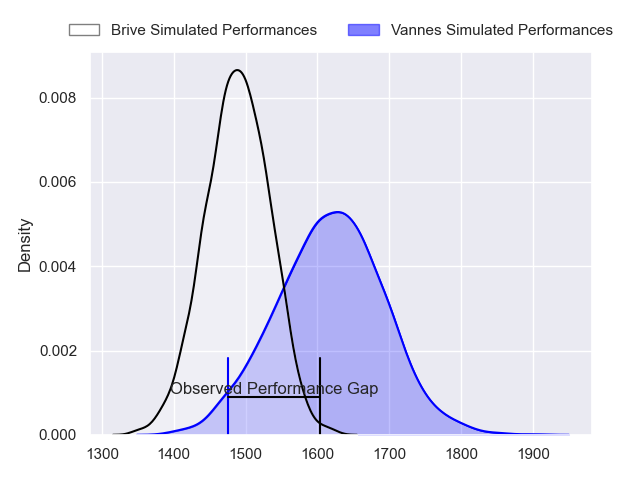
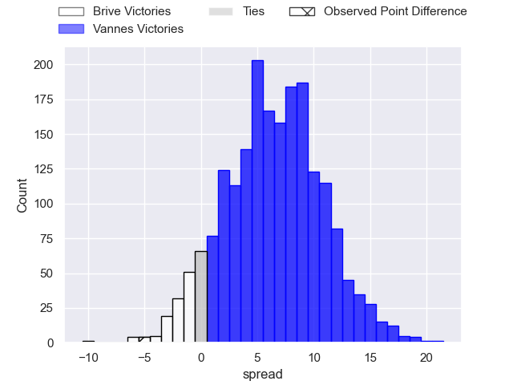
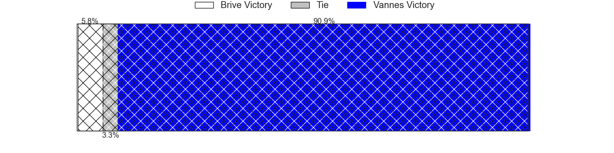
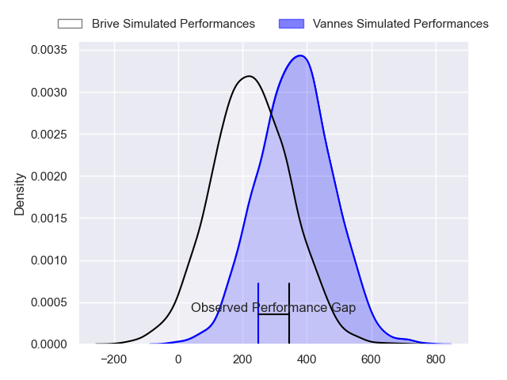
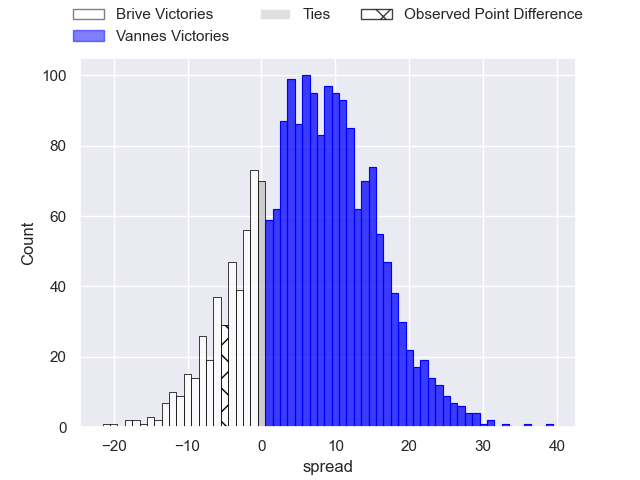
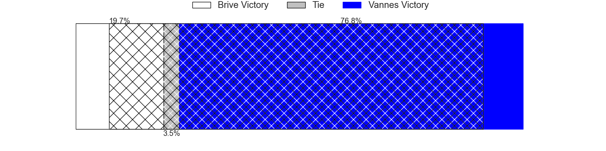

---  
layout: page  
title: Brive at Vannes; 26-21  
date: 2024-05-09 18:00:00 -0500  
categories: "Pro D2 2023" match review  
---
# Brive at Vannes; 26-21

# Club Level Predictions

The first set of predictions treats a club as the smallest object, as the club develops its members, organizes a gameplan, and deploys its players as needed for each match. This club model has a prediction of 0.676, which translates to predicting Vannes to win by 6.5.

Our Over/Under is 45.5 - and combined with the spread above, we have a predicted scoreline of 20 to 26

Each club has a rating and a rating deviation (similar to a Glicko rating), and expected performances can be generated. This allows for simulated matches and spreads like the ones below.
## Projected Performances - Club Model

## Projected Spreads - Club Model

## Projected Results - Club Model

# Player Level Predictions

Treating teams instead as an entity made up of the currently active players, I have ratings for each player in an altogether different system. These can be combined to form team ratings once teamsheets are announced, weighting starters a bit higher than the reserves. After the match is played, players can be weighted by their minutes on the field, allowing for an accurate measure of the team's composition. With these compiled team ratings, we can make predictions, measure inaccuracy, and update the individual player ratings.
## Prediction without Player Minutes: Vannes by 9.3

Vannes by 5.3 on a neutral pitch

## Projected Performances - Player Model

## Projected Spreads - Player Model

## Projected Results - Player Model

|   Away Minutes | Away Player               |   Away Percentile |   Number |   Home Percentile | Home Player             |   Home Minutes |
|---------------:|:--------------------------|------------------:|---------:|------------------:|:------------------------|---------------:|
|             29 | Daniel Brennan            |             15.08 |        1 |             90.63 | Andy Bordelai           |             59 |
|             53 | Lucas da Silva            |             52.14 |        2 |             87.01 | Pat Leafa               |             49 |
|             29 | Marcel van der Merwe      |             12.39 |        3 |             94.13 | Paga Tafili             |             55 |
|             67 | Renger Van Eerten         |             71.66 |        4 |             85.43 | Darren O'Shea           |             49 |
|             51 | Tevita Ratuva             |             73.87 |        5 |             15.08 | Mattéo Desjeux          |             80 |
|             80 | Retief Marais             |             85.38 |        6 |             28.75 | Juan Bautista Pedemonte |             68 |
|             80 | Ross Moriarty             |             94.07 |        7 |             22.04 | Gregoire Bazin          |             49 |
|             53 | Taniela Sadrugu           |             60.77 |        8 |             91.04 | Joe Edwards             |             80 |
|             80 | Leo Carbonneau            |             64.4  |        9 |             93.89 | Michael Ruru            |             68 |
|             67 | Stuart Olding             |             92.54 |       10 |             94.24 | Maxime Lafage           |             80 |
|             80 | Arthur Bonneval           |             85.99 |       11 |             77.58 | Romaric Camou           |             80 |
|             80 | Sam Johnson               |             91.8  |       12 |              9.15 | Alex Arrate             |             80 |
|             80 | Georges Shvelidze         |             57.62 |       13 |             11.46 | Andres Vilaseca         |             68 |
|             80 | Mathis Ferté              |             77.2  |       14 |             65.22 | Paul Surano             |             80 |
|             80 | Nic Krone                 |             59.66 |       15 |             60.52 | Thibault Debaes         |             80 |
|             51 | Nathan Fraissenon         |            nan    |       16 |             66.28 | Théo Beziat             |             31 |
|             51 | Francisco Coria Marchetti |             14.91 |       17 |             60.98 | Sione Kalamafoni        |             31 |
|             29 | Asier Usarraga            |             78.09 |       18 |             98.81 | Francisco Gorrissen     |             31 |
|             27 | Matthieu Voisin           |             33    |       19 |             32.6  | Simon Bourgeois         |             25 |
|             27 | Benjamin Boudou           |             42.27 |       20 |              6.76 | Ximun Bessonart         |             21 |
|             13 | Tom Raffy                 |             42.86 |       21 |             13.37 | Eric Marks              |             12 |
|             13 | Julien Delannoy           |             31.66 |       22 |             67.82 | Robin Taccola           |             12 |
|            nan | nan                       |            nan    |       23 |             39.44 | Jules Le Bail           |             12 |

