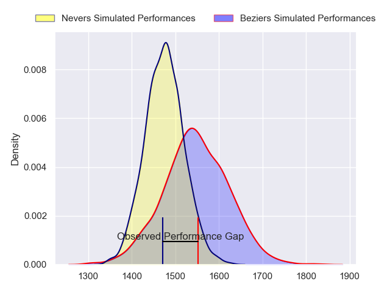
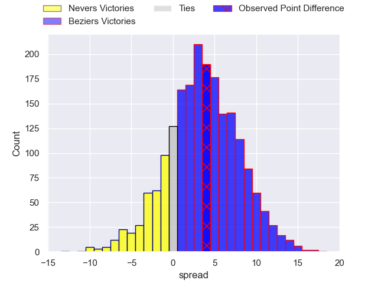
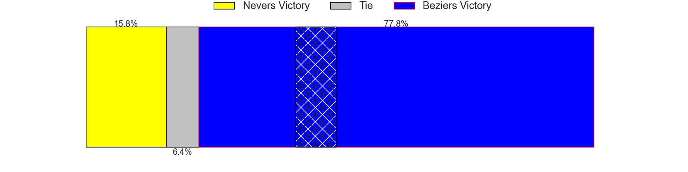
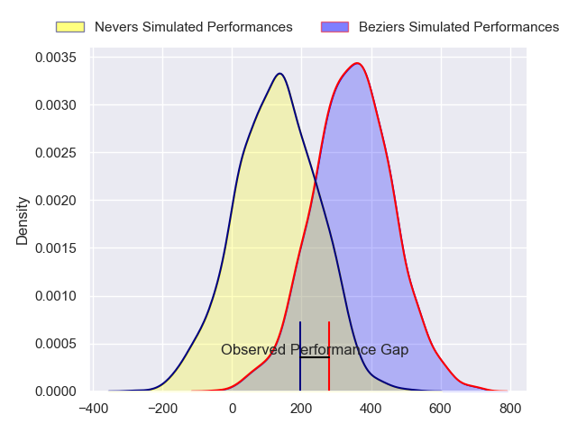
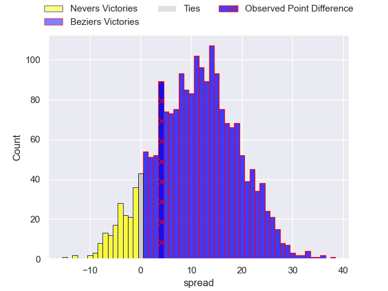
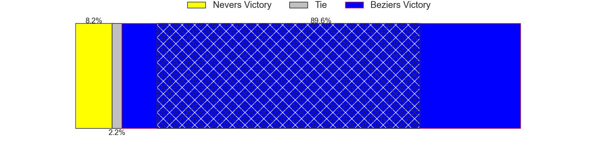

---  
layout: page  
title: Nevers at Beziers; 16-20  
date: 2024-05-10 18:00:00 -0500  
categories: "Pro D2 2023" match review  
---
# Nevers at Beziers; 16-20

# Club Level Predictions

The first set of predictions treats a club as the smallest object, as the club develops its members, organizes a gameplan, and deploys its players as needed for each match. This club model has a prediction of 0.601, which translates to predicting Beziers to win by 3.6.

Our Over/Under is 44.5 - and combined with the spread above, we have a predicted scoreline of 20 to 24

Each club has a rating and a rating deviation (similar to a Glicko rating), and expected performances can be generated. This allows for simulated matches and spreads like the ones below.
## Projected Performances - Club Model

## Projected Spreads - Club Model

## Projected Results - Club Model

# Player Level Predictions

Treating teams instead as an entity made up of the currently active players, I have ratings for each player in an altogether different system. These can be combined to form team ratings once teamsheets are announced, weighting starters a bit higher than the reserves. After the match is played, players can be weighted by their minutes on the field, allowing for an accurate measure of the team's composition. With these compiled team ratings, we can make predictions, measure inaccuracy, and update the individual player ratings.
## Prediction without Player Minutes: Beziers by 12.0

Beziers by 3.5 on a neutral pitch

## Projected Performances - Player Model

## Projected Spreads - Player Model

## Projected Results - Player Model

|   Away Minutes | Away Player           |   Away Percentile |   Number |   Home Percentile | Home Player         |   Home Minutes |
|---------------:|:----------------------|------------------:|---------:|------------------:|:--------------------|---------------:|
|             45 | Tornike Mataradze     |             57.78 |        1 |             12.14 | Francisco Fernandes |             52 |
|             52 | Elia Elia             |             59.21 |        2 |             80.43 | Jose Luis Gonzalez  |             45 |
|             45 | Cleopas Kundiona      |             34.64 |        3 |             72.53 | Jon Zabala Arrieta  |             76 |
|             80 | Lasha Jaiani          |             86.53 |        4 |              5.03 | Hans N'kinsi        |             76 |
|             44 | Makatuki Polutele     |             13.47 |        5 |             21.51 | John Madigan        |             52 |
|             52 | Luka Plataret         |             81.23 |        6 |             71.94 | Otonuku Jr Pauta    |             80 |
|             41 | Julien Kazubek        |             82.71 |        7 |             74.31 | Clement Ancely      |             80 |
|             80 | Jason-Colin Fraser    |             89.34 |        8 |             58.85 | Sias Koen           |             34 |
|             80 | Hugo Bouyssou         |              9.25 |        9 |             89.18 | Samuel Marques      |             64 |
|             67 | Shaun Reynolds        |             34.97 |       10 |             61.62 | Charly Malie        |             80 |
|             80 | Johan Georg Wasserman |             54.49 |       11 |             15.75 | Pierre Courtaud     |             80 |
|             80 | Mattéo Faucher        |             60.67 |       12 |             84.54 | Watisoni Votu       |             80 |
|             80 | Arthur Mathiron       |             47.32 |       13 |             47.63 | Maxime Espeut       |             80 |
|             59 | Thomas Zenon          |              3.57 |       14 |             84.73 | Raffaele Storti     |             34 |
|             80 | Kylian Jaminet        |             79.83 |       15 |             90.99 | Gabin Lorre         |             80 |
|             39 | Hugues Bastide        |             86.76 |       16 |             28.06 | William van Bost    |             46 |
|             36 | Chris Gabriel         |             51.56 |       17 |             91.06 | Tim Nanai-Williams  |             46 |
|             35 | Aitor Kitutu          |             66.18 |       18 |             79.61 | Wilmar Arnoldi      |             35 |
|             35 | Ilia Kaikatsishvili   |             57.46 |       19 |             36.84 | Youssef Amrouni     |             28 |
|             28 | Kevin Noah            |             33.27 |       20 |             12.36 | Pierre Gayraud      |             28 |
|             28 | Jonathan Maiau        |              9.7  |       21 |             33.16 | Mitch Short         |             16 |
|             21 | Guillaume Manevy      |              7.5  |       22 |             64.79 | Luka Tchelidze      |              4 |
|             13 | Yohan Le Bourhis      |             76.55 |       23 |             66.43 | Clément Bitz        |              4 |

