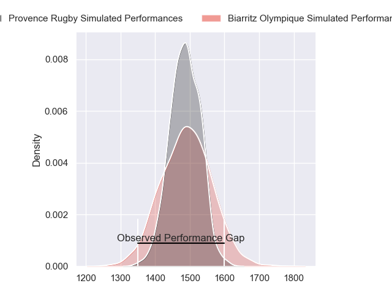
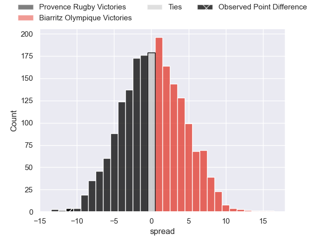
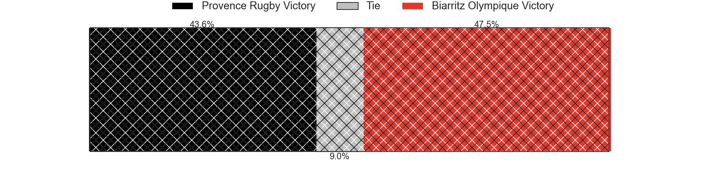
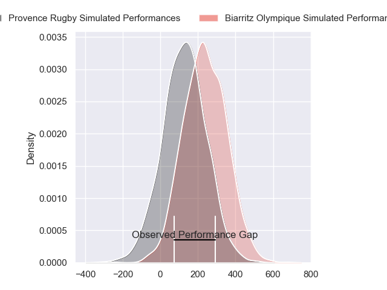
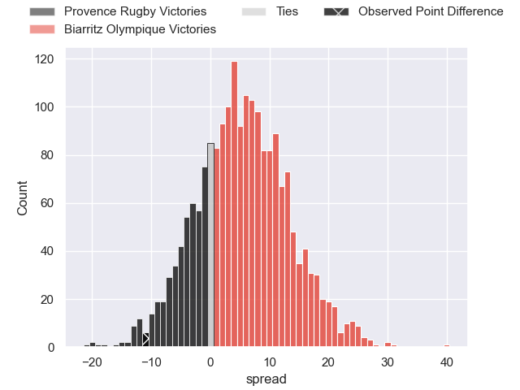
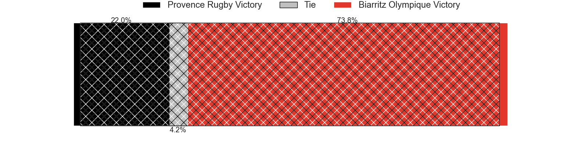

---  
layout: page  
title: Provence Rugby at Biarritz Olympique; 27-16  
date: 2024-05-10 18:00:00 -0500  
categories: "Pro D2 2023" match review  
---
# Provence Rugby at Biarritz Olympique; 27-16

# Club Level Predictions

The first set of predictions treats a club as the smallest object, as the club develops its members, organizes a gameplan, and deploys its players as needed for each match. This club model has a prediction of 0.509, which translates to predicting Biarritz Olympique to win by 0.3.

Our Over/Under is 56.5 - and combined with the spread above, we have a predicted scoreline of 28 to 28

Each club has a rating and a rating deviation (similar to a Glicko rating), and expected performances can be generated. This allows for simulated matches and spreads like the ones below.
## Projected Performances - Club Model

## Projected Spreads - Club Model

## Projected Results - Club Model

# Player Level Predictions

Treating teams instead as an entity made up of the currently active players, I have ratings for each player in an altogether different system. These can be combined to form team ratings once teamsheets are announced, weighting starters a bit higher than the reserves. After the match is played, players can be weighted by their minutes on the field, allowing for an accurate measure of the team's composition. With these compiled team ratings, we can make predictions, measure inaccuracy, and update the individual player ratings.
## Prediction without Player Minutes: Biarritz Olympique by 6.2

Provence Rugby by 2.7 on a neutral pitch

## Projected Performances - Player Model

## Projected Spreads - Player Model

## Projected Results - Player Model

|   Away Minutes | Away Player           |   Away Percentile |   Number |   Home Percentile | Home Player        |   Home Minutes |
|---------------:|:----------------------|------------------:|---------:|------------------:|:-------------------|---------------:|
|             50 | Thomas Vernet         |             57.62 |        1 |             11.08 | Zakaria El Fakir   |             62 |
|             50 | Loick Jammes          |              3.78 |        2 |             52.96 | Luteru Tolai       |             70 |
|             50 | Paul Mallez           |             81.26 |        3 |             78.57 | Mohamed Haouas     |             70 |
|             80 | Andres Zafra Tarazona |              1.81 |        4 |              1.41 | Johnny Dyer        |             41 |
|             44 | Josh Tyrell           |             80.5  |        5 |             66.73 | Charlie Matthews   |             80 |
|             80 | Guillaume Piazzoli    |             83.4  |        6 |              5.24 | Charlie Francoz    |             48 |
|             50 | Jessy Jegerlehner     |              1.98 |        7 |             39.72 | Simon Augry        |             80 |
|             80 | Carl Axtens           |             56.93 |        8 |             21.54 | Temo Matiu         |             80 |
|             50 | Joris Cazenave        |             77.31 |        9 |             20.94 | Pierre Pages       |             70 |
|             80 | Enzo Selponi          |             91.04 |       10 |              5.12 | Billy Searle       |             80 |
|             80 | Adrien Lapegue-Lafaye |             35.65 |       11 |             12.08 | Vincent Martin     |             80 |
|             80 | Dorian Lavernhe       |             55.21 |       12 |             70.35 | Ilian Perraux      |             48 |
|             80 | Atila Septar          |             67.09 |       13 |             85.17 | Jonathan Joseph    |             80 |
|             50 | Sione Tui             |             87.73 |       14 |              9.57 | Zach Kibirige      |             80 |
|             50 | Mathias Colombet      |             63.73 |       15 |             37.12 | Gervais Cordin     |             80 |
|             36 | Malohi Suta           |             51.26 |       16 |              2.91 | Adrian Motoc       |             39 |
|             30 | Lucas Martin          |             92.43 |       17 |             50.61 | Killian Taofifenua |             18 |
|             30 | Julius Nostadt        |             85.82 |       18 |             71.5  | Yann David         |             32 |
|             30 | Bilel Taieb           |             86.26 |       19 |             47.76 | Tornike Jalagonia  |             32 |
|             30 | Arthur Coville        |             68.41 |       20 |             62.66 | Brendan Lebrun     |             10 |
|             30 | Adrian Sanday         |            nan    |       21 |             65.28 | Lasha Tabidze      |             10 |
|             30 | Tomas Francis         |             99.27 |       22 |             35.95 | Antoine Domercq    |             10 |
|             30 | Léo Drouet            |             64.59 |       23 |            nan    | nan                |            nan |

