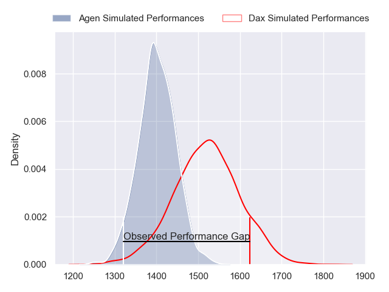
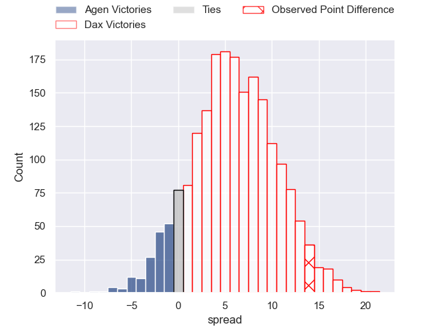
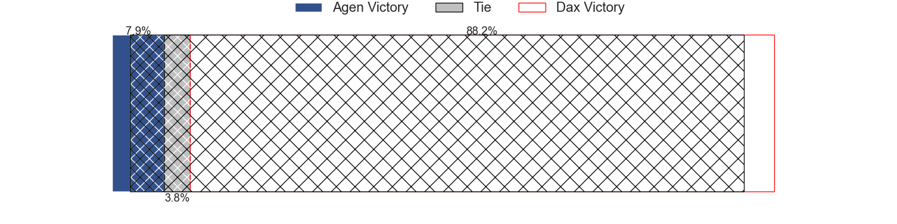
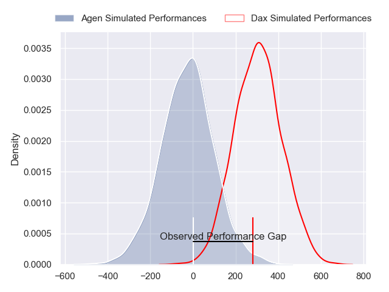
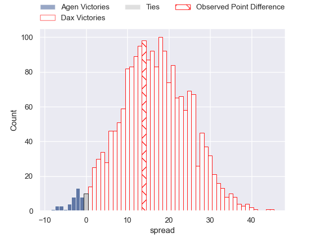
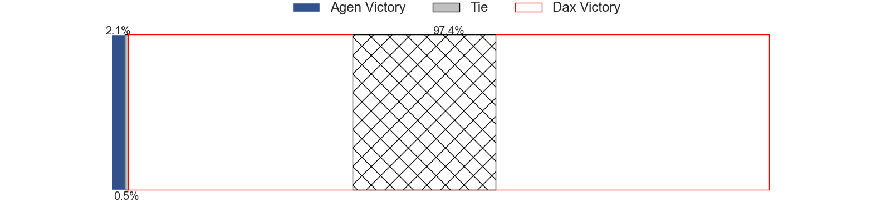

---  
layout: page  
title: Agen at Dax; 16-30  
date: 2024-05-10 18:00:00 -0500  
categories: "Pro D2 2023" match review  
---
# Agen at Dax; 16-30

# Club Level Predictions

The first set of predictions treats a club as the smallest object, as the club develops its members, organizes a gameplan, and deploys its players as needed for each match. This club model has a prediction of 0.665, which translates to predicting Dax to win by 6.0.

Our Over/Under is 52.5 - and combined with the spread above, we have a predicted scoreline of 23 to 29

Each club has a rating and a rating deviation (similar to a Glicko rating), and expected performances can be generated. This allows for simulated matches and spreads like the ones below.
## Projected Performances - Club Model

## Projected Spreads - Club Model

## Projected Results - Club Model

# Player Level Predictions

Treating teams instead as an entity made up of the currently active players, I have ratings for each player in an altogether different system. These can be combined to form team ratings once teamsheets are announced, weighting starters a bit higher than the reserves. After the match is played, players can be weighted by their minutes on the field, allowing for an accurate measure of the team's composition. With these compiled team ratings, we can make predictions, measure inaccuracy, and update the individual player ratings.
## Prediction without Player Minutes: Dax by 17.6

Dax by 10.1 on a neutral pitch

## Projected Performances - Player Model

## Projected Spreads - Player Model

## Projected Results - Player Model

|   Away Minutes | Away Player                   |   Away Percentile |   Number |   Home Percentile | Home Player        |   Home Minutes |
|---------------:|:------------------------------|------------------:|---------:|------------------:|:-------------------|---------------:|
|             57 | Hans Lombard-Buret            |             59.82 |        1 |             66.1  | Asa Faitotoa       |             48 |
|             49 | Mike Sosene-Feagai            |              7.07 |        2 |             53.45 | Maxime Delonca     |             48 |
|             49 | Beau Farrance                 |             31.05 |        3 |             48.33 | Thibaud Dréan      |             48 |
|             80 | Joe Maksymiw                  |              7.24 |        4 |             47.84 | Mattieu Bidau      |             41 |
|             80 | Corentin Vernet               |             28.84 |        5 |             72.46 | Mat Luamanu        |             80 |
|             40 | Vincent Farre                 |             57.02 |        6 |             50.4  | Théo Tremeau       |             80 |
|             80 | Arnaud Duputs                 |             76.68 |        7 |             63.14 | Paul Arnaud Ausset |             28 |
|             28 | Martin Devergie               |             10.23 |        8 |             44.14 | Sam Wasley         |             80 |
|             62 | Dorian Bellot                 |             14.66 |        9 |             73.47 | Simon Garrouteigt  |             48 |
|             60 | Ben Volavola                  |             19.4  |       10 |             62.69 | Romuald Séguy      |             55 |
|             60 | Iban Etcheverry               |             30.43 |       11 |              8.31 | Alexandre Pilati   |             80 |
|             80 | Peyo Muscarditz               |             69.09 |       12 |             90.33 | Ilikena Bolakoro   |             80 |
|             80 | Jean-Marcelin Buttin          |             32.07 |       13 |             81.18 | Alex McHenry       |             57 |
|             80 | Inoke Nalaga Kurukuruvakatini |              5.51 |       14 |             16.62 | Maxime Oltmann     |             80 |
|             80 | Loris Tolot                   |              0.64 |       15 |             70.17 | Théo Duprat        |             80 |
|             52 | Matthieu Bonnet               |             26.01 |       16 |             58.89 | Brice Ferrer       |             52 |
|             40 | Valentin Gayraud              |             29.84 |       17 |             68.94 | Étienne Loiret     |             39 |
|             31 | Pierre Jouvin                 |             10.86 |       18 |            nan    | Raphaël Laboille   |             32 |
|             31 | Alex Burin                    |             46.05 |       19 |             18.75 | Louis Barrere      |             32 |
|             23 | Mamuka Mstoiani               |            nan    |       20 |             39.04 | Nephi Leatigaga    |             32 |
|             20 | Tevita Railevu                |             65.31 |       21 |             82.9  | Sylvère Reteau     |             32 |
|             20 | Henry Purdy                   |             89.86 |       22 |             80.38 | Hugo Cerisier      |             25 |
|             18 | Emile Dayral                  |             21.54 |       23 |             85.91 | Hugo Fourquet      |             23 |

