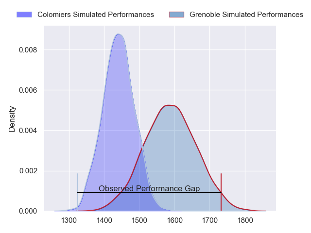
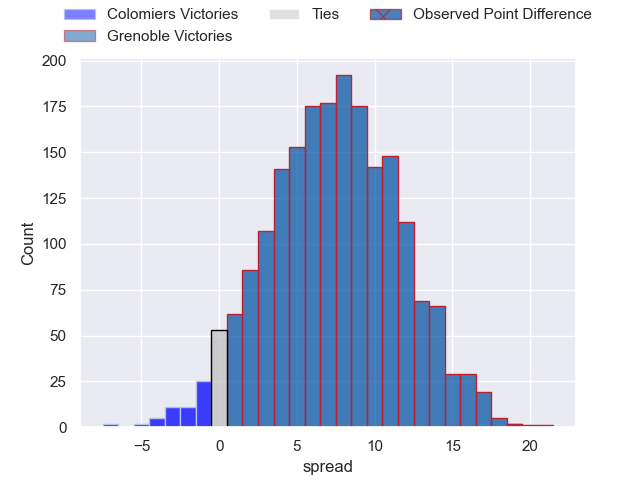
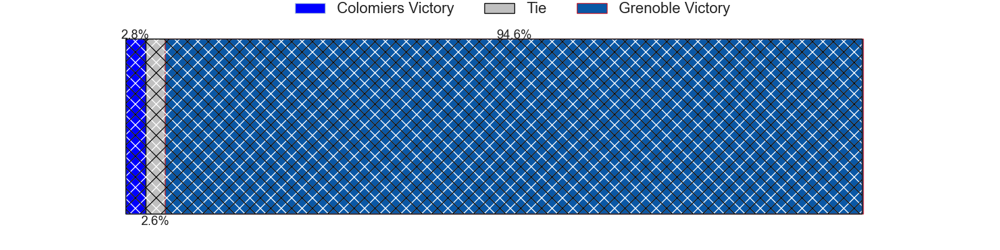
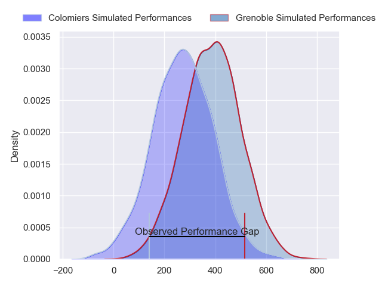
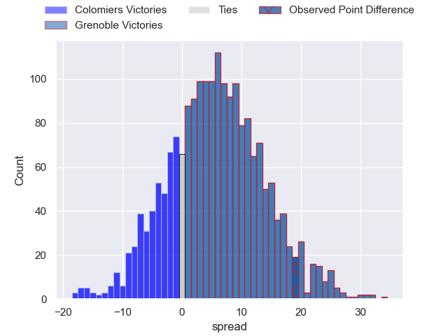
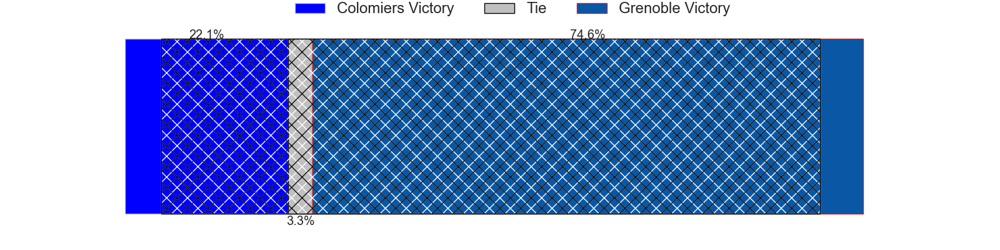

---  
layout: page  
title: Colomiers at Grenoble; 10-29  
date: 2024-05-10 18:00:00 -0500  
categories: "Pro D2 2023" match review  
---
# Colomiers at Grenoble; 10-29

# Club Level Predictions

The first set of predictions treats a club as the smallest object, as the club develops its members, organizes a gameplan, and deploys its players as needed for each match. This club model has a prediction of 0.699, which translates to predicting Grenoble to win by 7.4.

Our Over/Under is 55.5 - and combined with the spread above, we have a predicted scoreline of 24 to 31

Each club has a rating and a rating deviation (similar to a Glicko rating), and expected performances can be generated. This allows for simulated matches and spreads like the ones below.
## Projected Performances - Club Model

## Projected Spreads - Club Model

## Projected Results - Club Model

# Player Level Predictions

Treating teams instead as an entity made up of the currently active players, I have ratings for each player in an altogether different system. These can be combined to form team ratings once teamsheets are announced, weighting starters a bit higher than the reserves. After the match is played, players can be weighted by their minutes on the field, allowing for an accurate measure of the team's composition. With these compiled team ratings, we can make predictions, measure inaccuracy, and update the individual player ratings.
## Prediction without Player Minutes: Grenoble by 7.1

Colomiers by 0.8 on a neutral pitch

## Projected Performances - Player Model

## Projected Spreads - Player Model

## Projected Results - Player Model

|   Away Minutes | Away Player           |   Away Percentile |   Number |   Home Percentile | Home Player         |   Home Minutes |
|---------------:|:----------------------|------------------:|---------:|------------------:|:--------------------|---------------:|
|             51 | Hugo Djehi            |             71.88 |        1 |             32.44 | Eli Eglaine         |             58 |
|             51 | Andrew Ready          |             14.31 |        2 |             85.36 | Barnabé Massa       |             48 |
|             51 | Michael Simutoga      |             82.4  |        3 |             87.37 | Regis Montagne      |             51 |
|             80 | Jean Thomas           |             48.94 |        4 |             67.44 | Thomas Lainault     |             59 |
|             51 | Jack Whetton          |              6.23 |        5 |             82.91 | Pierce Phillips     |             48 |
|             80 | Anthony Coletta       |             45.06 |        6 |             91.21 | Jose Madeira        |             80 |
|             80 | Aldric Lescure        |             85.18 |        7 |             84.68 | Steeve Blanc-Mappaz |             80 |
|             56 | Jeremy Bechu          |             35.61 |        8 |             76.76 | Pio Muarua          |             80 |
|             51 | Mathis Galthié        |             46.07 |        9 |             93.72 | Eric Escande        |             58 |
|             80 | Maxime Javaux         |             52.45 |       10 |             88.7  | Sam Davies          |             70 |
|             80 | Rodrigo Marta         |             91.98 |       11 |             22.9  | Nathan Farissier    |             80 |
|             61 | Baptiste Serrano      |            100    |       12 |             82.02 | Romain Trouilloud   |             80 |
|             15 | Paul Pimienta         |             39.75 |       13 |             56.36 | Romain Fusier       |             68 |
|             80 | Vincent Pinto         |             88.12 |       14 |             77.1  | Geoffrey Cros       |             80 |
|             80 | Max Auriac            |             33.91 |       15 |             30.04 | Hugo Trouilloud     |             80 |
|             65 | Fabien Perrin         |             27.44 |       16 |             87.34 | Georgi Javakhia     |             32 |
|             29 | Pierre-Samuel Pacheco |             52.96 |       17 |             53.12 | Mathis Sarragallet  |             32 |
|             29 | Guillaume Tartas      |             76.94 |       18 |             83.78 | Irakli Aptsiauri    |             29 |
|             29 | Alexandre Manukula    |             39.1  |       19 |             97.06 | Bautista Ezcurra    |             12 |
|             29 | Ugo Seguela           |             51.31 |       20 |             83.29 | Zack Gauthier       |             22 |
|             29 | Marco Fepulea'i       |             10.84 |       21 |             10.99 | Barnabe Couilloud   |             22 |
|             24 | Jorick Dastugue       |             61.19 |       22 |             68.58 | Thibaut Martel      |             21 |
|             19 | Valentin Saurs        |              4.72 |       23 |             75.91 | Max Clement         |             10 |

