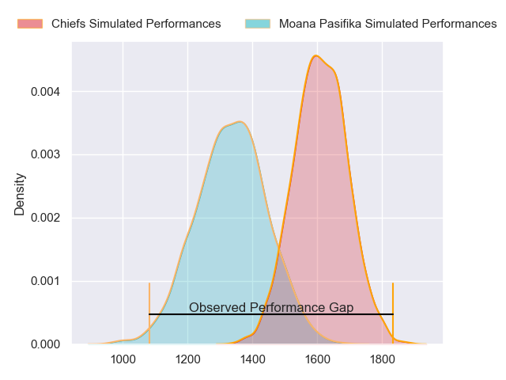
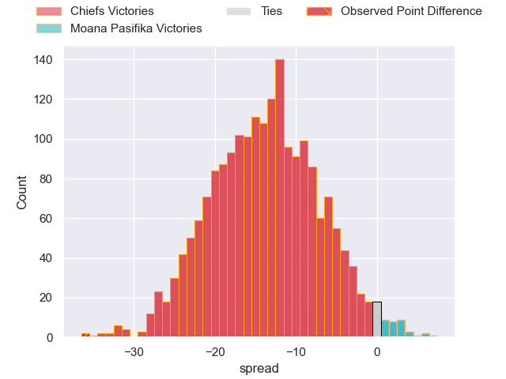
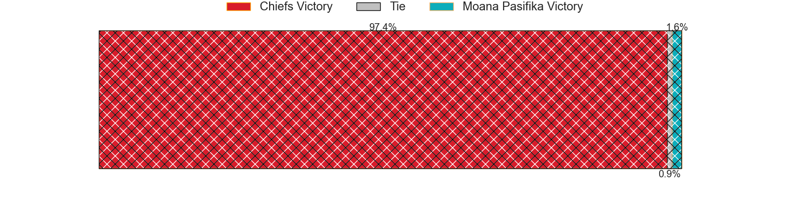
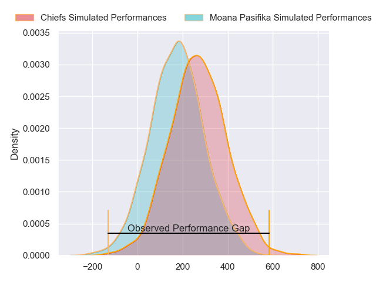
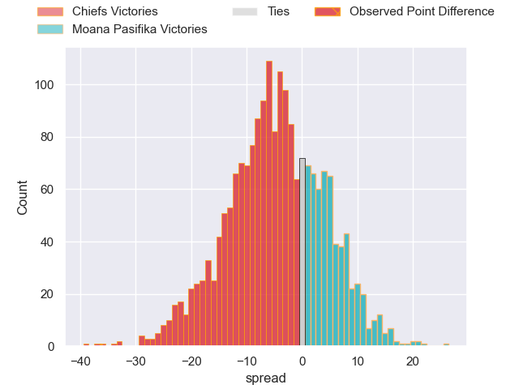

---  
layout: page  
title: Chiefs at Moana Pasifika; 43-7  
date: 2024-05-10 18:00:00 -0500  
categories: "Super Rugby Pacific 2024" match review  
---
# Chiefs at Moana Pasifika; 43-7

# Club Level Predictions

The first set of predictions treats a club as the smallest object, as the club develops its members, organizes a gameplan, and deploys its players as needed for each match. This club model has a prediction of 0.176, which translates to predicting Chiefs to win by 13.8.

Our Over/Under is 63.5 - and combined with the spread above, we have a predicted scoreline of 38 to 25

Each club has a rating and a rating deviation (similar to a Glicko rating), and expected performances can be generated. This allows for simulated matches and spreads like the ones below.
## Projected Performances - Club Model

## Projected Spreads - Club Model

## Projected Results - Club Model

# Player Level Predictions

Treating teams instead as an entity made up of the currently active players, I have ratings for each player in an altogether different system. These can be combined to form team ratings once teamsheets are announced, weighting starters a bit higher than the reserves. After the match is played, players can be weighted by their minutes on the field, allowing for an accurate measure of the team's composition. With these compiled team ratings, we can make predictions, measure inaccuracy, and update the individual player ratings.
## Prediction without Player Minutes: Chiefs by 4.3

Chiefs by 6.6 on a neutral pitch

## Projected Performances - Player Model

## Projected Spreads - Player Model

## Projected Results - Player Model

|   Away Minutes | Away Player            |   Away Percentile |   Number |   Home Percentile | Home Player       |   Home Minutes |
|---------------:|:-----------------------|------------------:|---------:|------------------:|:------------------|---------------:|
|             56 | Ollie Norris           |             86.47 |        1 |              8.15 | Abraham Pole      |             72 |
|             56 | Samisoni Taukei'aho    |             95.56 |        2 |             43.26 | Sama Malolo       |             56 |
|             53 | Reuben O'Neill         |             44.58 |        3 |             33.74 | Sione Mafileo     |             56 |
|             80 | Manaaki Selby-Rickit   |             23.82 |        4 |             66.83 | Semisi Paea       |             40 |
|             61 | Tupou Vaa'i            |             93.77 |        5 |              9.65 | Allan Craig       |             80 |
|             80 | Simon Parker           |             60.67 |        6 |             64.92 | Miracle Faiilagi  |             17 |
|             80 | Luke Jacobson          |             94.17 |        7 |             31.42 | Alamanda Motuga   |             80 |
|             67 | Wallace Sititi         |             53.73 |        8 |              6.82 | Lotu Inisi        |             63 |
|             55 | Xavier Roe             |             57.24 |        9 |             23.91 | Aisea Halo        |             56 |
|             80 | Josh Jacomb            |             50.32 |       10 |             12.15 | D'Angelo Leuila   |             80 |
|             69 | Daniel Rona            |             84.64 |       11 |             87.83 | Neria Fomai       |             80 |
|             80 | Quinn Tupaea           |             93.38 |       12 |              6.1  | Danny Toala       |             80 |
|             80 | Anton Lienert-Brown    |             94.64 |       13 |             59.31 | Pepesana Patafilo |             80 |
|             80 | Liam Coombes-Fabling   |             89.18 |       14 |             73.24 | Nigel Ah Wong     |             80 |
|             61 | Etene Nanai-Seturo     |             71.24 |       15 |             21.46 | Kyren Taumoefolau |             59 |
|             24 | Tyrone Thompson        |             75.33 |       16 |            nan    | Thomas Maka       |             24 |
|             24 | Jared Proffit          |             28.04 |       17 |              9.86 | Donald Brighouse  |              8 |
|             27 | Sione Ahio             |            nan    |       18 |             20.54 | Suetena Asomua    |             24 |
|             19 | Hamilton Burr          |            nan    |       19 |             91.26 | Tom Savage        |             40 |
|             13 | Kaylum Boshier         |             55.43 |       20 |             42.89 | Irie Papuni       |             63 |
|             25 | Te Toiroa Tahuriorangi |             69.63 |       21 |            nan    | Siaosi Nginingini |             24 |
|             11 | Rameka Poihipi         |             77.29 |       22 |             70.39 | Otumaka Mausia    |             17 |
|             19 | Gideon Wrampling       |            nan    |       23 |             14.98 | Anzelo Tuitavuki  |             21 |

