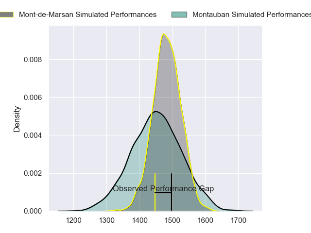
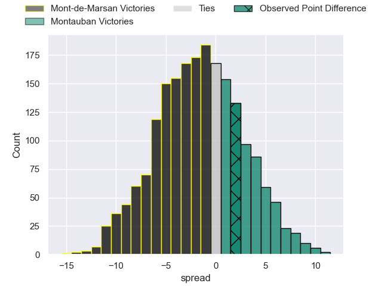
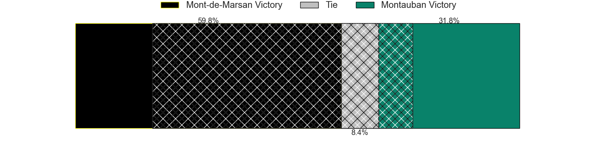
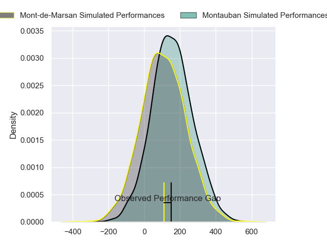
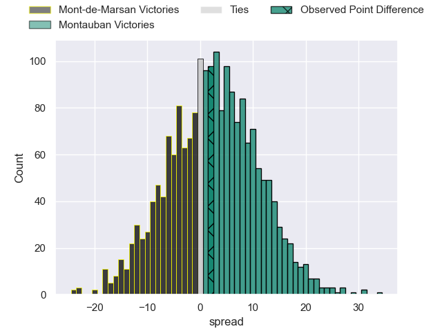
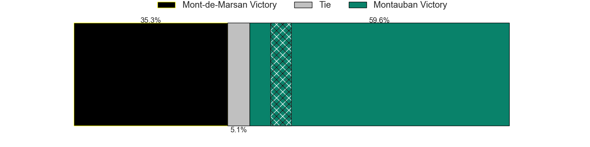

---  
layout: page  
title: Mont-de-Marsan at Montauban; 24-26  
date: 2024-05-10 18:00:00 -0500  
categories: "Pro D2 2023" match review  
---
# Mont-de-Marsan at Montauban; 24-26

# Club Level Predictions

The first set of predictions treats a club as the smallest object, as the club develops its members, organizes a gameplan, and deploys its players as needed for each match. This club model has a prediction of 0.454, which translates to predicting Mont-de-Marsan to win by 1.6.

Our Over/Under is 52.5 - and combined with the spread above, we have a predicted scoreline of 27 to 26

Each club has a rating and a rating deviation (similar to a Glicko rating), and expected performances can be generated. This allows for simulated matches and spreads like the ones below.
## Projected Performances - Club Model

## Projected Spreads - Club Model

## Projected Results - Club Model

# Player Level Predictions

Treating teams instead as an entity made up of the currently active players, I have ratings for each player in an altogether different system. These can be combined to form team ratings once teamsheets are announced, weighting starters a bit higher than the reserves. After the match is played, players can be weighted by their minutes on the field, allowing for an accurate measure of the team's composition. With these compiled team ratings, we can make predictions, measure inaccuracy, and update the individual player ratings.
## Prediction without Player Minutes: Montauban by 0.6

Mont-de-Marsan by 6.1 on a neutral pitch

## Projected Performances - Player Model

## Projected Spreads - Player Model

## Projected Results - Player Model

|   Away Minutes | Away Player               |   Away Percentile |   Number |   Home Percentile | Home Player       |   Home Minutes |
|---------------:|:--------------------------|------------------:|---------:|------------------:|:------------------|---------------:|
|             50 | Thomas Bultel             |             33.17 |        1 |             11.33 | Lucas Seyrolle    |             28 |
|             50 | Torsten van Jaarsveld     |             97.04 |        2 |              4.93 | Kevin Firmin      |             57 |
|             50 | Gheorghe Gajion           |             78.24 |        3 |              1.79 | Mirian Burduli    |             28 |
|             67 | Romain Durand             |             74.67 |        4 |              4.62 | Tjuee Uanivi      |             80 |
|             80 | Myles Edwards             |             10.55 |        5 |             24.32 | Dimitri Vaotoa    |             28 |
|             80 | Aurélien Lisena           |             47.53 |        6 |             30.24 | Kyllian Ringuet   |             80 |
|             50 | Yann Brethous             |             25.4  |        7 |             52.77 | Noa Kanika        |             61 |
|             61 | Veresa Tuqovu Ramototabua |             55.22 |        8 |             11.09 | Tyrone Viiga      |             57 |
|             71 | Nicolas Darquier          |             27.92 |        9 |              4.19 | Shaun Venter      |             80 |
|             80 | Joris Pialot              |             15.35 |       10 |             68.66 | Tedo Abzhandadze  |             80 |
|             73 | Eroni Sau                 |             70.72 |       11 |             36.14 | Yvan Reilhac      |             80 |
|             80 | Jules Even                |             73.4  |       12 |             80.44 | Dan Goggin        |             80 |
|             80 | Nacani Wakaya             |             83.18 |       13 |             55.52 | Simon Renda       |             80 |
|             80 | Semi Lagivala             |             48.79 |       14 |             88.89 | Stephane Ahmed    |             80 |
|             80 | Simao Broeiro Bento       |              8.8  |       15 |             41.2  | Simeon Soenen     |             48 |
|             30 | Jean-Luc Innocente        |              5.7  |       16 |             80.69 | Jérôme Bosviel    |             32 |
|             30 | Florian Dufour            |             26.97 |       17 |              0.33 | Malino Vanai      |             52 |
|             30 | Anthony Alves             |              3.67 |       18 |             22.31 | Lewis Bean        |             52 |
|             30 | Leo Banos                 |             80.34 |       19 |             59.41 | Tietie Tuimauga   |             52 |
|             19 | Mike Faleafa              |             22.17 |       20 |             31.41 | German Kessler    |             23 |
|             13 | Jules Dussutour           |             51.96 |       21 |             21.96 | Corentin Coularis |             23 |
|              9 | Kevin Viallard            |             34.73 |       22 |             13.57 | Karl Wilkins      |             19 |
|              7 | Théo Cortes               |             42.06 |       23 |            nan    | nan               |            nan |

