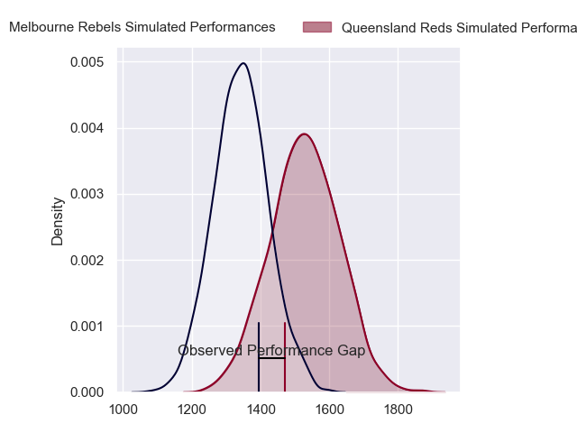
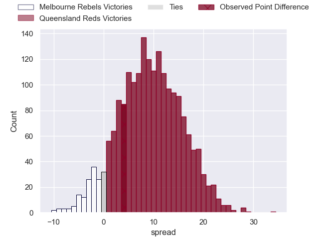
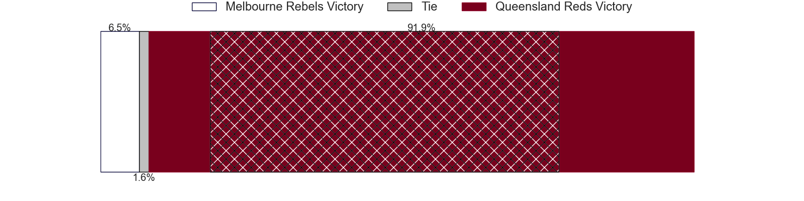
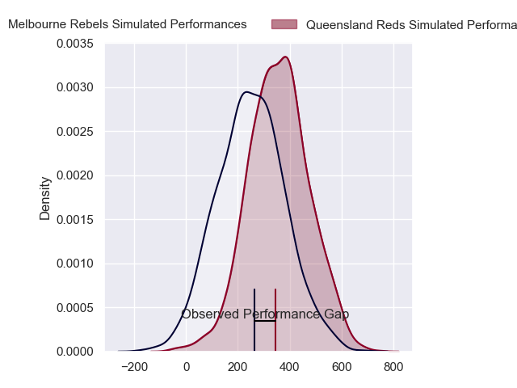
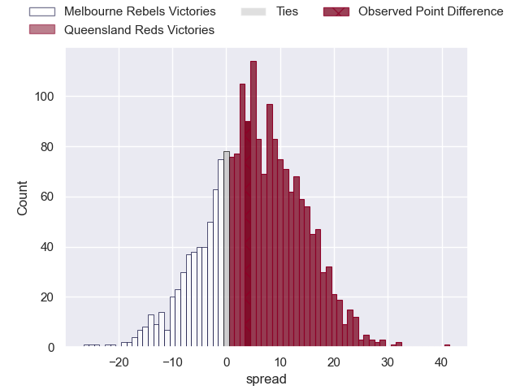
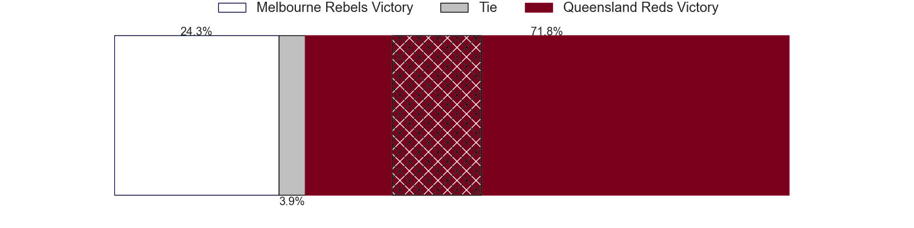

---  
layout: page  
title: Melbourne Rebels at Queensland Reds; 22-26  
date: 2024-05-10 18:00:00 -0500  
categories: "Super Rugby Pacific 2024" match review  
---
# Melbourne Rebels at Queensland Reds; 22-26

# Club Level Predictions

The first set of predictions treats a club as the smallest object, as the club develops its members, organizes a gameplan, and deploys its players as needed for each match. This club model has a prediction of 0.739, which translates to predicting Queensland Reds to win by 9.3.

Our Over/Under is 55.5 - and combined with the spread above, we have a predicted scoreline of 23 to 32

Each club has a rating and a rating deviation (similar to a Glicko rating), and expected performances can be generated. This allows for simulated matches and spreads like the ones below.
## Projected Performances - Club Model

## Projected Spreads - Club Model

## Projected Results - Club Model

# Player Level Predictions

Treating teams instead as an entity made up of the currently active players, I have ratings for each player in an altogether different system. These can be combined to form team ratings once teamsheets are announced, weighting starters a bit higher than the reserves. After the match is played, players can be weighted by their minutes on the field, allowing for an accurate measure of the team's composition. With these compiled team ratings, we can make predictions, measure inaccuracy, and update the individual player ratings.
## Prediction without Player Minutes: Queensland Reds by 5.6

Queensland Reds by 0.8 on a neutral pitch

## Projected Performances - Player Model

## Projected Spreads - Player Model

## Projected Results - Player Model

|   Away Minutes | Away Player         |   Away Percentile |   Number |   Home Percentile | Home Player          |   Home Minutes |
|---------------:|:--------------------|------------------:|---------:|------------------:|:---------------------|---------------:|
|             67 | Isaac Aedo Kailea   |             44.95 |        1 |             76.78 | Sef Fa'agase         |             50 |
|             67 | Jordan Uelese       |             46.5  |        2 |             77    | Matt Faessler        |             65 |
|              9 | Taniela Tupou       |             96.06 |        3 |             94.26 | Jeff Toomaga-Allen   |             45 |
|             60 | Angelo Smith        |             51.06 |        4 |             46.01 | Ryan Smith           |             80 |
|             80 | Josh Canham         |             61.88 |        5 |             93.23 | Angus Blyth          |             58 |
|             80 | Josh Kemeny         |             16.05 |        6 |             97.29 | Liam Wright          |             80 |
|             80 | Vaiolini Ekuasi     |             23.07 |        7 |             94.48 | Fraser McReight      |             80 |
|             72 | Tuaina Taii Tualima |             71.96 |        8 |             68.91 | Harry Wilson         |             48 |
|             80 | Ryan Louwrens       |             96.27 |        9 |             67.67 | Kalani Thomas        |             45 |
|             80 | Carter Gordon       |             64.87 |       10 |             17.24 | Lawson Creighton     |             60 |
|             74 | Darby Lancaster     |             64.44 |       11 |             87.6  | Mac Grealy           |             75 |
|             80 | Nick Jooste         |             63.65 |       12 |             79.35 | Hunter Paisami       |             80 |
|             80 | Filipo Daugunu      |             95.57 |       13 |             44.15 | Josh Flook           |             80 |
|             80 | Lachie Anderson     |             49.9  |       14 |             51.36 | Tim Ryan             |             80 |
|             68 | Andrew Kellaway     |             71.24 |       15 |             71.03 | Jock Campbell        |             80 |
|              0 | Alex Mafi           |             63.33 |       16 |            nan    | Josh Nasser          |             15 |
|             26 | Cabous Eloff        |            nan    |       17 |             58.33 | Peni Ravai Kovekalou |             30 |
|             71 | Sam Talakai         |             56.28 |       18 |             80.07 | Zane Nonggorr        |             35 |
|              8 | Daniel Maiava       |            nan    |       19 |             43.28 | Connor Vest          |             22 |
|             20 | Maciu Nabolakasi    |             63.69 |       20 |             49.35 | John Bryant          |             32 |
|              0 | Jack Maunder        |             39.96 |       21 |             81.35 | Tate McDermott       |             35 |
|             12 | Jake Strachan       |             27.68 |       22 |             92.52 | James O'Connor       |             20 |
|              6 | Glen Vaihu          |             20.06 |       23 |             47.19 | Suliasi Vunivalu     |              5 |

