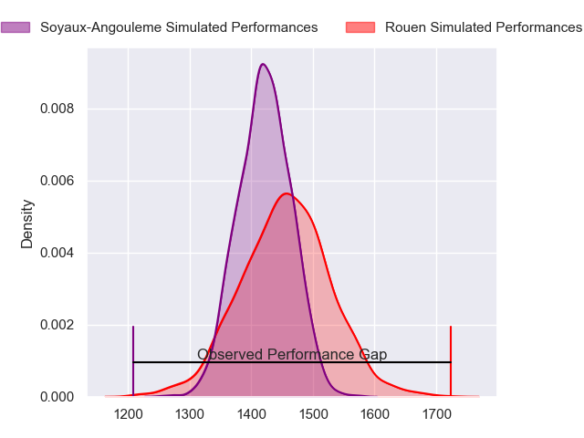
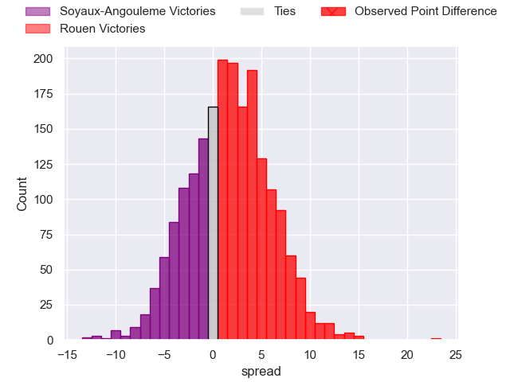
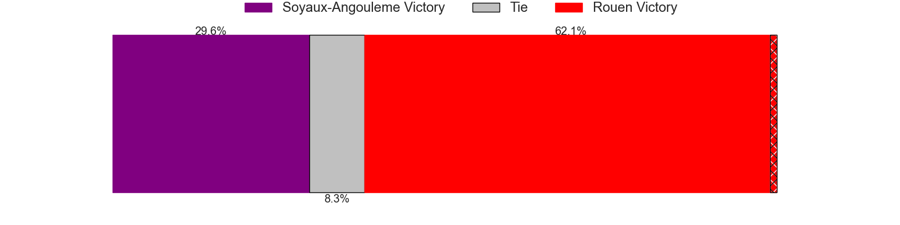
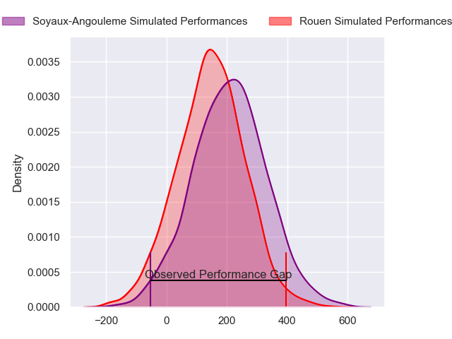
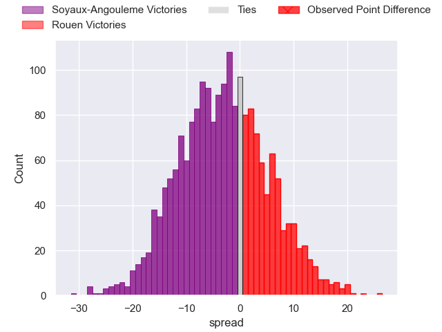
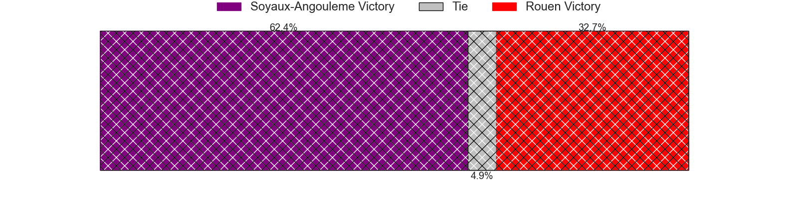

---  
layout: page  
title: Soyaux-Angouleme at Rouen; 18-41  
date: 2024-05-10 18:00:00 -0500  
categories: "Pro D2 2023" match review  
---
# Soyaux-Angouleme at Rouen; 18-41

# Club Level Predictions

The first set of predictions treats a club as the smallest object, as the club develops its members, organizes a gameplan, and deploys its players as needed for each match. This club model has a prediction of 0.548, which translates to predicting Rouen to win by 1.7.

Our Over/Under is 53.5 - and combined with the spread above, we have a predicted scoreline of 26 to 28

Each club has a rating and a rating deviation (similar to a Glicko rating), and expected performances can be generated. This allows for simulated matches and spreads like the ones below.
## Projected Performances - Club Model

## Projected Spreads - Club Model

## Projected Results - Club Model

# Player Level Predictions

Treating teams instead as an entity made up of the currently active players, I have ratings for each player in an altogether different system. These can be combined to form team ratings once teamsheets are announced, weighting starters a bit higher than the reserves. After the match is played, players can be weighted by their minutes on the field, allowing for an accurate measure of the team's composition. With these compiled team ratings, we can make predictions, measure inaccuracy, and update the individual player ratings.
## Prediction without Player Minutes: Soyaux-Angouleme by 3.1

Soyaux-Angouleme by 6.3 on a neutral pitch

## Projected Performances - Player Model

## Projected Spreads - Player Model

## Projected Results - Player Model

|   Away Minutes | Away Player                      |   Away Percentile |   Number |   Home Percentile | Home Player        |   Home Minutes |
|---------------:|:---------------------------------|------------------:|---------:|------------------:|:-------------------|---------------:|
|             48 | Sami Zouhair                     |             96.5  |        1 |             32.11 | Elias El Ansari    |             41 |
|             48 | Motu Matu'u                      |              9.87 |        2 |              4.44 | Jeremie Maurouard  |             59 |
|             48 | Seydou Diakité                   |             16.63 |        3 |             45.88 | Cody Thomas        |             41 |
|             80 | Ian Kitwanga                     |             22.71 |        4 |             55.08 | John-Charles Astle |             80 |
|             80 | Matthew Dalton                   |              4.22 |        5 |             59.6  | Will Witty         |             80 |
|             65 | Germain Burgaud                  |             83.99 |        6 |             57.51 | Lucas Costa        |             80 |
|             80 | Irakli Tskhadadze                |             61.86 |        7 |             19.17 | Jean Leleu         |             41 |
|             48 | Hubert Texier                    |             33.9  |        8 |             67.16 | Abdelkarim Fofana  |             56 |
|             54 | Manu Saubusse                    |             42.76 |        9 |             66.14 | Florent Campeggia  |             59 |
|             48 | Jacob Botica                     |             16.2  |       10 |             90.83 | Franck Pourteau    |             80 |
|             80 | Matthys Gratien                  |             77.87 |       11 |             75.36 | Paul Vallee        |             80 |
|             51 | Akuila Joeli Tabualevu           |             75.92 |       12 |             43.32 | JT Jackson         |             80 |
|             80 | Inaki Ayarza                     |             14.41 |       13 |              8.83 | Opetera Peleseuma  |             62 |
|             80 | Eoghan Barrett                   |             53.62 |       14 |             91.69 | Kevin Bly          |             36 |
|             80 | Jules Dubecq                     |             66.52 |       15 |             89.48 | Baptiste Mouchous  |             80 |
|             32 | Georgy Balakarev                 |            nan    |       16 |             71.48 | Antoine Fournier   |             39 |
|             32 | Rayne Barka                      |             85.53 |       17 |             76.45 | Soso Bekoshvili    |             39 |
|             32 | Alexander Masibaka               |             71.64 |       18 |             43.95 | Pablo Patilla      |             44 |
|             32 | Ben Botica                       |             86.99 |       19 |             46.05 | Samuel Maximin     |             39 |
|             32 | Michael Masimba Tingini Kumbirai |            nan    |       20 |              3.36 | Willy N'Diaye      |             24 |
|             29 | Franck Giraudeau                 |             46.37 |       21 |             35.69 | Efi Ma'afu         |             21 |
|             26 | Alexis Levron                    |             40.49 |       22 |             76.79 | Maxime Sidobre     |             21 |
|             15 | Matt Beukeboom                   |             15.98 |       23 |             84.76 | Pete Lydon         |             18 |

