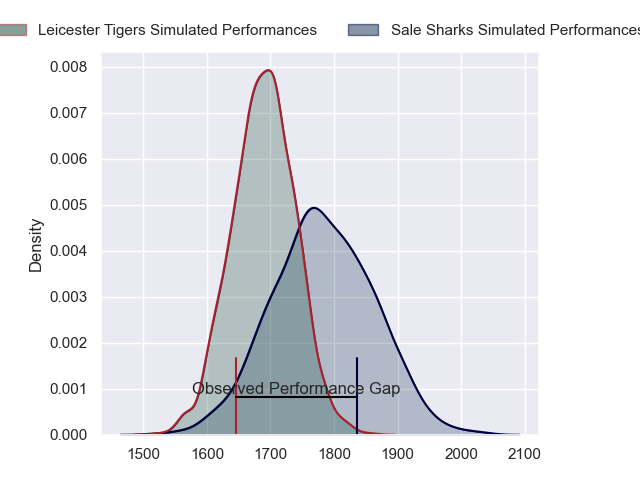
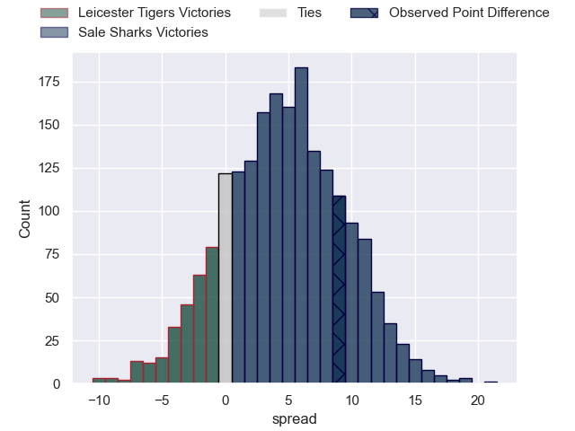
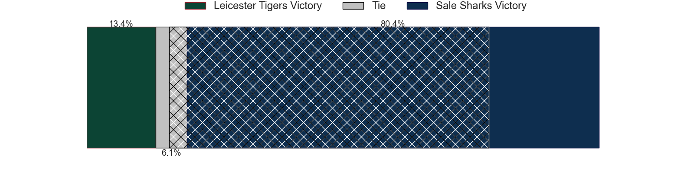
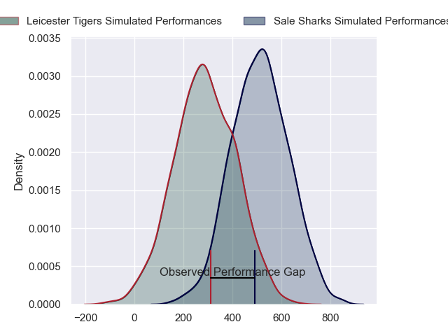
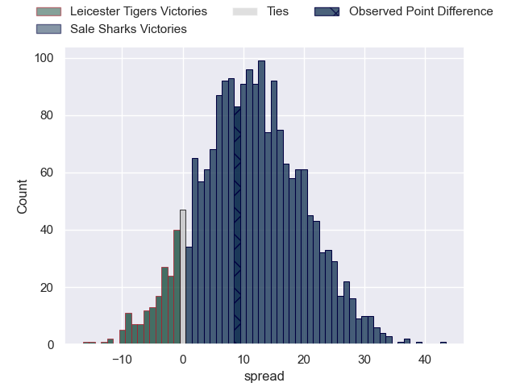
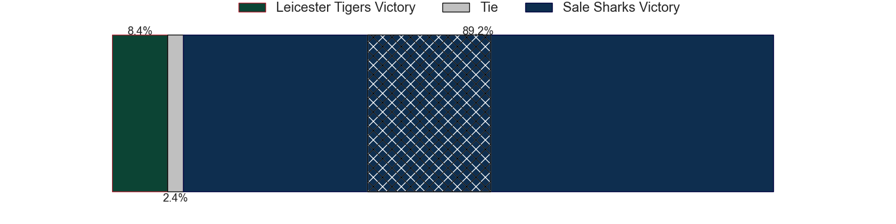

---  
layout: page  
title: Leicester Tigers at Sale Sharks; 22-31  
date: 2024-05-10 18:00:00 -0500  
categories: "Gallagher Premiership 2023" match review  
---
# Leicester Tigers at Sale Sharks; 22-31

# Club Level Predictions

The first set of predictions treats a club as the smallest object, as the club develops its members, organizes a gameplan, and deploys its players as needed for each match. This club model has a prediction of 0.631, which translates to predicting Sale Sharks to win by 4.7.

Our Over/Under is 56.5 - and combined with the spread above, we have a predicted scoreline of 26 to 30

Each club has a rating and a rating deviation (similar to a Glicko rating), and expected performances can be generated. This allows for simulated matches and spreads like the ones below.
## Projected Performances - Club Model

## Projected Spreads - Club Model

## Projected Results - Club Model

# Player Level Predictions

Treating teams instead as an entity made up of the currently active players, I have ratings for each player in an altogether different system. These can be combined to form team ratings once teamsheets are announced, weighting starters a bit higher than the reserves. After the match is played, players can be weighted by their minutes on the field, allowing for an accurate measure of the team's composition. With these compiled team ratings, we can make predictions, measure inaccuracy, and update the individual player ratings.
## Prediction without Player Minutes: Sale Sharks by 11.8

Sale Sharks by 3.9 on a neutral pitch

## Projected Performances - Player Model

## Projected Spreads - Player Model

## Projected Results - Player Model

|   Away Minutes | Away Player           |   Away Percentile |   Number |   Home Percentile | Home Player          |   Home Minutes |
|---------------:|:----------------------|------------------:|---------:|------------------:|:---------------------|---------------:|
|             60 | Francois van Wyk      |             85.33 |        1 |             92.34 | Bevan Rodd           |             55 |
|             78 | Charlie Clare         |              8.06 |        2 |             12.66 | Tommy Taylor         |             55 |
|             46 | Dan Cole              |             40.26 |        3 |              9.54 | James Harper         |             50 |
|             80 | George Martin         |             92.66 |        4 |             91.46 | Cobus Wiese          |             66 |
|             58 | Harry Wells           |             83.42 |        5 |             23.12 | Hyron Andrews        |             80 |
|             80 | Hanro Liebenberg      |             91.7  |        6 |             37.85 | Ben Curry            |             80 |
|             56 | Tommy Reffell         |             85.08 |        7 |             12.65 | Sam Dugdale          |             50 |
|             80 | Jasper Wiese          |             84.65 |        8 |             98.29 | Jean-Luc du Preez    |             80 |
|             68 | Jack van Poortvliet   |             73.12 |        9 |             22.34 | Gus Warr             |             50 |
|             48 | Handre Pollard        |             87.85 |       10 |             95.31 | George Ford          |             80 |
|             80 | Ollie Hassell-Collins |             81.45 |       11 |             94.4  | Tom O'Flaherty       |             60 |
|             70 | Dan Kelly             |             88.43 |       12 |             98.32 | Manu Tuilagi         |             68 |
|             70 | Matt Scott            |             88.96 |       13 |             65.62 | Robert du Preez      |             80 |
|             80 | Jamie Shillcock       |             69.57 |       14 |             74.49 | Tom Roebuck          |             80 |
|             80 | Freddie Steward       |             34.76 |       15 |             84.55 | Sam James            |             80 |
|             12 | Nic Dolly             |            nan    |       16 |             94.24 | Agustin Creevy       |             25 |
|             20 | James Whitcombe       |             59.17 |       17 |             92.67 | Simon McIntyre       |             25 |
|             34 | Joe Heyes             |             89.81 |       18 |            nan    | WillGriff John       |             30 |
|             22 | Finn Carnduff         |             82.41 |       19 |             14.37 | Ben Bamber           |             14 |
|             24 | Olly Cracknell        |             36.17 |       20 |             85.47 | Ernst van Rhyn       |             30 |
|             12 | Tom Whiteley          |             63.35 |       21 |             71.38 | Raffi Quirke         |             30 |
|             10 | Phil Cokanasiga       |            nan    |       22 |             30.7  | Rekeiti Ma'asi-White |             12 |
|             32 | Solomone Kata         |             33.33 |       23 |             80.19 | Arron Reed           |             20 |

