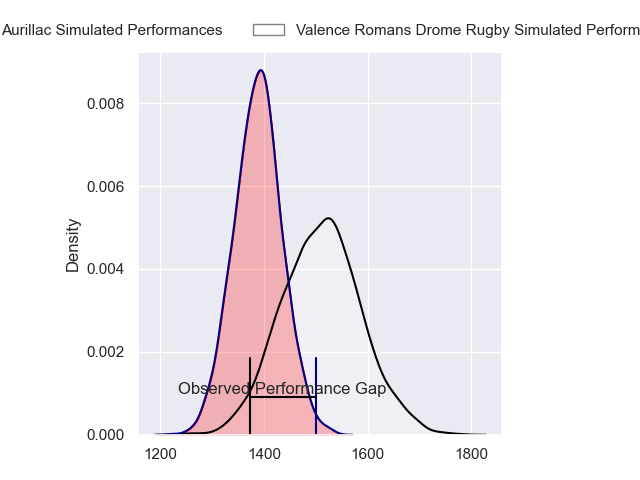
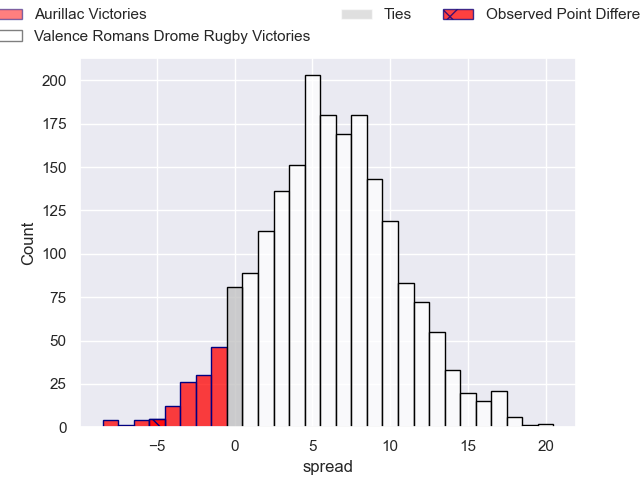
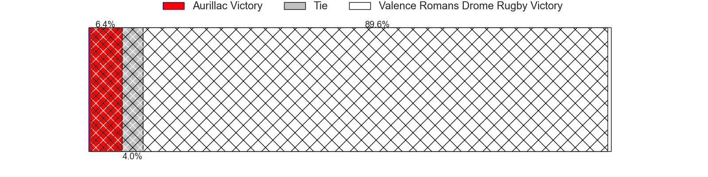
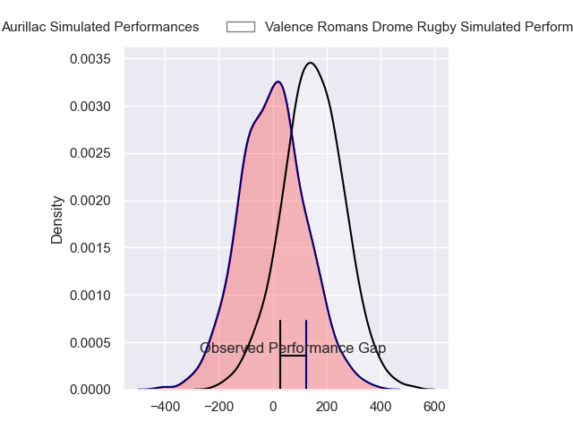
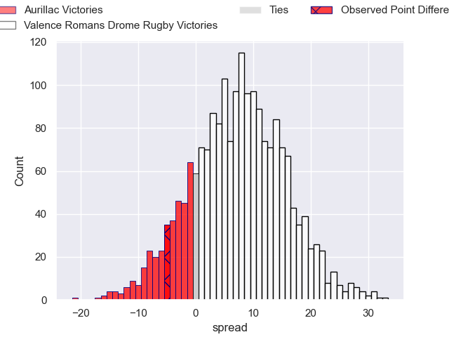
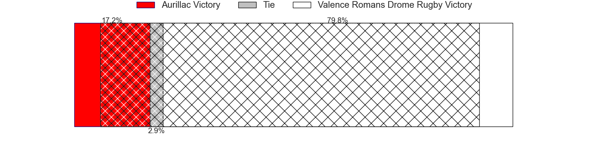

---  
layout: page  
title: Aurillac at Valence Romans Drome Rugby; 41-36  
date: 2024-05-10 18:00:00 -0500  
categories: "Pro D2 2023" match review  
---
# Aurillac at Valence Romans Drome Rugby; 41-36

# Club Level Predictions

The first set of predictions treats a club as the smallest object, as the club develops its members, organizes a gameplan, and deploys its players as needed for each match. This club model has a prediction of 0.672, which translates to predicting Valence Romans Drome Rugby to win by 6.3.

Our Over/Under is 54.5 - and combined with the spread above, we have a predicted scoreline of 24 to 30

Each club has a rating and a rating deviation (similar to a Glicko rating), and expected performances can be generated. This allows for simulated matches and spreads like the ones below.
## Projected Performances - Club Model

## Projected Spreads - Club Model

## Projected Results - Club Model

# Player Level Predictions

Treating teams instead as an entity made up of the currently active players, I have ratings for each player in an altogether different system. These can be combined to form team ratings once teamsheets are announced, weighting starters a bit higher than the reserves. After the match is played, players can be weighted by their minutes on the field, allowing for an accurate measure of the team's composition. With these compiled team ratings, we can make predictions, measure inaccuracy, and update the individual player ratings.
## Prediction without Player Minutes: Valence Romans Drome Rugby by 7.1

Valence Romans Drome Rugby by 4.1 on a neutral pitch

## Projected Performances - Player Model

## Projected Spreads - Player Model

## Projected Results - Player Model

|   Away Minutes | Away Player               |   Away Percentile |   Number |   Home Percentile | Home Player          |   Home Minutes |
|---------------:|:--------------------------|------------------:|---------:|------------------:|:---------------------|---------------:|
|             50 | Jean-Jacques Gymael       |             14.18 |        1 |              2.77 | Julien Royer         |             52 |
|             50 | Basa Khonelidze           |             53.78 |        2 |             75.82 | Dorian Marco Pena    |             65 |
|             50 | Tim Daniel-Meissen        |             41.32 |        3 |             31.78 | Gareth Milasinovich  |             52 |
|             73 | Aleksandre Burduli        |             61.81 |        4 |             63.42 | Ryan McCauley        |             10 |
|             80 | Martial Rolland           |             51.16 |        5 |             47.54 | Yassine Maamry       |             80 |
|             80 | Théo Cambon               |             15.02 |        6 |              2.37 | Éloi Massot          |             60 |
|             56 | Hugo Huurman              |             76.19 |        7 |              0.1  | Mathieu Vachon       |             80 |
|             63 | Didier Tison              |             49.25 |        8 |             89.98 | Ioane Iashagashvili  |             60 |
|             63 | Mikheil Alania            |             39.62 |        9 |             83.07 | Thomas Lhusero       |             69 |
|             80 | Marc Palmier              |             25.59 |       10 |             28.36 | Lucas Meret          |             80 |
|             80 | Jordon Janse Van Rensburg |             27.44 |       11 |             89.08 | Mosese Mawalu        |             80 |
|             80 | Hugo Bastard              |             54.26 |       12 |             84.86 | Ben Neiceru          |             80 |
|             33 | Juun Pieters              |             68.56 |       13 |              4.1  | Isaac Te Tamaki      |             80 |
|             80 | Axel Bevia                |             26.47 |       14 |             43.67 | Jonathan Quinnez     |             80 |
|             80 | Anderson Neisen           |             48.93 |       15 |             32.19 | Gauthier Minguillon  |             50 |
|             47 | Jules Margarit            |             15.88 |       16 |             50.35 | Charles Brayer       |             70 |
|             30 | Luka Nioradze             |             11.84 |       17 |             94.21 | Charles Bouldoire    |             30 |
|             30 | Robert Rodgers            |              9.13 |       18 |             63    | Anthony Aléo         |             28 |
|             30 | Nodari Shengelia          |            nan    |       19 |             34.8  | Chris Talakai        |             28 |
|             24 | Lilian Djomboue           |             42.11 |       20 |             55.26 | Brice Humbert        |             15 |
|             17 | David Delarue             |             25.65 |       21 |             73.13 | Sven Bernat Girlando |             20 |
|             17 | Latuka Maituku            |              7.46 |       22 |             40.51 | Axel Bruchet         |             20 |
|              7 | Mosa'ati Moala            |             16.68 |       23 |             60.03 | Léopold Dupas        |             11 |

