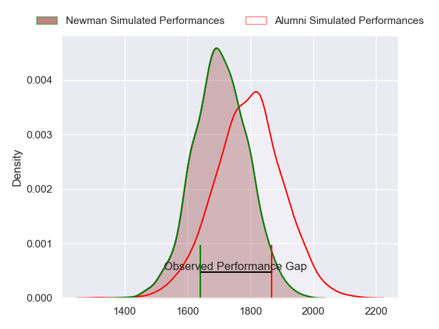
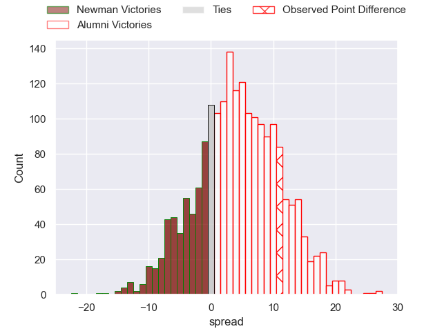
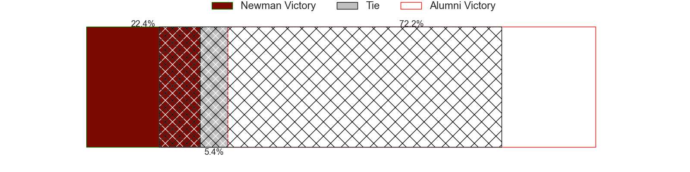
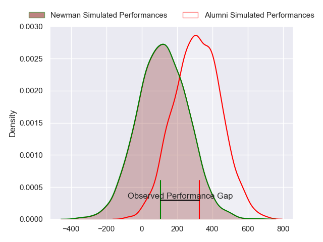
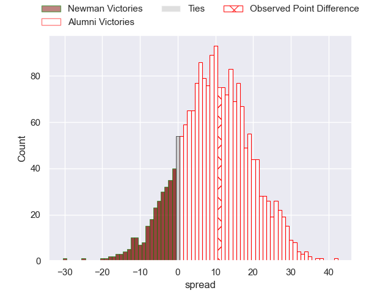
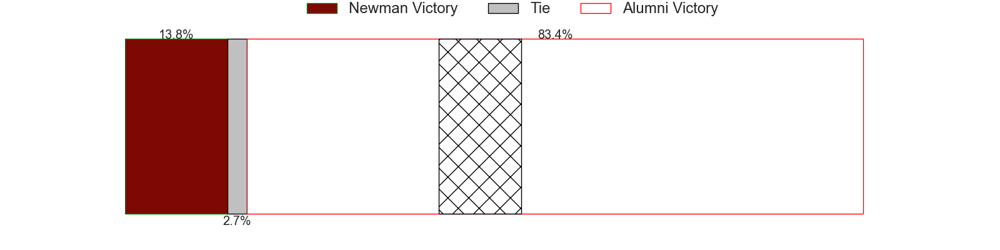

---  
layout: page  
title: Newman at Alumni; 26-37  
date: 2024-05-11 18:00:00 -0500  
categories: "URBA Top 12 2024" match review  
---
# Newman at Alumni; 26-37

# Club Level Predictions

The first set of predictions treats a club as the smallest object, as the club develops its members, organizes a gameplan, and deploys its players as needed for each match. This club model has a prediction of 0.624, which translates to predicting Alumni to win by 4.6.

Our Over/Under is 55.5 - and combined with the spread above, we have a predicted scoreline of 26 to 30

Each club has a rating and a rating deviation (similar to a Glicko rating), and expected performances can be generated. This allows for simulated matches and spreads like the ones below.
## Projected Performances - Club Model

## Projected Spreads - Club Model

## Projected Results - Club Model

# Player Level Predictions

Treating teams instead as an entity made up of the currently active players, I have ratings for each player in an altogether different system. These can be combined to form team ratings once teamsheets are announced, weighting starters a bit higher than the reserves. After the match is played, players can be weighted by their minutes on the field, allowing for an accurate measure of the team's composition. With these compiled team ratings, we can make predictions, measure inaccuracy, and update the individual player ratings.
## Prediction without Player Minutes: Alumni by 10.1

Alumni by 6.0 on a neutral pitch

## Projected Performances - Player Model

## Projected Spreads - Player Model

## Projected Results - Player Model

|   Away Minutes | Away Player               |   Away Percentile |   Number |   Home Percentile | Home Player         |   Home Minutes |
|---------------:|:--------------------------|------------------:|---------:|------------------:|:--------------------|---------------:|
|             81 | Miguel Prince             |             22.82 |        1 |             80.2  | Federico Lucca      |             81 |
|             81 | Rodrigo Pueyrredon        |             45.72 |        2 |             81.09 | Tomas Bivort        |             81 |
|             81 | Luciano Borio             |             66.26 |        3 |             65.12 | Ezequiel Oliva      |             81 |
|             81 | Pablo Cardinal            |             60.4  |        4 |             77.09 | Manuel Mora         |             81 |
|             81 | Alejandro Urtubey         |             43.72 |        5 |             72.56 | Santiago Alduncin   |             81 |
|             81 | Joaquin de la Vega        |             40.71 |        6 |             74.6  | Ignacio Cubilla     |             81 |
|             81 | Miguel Urtubey            |             37.94 |        7 |             75.79 | Juan Anderson       |             81 |
|             81 | Rodrigo Diaz de Vivar     |             59.06 |        8 |             45.42 | Juan Cruz Alvarinas |             81 |
|             81 | Felix Branca              |             43.8  |        9 |             74.35 | Tomas Passerotti    |             81 |
|             81 | Gonzalo Guiterrez Taboada |             39.87 |       10 |             72.71 | Joaquin Luzzi       |             81 |
|             81 | Justo Ortiz Basualdo      |             58.74 |       11 |             49.08 | Cruz Gonzalez       |             81 |
|             81 | Tomas Keena               |             38.28 |       12 |             72.13 | Franco Battezzati   |             81 |
|             81 | Silvestre Casa            |             54.89 |       13 |             73.08 | Alejo Chavez        |             81 |
|             81 | Leandro Leivas            |             42.71 |       14 |             75.65 | Ramon Fuentes       |             81 |
|             81 | Francisco Pasman          |             38.2  |       15 |             66.31 | Tomas Corneille     |             81 |
|              0 | James Wright              |            nan    |       16 |            nan    | Maximo Castillo     |              0 |
|              0 | Fermin Perkins            |             63.41 |       17 |            nan    | Francisco Bottoni   |              0 |
|              0 | Bautista Bosch            |             20.86 |       18 |             71.56 | Bautista Vidal      |              0 |
|              0 | Tomas Ureta               |             28.74 |       19 |            nan    | Federico Canovas    |              0 |
|              0 | Faustino Santarelli       |            nan    |       20 |            nan    | Bautista Canzani    |              0 |
|              0 | Pablo Tezanos Pinto       |            nan    |       21 |            nan    | Santiago Ambroa     |              0 |
|              0 | Carlos Menendez           |            nan    |       22 |            nan    | Juan Berreta        |              0 |
|              0 | Benjamin Lanfranco        |             28.6  |       23 |            nan    | Filipo Testoni      |              0 |

