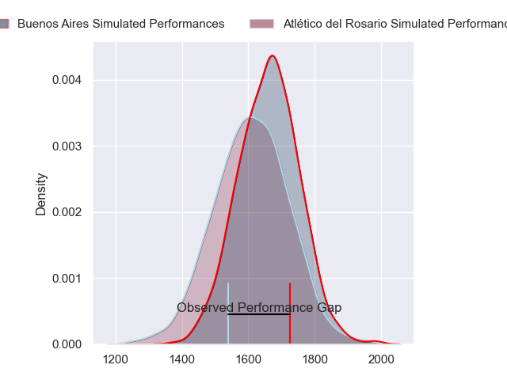
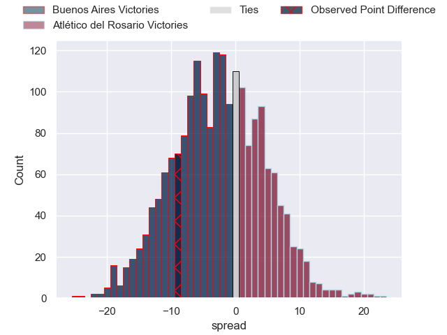
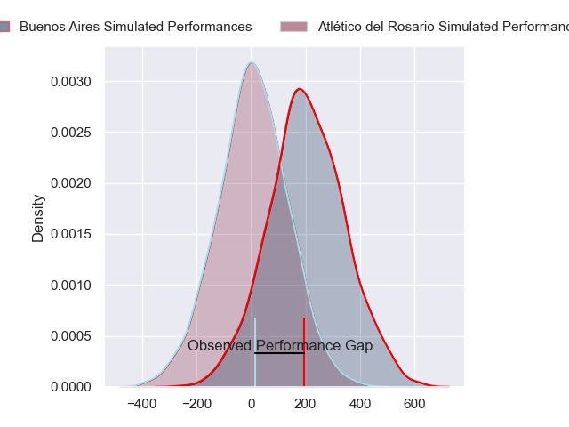
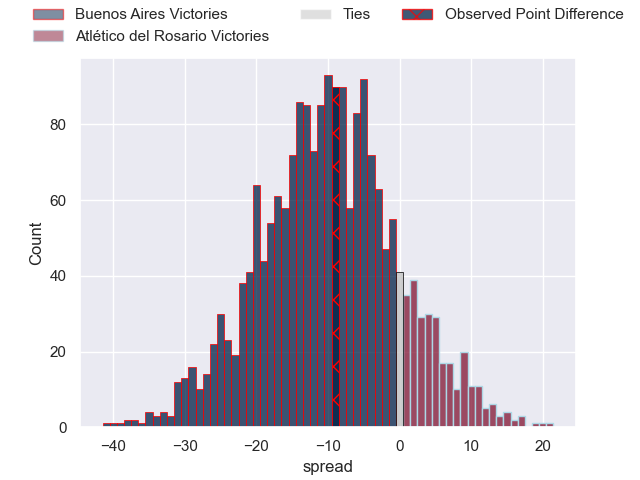

---  
layout: page  
title: Buenos Aires at Atletico del Rosario; 33-24  
date: 2024-05-11 18:00:00 -0500  
categories: "URBA Top 12 2024" match review  
---
# Buenos Aires at Atletico del Rosario; 33-24

# Club Level Predictions

The first set of predictions treats a club as the smallest object, as the club develops its members, organizes a gameplan, and deploys its players as needed for each match. This club model has a prediction of 0.433, which translates to predicting Buenos Aires to win by 2.4.

Our Over/Under is 52.5 - and combined with the spread above, we have a predicted scoreline of 27 to 25

Each club has a rating and a rating deviation (similar to a Glicko rating), and expected performances can be generated. This allows for simulated matches and spreads like the ones below.
## Projected Performances - Club Model

## Projected Spreads - Club Model

## Projected Results - Club Model

# Player Level Predictions

Treating teams instead as an entity made up of the currently active players, I have ratings for each player in an altogether different system. These can be combined to form team ratings once teamsheets are announced, weighting starters a bit higher than the reserves. After the match is played, players can be weighted by their minutes on the field, allowing for an accurate measure of the team's composition. With these compiled team ratings, we can make predictions, measure inaccuracy, and update the individual player ratings.
## Prediction without Player Minutes: Buenos Aires by 8.8

Buenos Aires by 12.5 on a neutral pitch

## Projected Performances - Player Model

## Projected Spreads - Player Model

## Projected Results - Player Model

|   Away Minutes | Away Player            |   Away Percentile |   Number |   Home Percentile | Home Player                 |   Home Minutes |
|---------------:|:-----------------------|------------------:|---------:|------------------:|:----------------------------|---------------:|
|             80 | Pablo Gaston Vaca      |             74.16 |        1 |             10.51 | Agustin Fernandez           |             80 |
|             80 | Tomas Rosasco          |             72.2  |        2 |              7.57 | Jeremias Aime               |             80 |
|             80 | Tomas Gallo            |             74    |        3 |             40.1  | Bruno Montenegro            |             80 |
|             80 | Francisco Jose Sluga   |             69.25 |        4 |             11.26 | Matias Kremer               |             80 |
|             80 | Franco Baldoni         |             63.02 |        5 |             10.35 | Octavio Capella             |             80 |
|             80 | Lucas Etcheverry       |             43.38 |        6 |              9.34 | Santiago Casals             |             80 |
|             80 | Pedro Maria Del Carril |             65.51 |        7 |              9.34 | Lucas Malanos               |             80 |
|             80 | Tomas Etcheverry       |             49.89 |        8 |             42    | Francisco Echenique Menta   |             80 |
|             80 | Mateo Freire           |             66.84 |        9 |             45.72 | Martin Del Pazo             |             80 |
|             80 | Mateo Capalbo          |             61.83 |       10 |              9.81 | Pedro de Aro                |             80 |
|             80 | Tomas Acosta Pimentel  |             67.05 |       11 |             18.94 | Facundo Gerosa              |             80 |
|             80 | Agustin Lamensa Sanudo |             62.09 |       12 |              9.67 | Guido Vidalle               |             80 |
|             80 | Tobias Diaz Borda      |             62.09 |       13 |             15.98 | Valentino Aime              |             80 |
|             80 | Alfonso Latorre        |             66.38 |       14 |             14.59 | Maximiliano Nicoli Fiscella |             80 |
|             80 | Julian Quetglas Bojar  |             61.37 |       15 |              9.66 | Pedro Bisio                 |             80 |
|              0 | Tomas Ruiz             |             43.09 |       16 |            nan    | Matias Malanos              |              0 |
|              0 | Tomas Herrador         |             43.28 |       17 |            nan    | Roberto Almeira             |              0 |
|              0 | Mariano Cederbaum      |            nan    |       18 |            nan    | Joaquin Viola Artola        |              0 |
|              0 | Matias Espina          |             63.24 |       19 |            nan    | Ignacio Sapino              |              0 |
|              0 | Jordi Dieguez          |             65.12 |       20 |            nan    | Ramiro Musio                |              0 |
|              0 | Juan Monasterio        |            nan    |       21 |            nan    | Jose Leon Caceres Musso     |              0 |
|              0 | Tomas Bunge            |            nan    |       22 |             40.68 | Nicolas Cripovich           |              0 |
|              0 | Benjamin Handley       |             46.18 |       23 |            nan    | Felipe Paloma               |              0 |

