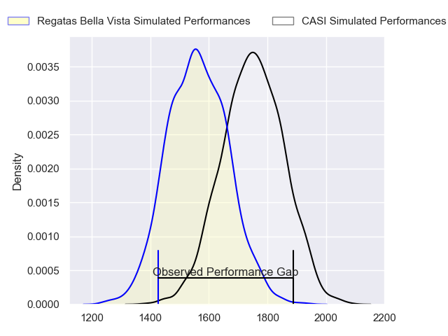
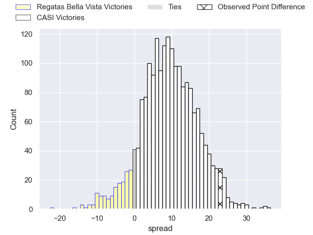
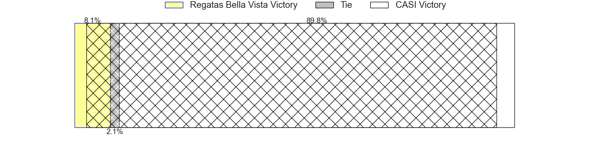
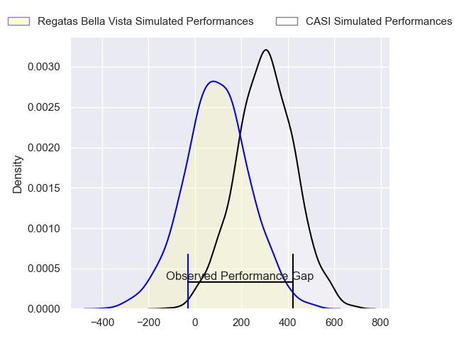
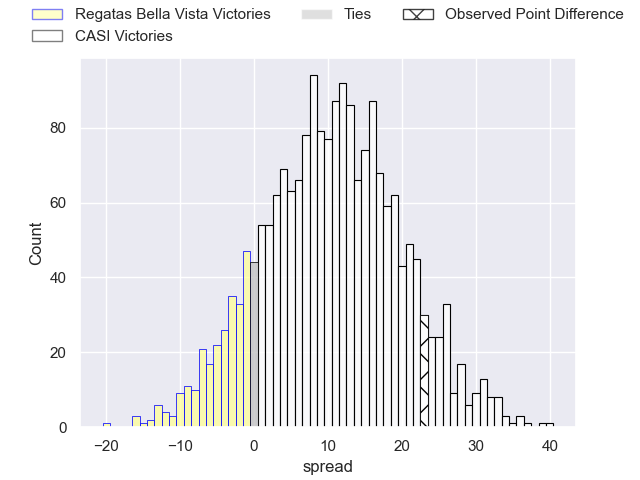
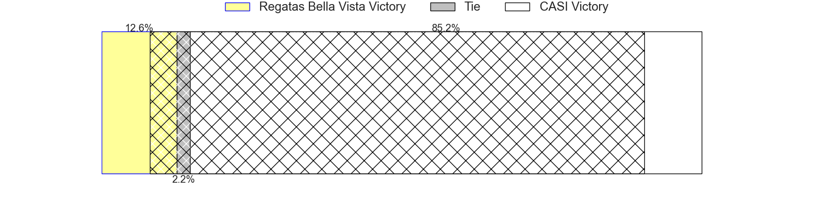

---  
layout: page  
title: Regatas Bella Vista at CASI; 18-41  
date: 2024-05-11 18:00:00 -0500  
categories: "URBA Top 12 2024" match review  
---
# Regatas Bella Vista at CASI; 18-41

# Club Level Predictions

The first set of predictions treats a club as the smallest object, as the club develops its members, organizes a gameplan, and deploys its players as needed for each match. This club model has a prediction of 0.742, which translates to predicting CASI to win by 9.7.

Our Over/Under is 59.5 - and combined with the spread above, we have a predicted scoreline of 25 to 35

Each club has a rating and a rating deviation (similar to a Glicko rating), and expected performances can be generated. This allows for simulated matches and spreads like the ones below.
## Projected Performances - Club Model

## Projected Spreads - Club Model

## Projected Results - Club Model

# Player Level Predictions

Treating teams instead as an entity made up of the currently active players, I have ratings for each player in an altogether different system. These can be combined to form team ratings once teamsheets are announced, weighting starters a bit higher than the reserves. After the match is played, players can be weighted by their minutes on the field, allowing for an accurate measure of the team's composition. With these compiled team ratings, we can make predictions, measure inaccuracy, and update the individual player ratings.
## Prediction without Player Minutes: CASI by 10.6

CASI by 6.6 on a neutral pitch

## Projected Performances - Player Model

## Projected Spreads - Player Model

## Projected Results - Player Model

|   Away Minutes | Away Player          |   Away Percentile |   Number |   Home Percentile | Home Player                |   Home Minutes |
|---------------:|:---------------------|------------------:|---------:|------------------:|:---------------------------|---------------:|
|             82 | Tomas Barbaccia      |             24.86 |        1 |             77.42 | Joaquin Britto             |             82 |
|             82 | Pedro Colinas        |             33.39 |        2 |             82.57 | Juan Torres Obeid          |             82 |
|             82 | Juan Gobet           |             39.2  |        3 |             81.42 | Juan Ignacio Nieto Sanchez |             82 |
|             82 | Esteban Sciandro     |             40.8  |        4 |             77.29 | Salvador Ochoa             |             82 |
|             82 | Tomas Sanguinetti    |             36.28 |        5 |             75.68 | Leo Mazzini                |             82 |
|             82 | Francisco Ploder     |             41.01 |        6 |             76.33 | Eugenio Sartori            |             82 |
|             82 | Marcos Ferro         |             52.08 |        7 |             76.33 | Joaquin Saenz de Miera     |             82 |
|             82 | Felipe Camerlinckx   |             29.42 |        8 |             50.11 | Benjamin Rocca Rivarola    |             82 |
|             82 | Marcos Joseph        |             29.14 |        9 |             75.22 | Luca Canzani               |             82 |
|             82 | Mateo Camerlinckx    |             27.93 |       10 |             73.77 | Felipe Hileman             |             82 |
|             82 | Rafael Santana       |             39.9  |       11 |             52.85 | Benjamin Belaga            |             82 |
|             82 | Juan Corso           |             49.63 |       12 |             73.76 | Bruno Devoto               |             82 |
|             82 | Alejo Barrera        |             29.23 |       13 |             73.76 | Jeronimo Solveyra          |             82 |
|             82 | Francisco Pisani     |             28.79 |       14 |             76.52 | Santiago David             |             82 |
|             82 | Cruz Camerlinckx     |             23.82 |       15 |             72.96 | Juan Akemeier              |             82 |
|              0 | Beltran Landivar     |            nan    |       16 |            nan    | Facundo Andreotti          |              0 |
|              0 | Diego Aguero         |            nan    |       17 |            nan    | Felix Paolucci             |              0 |
|              0 | Mateo Trimarco       |            nan    |       18 |            nan    | Hugo Garcia                |              0 |
|              0 | Lucas Gobet          |             20.65 |       19 |            nan    | Agustin Posleman           |              0 |
|              0 | Valentin Sanguinetti |             45.23 |       20 |            nan    | Jeronimo Martorelli        |              0 |
|              0 | Gonzalo Deluca       |            nan    |       21 |            nan    | Bautista Belleze           |              0 |
|              0 | Justo Camerlinckx    |             37.74 |       22 |            nan    | Tomas Phelan               |              0 |
|              0 | Felipe Rugolo        |            nan    |       23 |            nan    | Tobias Casaurang           |              0 |

