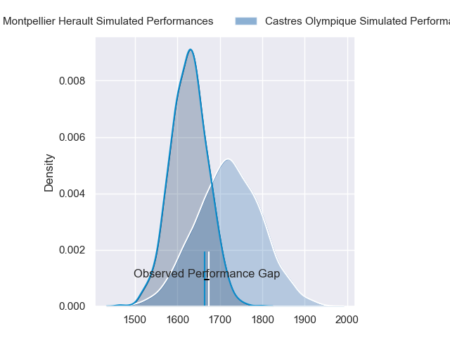
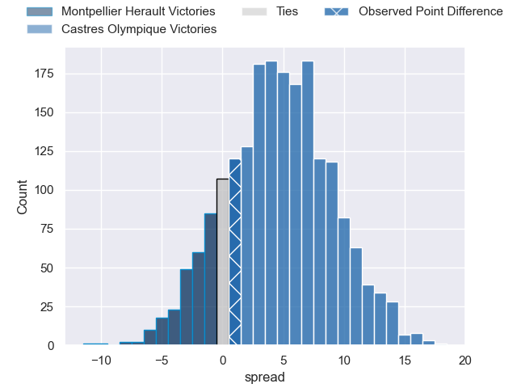
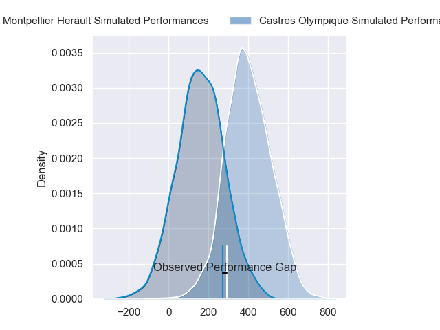
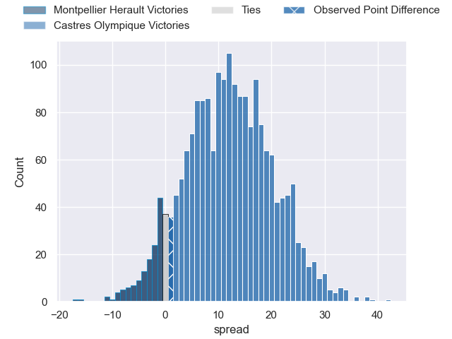
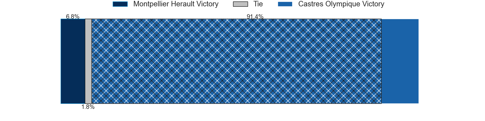

---  
layout: page  
title: Montpellier Herault at Castres Olympique; 26-27  
date: 2024-05-11 18:00:00 -0500  
categories: "Top 14 Orange 2023" match review  
---
# Montpellier Herault at Castres Olympique; 26-27

# Club Level Predictions

The first set of predictions treats a club as the smallest object, as the club develops its members, organizes a gameplan, and deploys its players as needed for each match. This club model has a prediction of 0.631, which translates to predicting Castres Olympique to win by 4.7.

Our Over/Under is 52.5 - and combined with the spread above, we have a predicted scoreline of 24 to 28

Each club has a rating and a rating deviation (similar to a Glicko rating), and expected performances can be generated. This allows for simulated matches and spreads like the ones below.
## Projected Performances - Club Model

## Projected Spreads - Club Model

## Projected Results - Club Model

# Player Level Predictions

Treating teams instead as an entity made up of the currently active players, I have ratings for each player in an altogether different system. These can be combined to form team ratings once teamsheets are announced, weighting starters a bit higher than the reserves. After the match is played, players can be weighted by their minutes on the field, allowing for an accurate measure of the team's composition. With these compiled team ratings, we can make predictions, measure inaccuracy, and update the individual player ratings.
## Prediction without Player Minutes: Castres Olympique by 13.5

Castres Olympique by 5.4 on a neutral pitch

## Projected Performances - Player Model

## Projected Spreads - Player Model

## Projected Results - Player Model

|   Away Minutes | Away Player         |   Away Percentile |   Number |   Home Percentile | Home Player           |   Home Minutes |
|---------------:|:--------------------|------------------:|---------:|------------------:|:----------------------|---------------:|
|             40 | Gregory Fichten     |             12.96 |        1 |             74.9  | Quentin Walcker       |             55 |
|             41 | Vano Karkadze       |             76.48 |        2 |             80.59 | Gaetan Barlot         |             58 |
|             41 | Titi Lamositele     |             56.15 |        3 |             36.51 | Henry Thomas          |             63 |
|             80 | Florian Verhaeghe   |             59.4  |        4 |             64.82 | Florent Vanverberghe  |             68 |
|             44 | Bastien Chalureau   |             82.11 |        5 |             56.98 | Tom Staniforth        |             65 |
|             61 | Yacouba Camara      |             90.71 |        6 |             22.53 | Mathieu Babillot      |             77 |
|             67 | Sam Simmonds        |             64.72 |        7 |             78.56 | Baptiste Delaporte    |             63 |
|             44 | Marco Tauleigne     |             91.68 |        8 |             73.56 | Yann Peysson          |             69 |
|             80 | Leo Coly            |             54.97 |        9 |             17.63 | Jeremy Fernandez      |             75 |
|             37 | Louis Carbonel      |             54.8  |       10 |             49.68 | Pierre Popelin        |             80 |
|             80 | George Bridge       |             93.53 |       11 |             81.84 | Filipo Nakosi         |             80 |
|             80 | Jan Serfontein      |             81.81 |       12 |             97.48 | Jack Goodhue          |             57 |
|             71 | Auguste Cadot       |             18.19 |       13 |             36.91 | Vilimoni Botitu       |             68 |
|             70 | Gabriel Ngandebe    |              3.38 |       14 |             80    | Nathanael Hulleu      |             67 |
|             80 | Julien Tisseron     |             59.87 |       15 |             79.18 | Julien Dumora         |             80 |
|             39 | Christopher Tolofua |             91.61 |       16 |             38.32 | Loris Zarantonello    |             25 |
|             40 | Baptiste Erdocio    |              2.12 |       17 |             51.51 | Lois Guerois-Galisson |             25 |
|             36 | Tyler Duguid        |             54.37 |       18 |             94.87 | Leone Nakarawa        |             27 |
|             36 | Lenni Nouchi        |             54.35 |       19 |             39.87 | Abraham Papali'i      |             28 |
|             32 | Alexandre Becognee  |             22.33 |       20 |             47.64 | Gauthier Doubrere     |              5 |
|             43 | Cobus Reinach       |             90.92 |       21 |             87.91 | Adrea Cocagi          |             35 |
|             19 | Thomas Darmon       |             17.67 |       22 |             79.52 | Josaia Raisuqe        |             13 |
|             39 | Luka Japaridze      |             73.35 |       23 |             51.43 | Aurelien Azar         |             17 |

