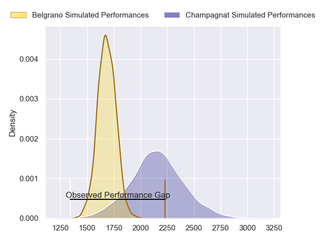
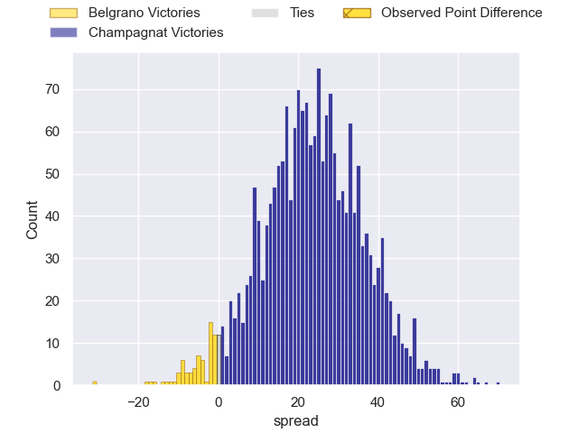
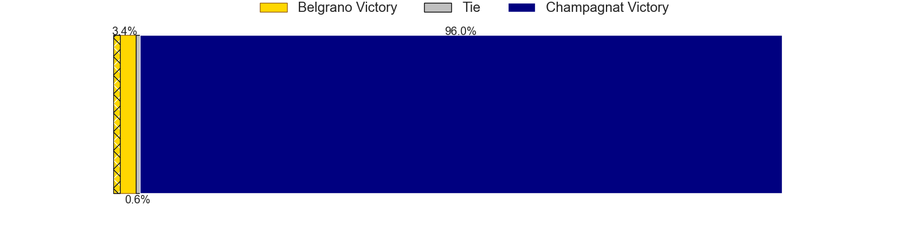
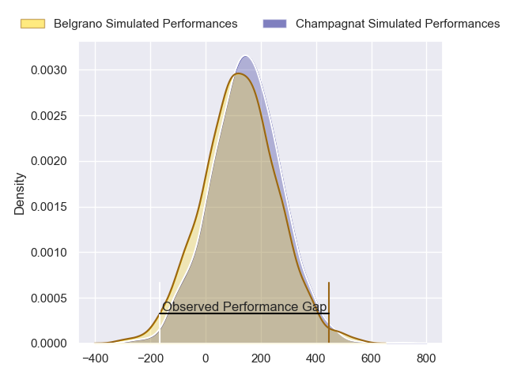
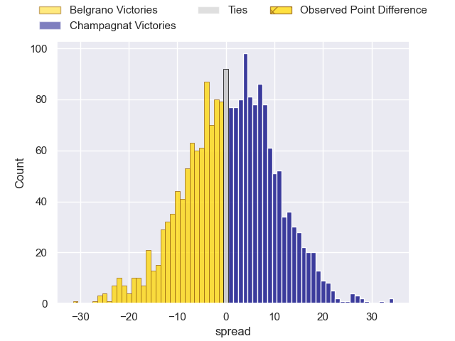

---  
layout: page  
title: Belgrano at Champagnat; 49-18  
date: 2024-05-11 18:00:00 -0500  
categories: "URBA Top 12 2024" match review  
---
# Belgrano at Champagnat; 49-18

# Club Level Predictions

The first set of predictions treats a club as the smallest object, as the club develops its members, organizes a gameplan, and deploys its players as needed for each match. This club model has a prediction of 0.934, which translates to predicting Champagnat to win by 23.8.

Our Over/Under is 62.5 - and combined with the spread above, we have a predicted scoreline of 20 to 43

Each club has a rating and a rating deviation (similar to a Glicko rating), and expected performances can be generated. This allows for simulated matches and spreads like the ones below.
## Projected Performances - Club Model

## Projected Spreads - Club Model

## Projected Results - Club Model

# Player Level Predictions

Treating teams instead as an entity made up of the currently active players, I have ratings for each player in an altogether different system. These can be combined to form team ratings once teamsheets are announced, weighting starters a bit higher than the reserves. After the match is played, players can be weighted by their minutes on the field, allowing for an accurate measure of the team's composition. With these compiled team ratings, we can make predictions, measure inaccuracy, and update the individual player ratings.
## Prediction without Player Minutes: Champagnat by 1.2

Belgrano by 1.4 on a neutral pitch

## Projected Performances - Player Model

## Projected Spreads - Player Model

## Projected Results - Player Model

|   Away Minutes | Away Player            |   Away Percentile |   Number |   Home Percentile | Home Player                   |   Home Minutes |
|---------------:|:-----------------------|------------------:|---------:|------------------:|:------------------------------|---------------:|
|             80 | Francisco Ferronato    |             77.18 |        1 |             19.64 | Tomas Distel                  |             80 |
|             80 | Francisco Lusarreta    |             75.99 |        2 |             20.56 | Fernando Rodriguez Pascarella |             80 |
|             80 | Lisandro Garcia Dragui |             73.84 |        3 |             20.05 | Alberto Adissi                |             80 |
|             80 | Luciano Tecca          |             75.38 |        4 |             25.23 | Inaki Ustariz                 |             80 |
|             80 | Mikael Quesada         |             60.7  |        5 |             25.53 | Santiago Escuti               |             80 |
|             80 | Joaquin de la Serna    |             70.36 |        6 |             20.41 | Matias Alonso Boto            |             80 |
|             80 | Augusto Vaccarino      |             54.55 |        7 |             20.41 | Francisco Castelli            |             80 |
|             80 | Franco Vega            |             68.23 |        8 |             24.31 | Matias Muniagurria            |             80 |
|             80 | Theo Blaksley          |             68.24 |        9 |             22.16 | Martin Graciarena             |             80 |
|             80 | Joaquin Mihura         |             65.67 |       10 |             22.81 | Santos Panela                 |             80 |
|             80 | Tobias Bernabe         |             57.2  |       11 |             24.25 | Tomas Baca Castex             |             80 |
|             80 | Ramon Arana            |             66.72 |       12 |             23.45 | Tobias Imbrosciano            |             80 |
|             80 | Tomas Etchepare        |             66.72 |       13 |             23.34 | Tomas Cotter                  |             80 |
|             80 | Ignacio Diaz           |             71.5  |       14 |             23.96 | Geronimo Tomasella            |             80 |
|             80 | Juan Lando             |             66.95 |       15 |             19.96 | Gregorio Carol Lugones        |             80 |
|              0 | Jose Saporitti         |            nan    |       16 |            nan    | Joaquin Guerra                |              0 |
|              0 | Justo Duranona         |            nan    |       17 |            nan    | Manuel Mauvecin               |              0 |
|              0 | Mateo Gasparotti       |            nan    |       18 |            nan    | Marcos Magaro                 |              0 |
|              0 | Valentin Chiodi        |            nan    |       19 |            nan    | Lucas Moresco                 |              0 |
|              0 | Juan Aparicio          |            nan    |       20 |            nan    | Facundo Rufino                |              0 |
|              0 | Francisco Gradin       |            nan    |       21 |            nan    | Pedro Del Piano               |              0 |
|              0 | Ignacio Marino         |             50.61 |       22 |            nan    | Tobias Rivas Orozco           |              0 |
|              0 | Juan Brescia           |            nan    |       23 |            nan    | Marcos Lafuente               |              0 |

