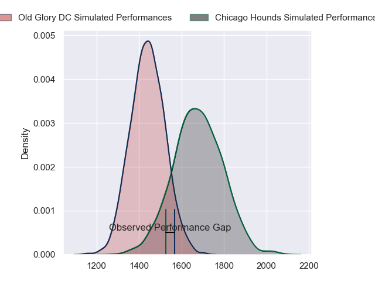
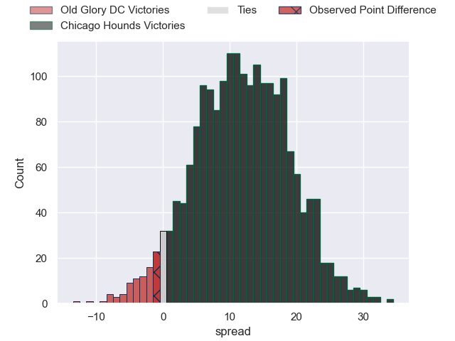
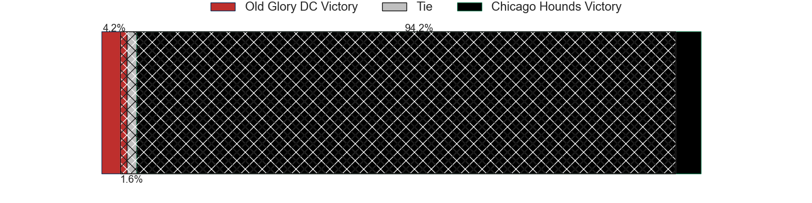
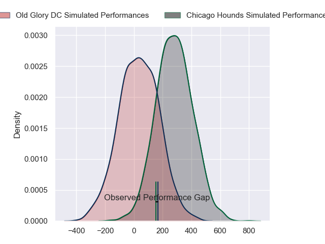
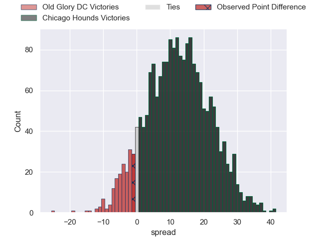
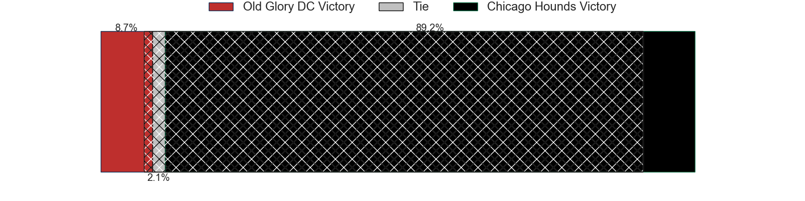

---  
layout: page  
title: Old Glory DC at Chicago Hounds; 22-21  
date: 2024-05-11 18:00:00 -0500  
categories: "Major League Rugby 2024" match review  
---
# Old Glory DC at Chicago Hounds; 22-21

# Club Level Predictions

The first set of predictions treats a club as the smallest object, as the club develops its members, organizes a gameplan, and deploys its players as needed for each match. This club model has a prediction of 0.785, which translates to predicting Chicago Hounds to win by 11.6.

Our Over/Under is 65.5 - and combined with the spread above, we have a predicted scoreline of 27 to 38

Each club has a rating and a rating deviation (similar to a Glicko rating), and expected performances can be generated. This allows for simulated matches and spreads like the ones below.
## Projected Performances - Club Model

## Projected Spreads - Club Model

## Projected Results - Club Model

# Player Level Predictions

Treating teams instead as an entity made up of the currently active players, I have ratings for each player in an altogether different system. These can be combined to form team ratings once teamsheets are announced, weighting starters a bit higher than the reserves. After the match is played, players can be weighted by their minutes on the field, allowing for an accurate measure of the team's composition. With these compiled team ratings, we can make predictions, measure inaccuracy, and update the individual player ratings.
## Prediction without Player Minutes: Chicago Hounds by 13.1

Chicago Hounds by 10.8 on a neutral pitch

## Projected Performances - Player Model

## Projected Spreads - Player Model

## Projected Results - Player Model

|   Away Minutes | Away Player              |   Away Percentile |   Number |   Home Percentile | Home Player             |   Home Minutes |
|---------------:|:-------------------------|------------------:|---------:|------------------:|:------------------------|---------------:|
|             80 | Jack Iscaro              |             15.16 |        1 |             79.79 | Charlie Abel            |             80 |
|             80 | Facundo Gattas           |             67.27 |        2 |             99.01 | Dylan Fawsitt           |             80 |
|             80 | Stevie Longwell          |             78.89 |        3 |             59.9  | Paddy Ryan              |             80 |
|             80 | Rob Harley               |             49.95 |        4 |             36.58 | George Merrick          |             80 |
|             80 | Tevita Naqali            |             58.09 |        5 |             75.58 | James Scott             |             80 |
|             80 | Jamason Fa'Anana-Schultz |             64.82 |        6 |              4.84 | Mason Flesch            |             80 |
|             80 | Cory Gilliland-Daniel    |             34.19 |        7 |             60.47 | Maclean Jones           |             80 |
|             80 | Lautaro Bavaro           |             51.6  |        8 |             13.22 | Luke White              |             80 |
|             80 | Ethan Mcveigh            |             64.05 |        9 |             72.6  | Jason Higgins           |             80 |
|             80 | Gradyn Bowd              |             58.85 |       10 |             55.86 | Adriaan Carelse         |             80 |
|             80 | Axel Muller              |             59.32 |       11 |             99.61 | Nate Augspurger         |             80 |
|             80 | Tommaso Boni             |              3.58 |       12 |             21.77 | Cassh Maluia            |             80 |
|             80 | John Powers              |             69.19 |       13 |             49.74 | Bryce Campbell          |             80 |
|             80 | Perry Humphreys          |             50.24 |       14 |             25.8  | Mark O'Keeffe           |             80 |
|             80 | Damien Hoyland           |             44.42 |       15 |             47    | Dave Kearney            |             80 |
|              0 | Koikoi Nelligan          |            nan    |       16 |             92.11 | Guillermo Pujadas       |              0 |
|              0 | Quentin Newcomer         |             46.45 |       17 |             38.71 | Fred Apulu              |              0 |
|              0 | Cali Martinez            |             44.17 |       18 |             89.41 | Ignacio Peculo          |              0 |
|              0 | Bill Whiteside           |             56.68 |       19 |             77.27 | Ben Landry              |              0 |
|              0 | Dacoda Worth             |            nan    |       20 |             53.09 | Conall Boomer           |              0 |
|              0 | Connor Buckley           |             36.13 |       21 |             53.23 | Nick McCarthy           |              0 |
|              0 | Jason Robertson          |             30.28 |       22 |             34.11 | Julián Dominguez Widmer |              0 |
|              0 | John Rizzo               |             46.28 |       23 |            nan    | Willis Goodwin          |              0 |

