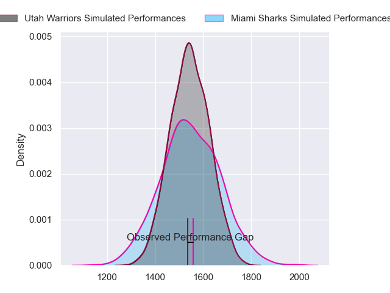
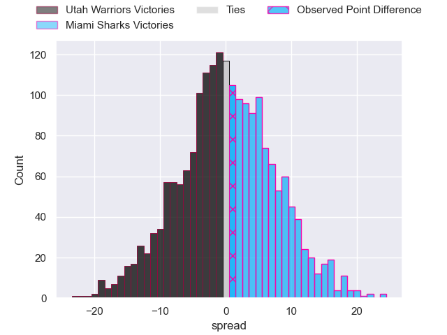
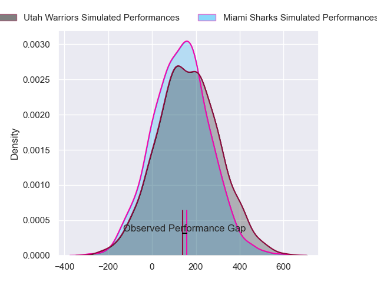
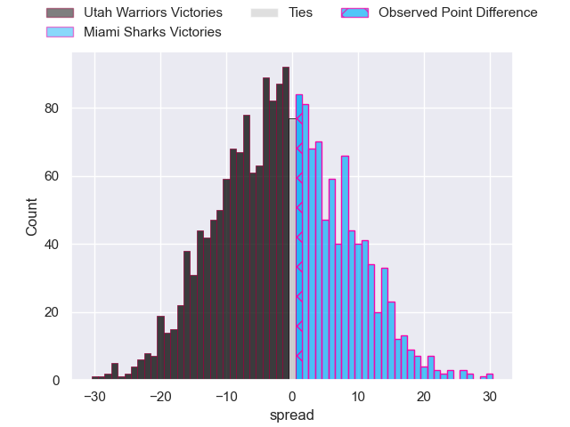

---  
layout: page  
title: Utah Warriors at Miami Sharks; 19-20  
date: 2024-05-11 18:00:00 -0500  
categories: "Major League Rugby 2024" match review  
---
# Utah Warriors at Miami Sharks; 19-20

# Club Level Predictions

The first set of predictions treats a club as the smallest object, as the club develops its members, organizes a gameplan, and deploys its players as needed for each match. This club model has a prediction of 0.503, which translates to predicting Miami Sharks to win by 0.1.

Our Over/Under is 49.5 - and combined with the spread above, we have a predicted scoreline of 25 to 25

Each club has a rating and a rating deviation (similar to a Glicko rating), and expected performances can be generated. This allows for simulated matches and spreads like the ones below.
## Projected Performances - Club Model

## Projected Spreads - Club Model

## Projected Results - Club Model

# Player Level Predictions

Treating teams instead as an entity made up of the currently active players, I have ratings for each player in an altogether different system. These can be combined to form team ratings once teamsheets are announced, weighting starters a bit higher than the reserves. After the match is played, players can be weighted by their minutes on the field, allowing for an accurate measure of the team's composition. With these compiled team ratings, we can make predictions, measure inaccuracy, and update the individual player ratings.
## Prediction without Player Minutes: Utah Warriors by 1.5

Utah Warriors by 3.7 on a neutral pitch

## Projected Performances - Player Model

## Projected Spreads - Player Model

## Projected Results - Player Model

|   Away Minutes | Away Player     |   Away Percentile |   Number |   Home Percentile | Home Player         |   Home Minutes |
|---------------:|:----------------|------------------:|---------:|------------------:|:--------------------|---------------:|
|             80 | Emerson Prior   |             36.35 |        1 |             19.97 | Rob Evans           |             80 |
|             80 | Nic Souchon     |             51.64 |        2 |             45.23 | Sean Mcnulty        |             80 |
|             80 | Paul Mullen     |             77.75 |        3 |             27.63 | Tevita Sole         |             80 |
|             80 | Frank Lochore   |             54.47 |        4 |             36.98 | Rick Rose           |             80 |
|             80 | Matt Jensen     |             55.28 |        5 |             53.87 | Stan Van Den Hoven  |             80 |
|             80 | Bailey Wilson   |             60.77 |        6 |             31.92 | Benjamin Bonasso    |             80 |
|             80 | Dylan Nel       |             51.09 |        7 |             19.37 | Dan Pryor           |             80 |
|             80 | Thomas Tu'avao  |             63.54 |        8 |             74.2  | Manuel Ardao        |             80 |
|             80 | Kieran Mcclea   |             36.3  |        9 |             34.03 | Tomas Inciarte      |             80 |
|             80 | Joel Hodgson    |             49.04 |       10 |             20.68 | Santiago Videla     |             80 |
|             80 | Joe Mano        |             76.04 |       11 |             29.86 | Avery Oitomen       |             80 |
|             80 | Lopeti Aisea    |             37.85 |       12 |             36.7  | Nick Grigg          |             80 |
|             80 | Mika Kruse      |             51.42 |       13 |             49.21 | Guiseppe Du Toit    |             80 |
|             80 | Isaia Kruse     |             27.73 |       14 |             51.5  | Michael Hand        |             80 |
|             80 | Caleb Makene    |             49.79 |       15 |             71.46 | Felipe Etcheverry   |             80 |
|              0 | Tyler Wong      |            nan    |       16 |            nan    | Alex Glover         |              0 |
|              0 | Fatongia Paea   |            nan    |       17 |             54.52 | Jonas Petrakopoulos |              0 |
|              0 | Angus Maclellan |             50.69 |       18 |             43.44 | Alec Mcdonnell      |              0 |
|              0 | Saia Uhila      |             47.74 |       19 |             33.79 | Tomás Casares       |              0 |
|              0 | Onehunga Havili |            nan    |       20 |            nan    | Chase Schor-Haskin  |              0 |
|              0 | Zion Going      |             48.87 |       21 |             17.8  | Tomas Cubelli       |              0 |
|              0 | Kalisi Moli     |            nan    |       22 |            nan    | Eric Naposki        |              0 |
|              0 | Robbie Povey    |             82.73 |       23 |             45.28 | Matías Freyre       |              0 |

