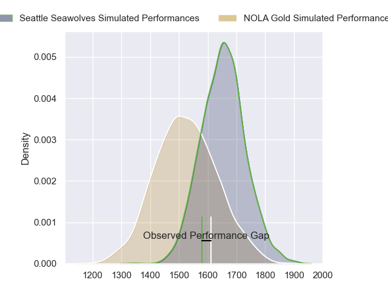
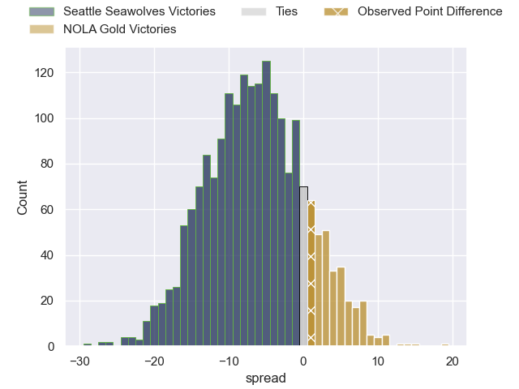
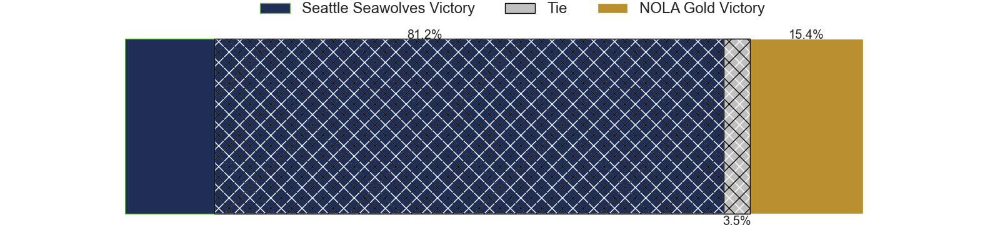
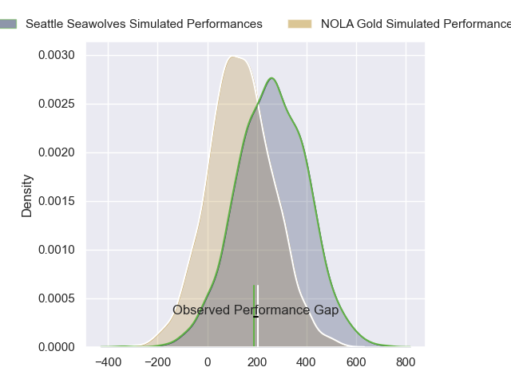
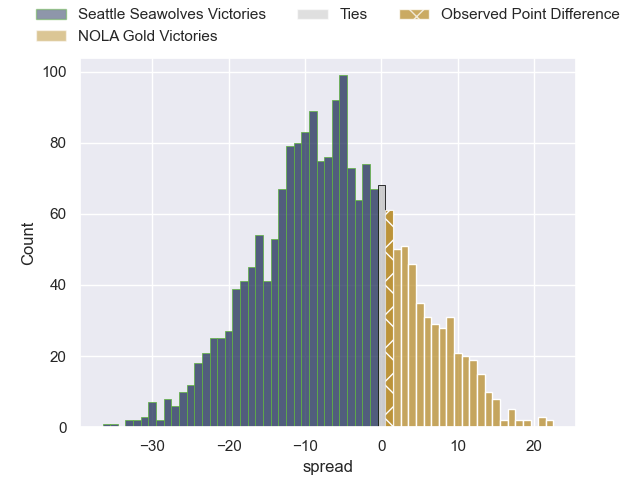

---  
layout: page  
title: Seattle Seawolves at NOLA Gold; 31-32  
date: 2024-05-11 18:00:00 -0500  
categories: "Major League Rugby 2024" match review  
---
# Seattle Seawolves at NOLA Gold; 31-32

# Club Level Predictions

The first set of predictions treats a club as the smallest object, as the club develops its members, organizes a gameplan, and deploys its players as needed for each match. This club model has a prediction of 0.334, which translates to predicting Seattle Seawolves to win by 6.2.

Our Over/Under is 55.5 - and combined with the spread above, we have a predicted scoreline of 31 to 25

Each club has a rating and a rating deviation (similar to a Glicko rating), and expected performances can be generated. This allows for simulated matches and spreads like the ones below.
## Projected Performances - Club Model

## Projected Spreads - Club Model

## Projected Results - Club Model

# Player Level Predictions

Treating teams instead as an entity made up of the currently active players, I have ratings for each player in an altogether different system. These can be combined to form team ratings once teamsheets are announced, weighting starters a bit higher than the reserves. After the match is played, players can be weighted by their minutes on the field, allowing for an accurate measure of the team's composition. With these compiled team ratings, we can make predictions, measure inaccuracy, and update the individual player ratings.
## Prediction without Player Minutes: Seattle Seawolves by 6.2

Seattle Seawolves by 8.9 on a neutral pitch

## Projected Performances - Player Model

## Projected Spreads - Player Model

## Projected Results - Player Model

|   Away Minutes | Away Player       |   Away Percentile |   Number |   Home Percentile | Home Player         |   Home Minutes |
|---------------:|:------------------|------------------:|---------:|------------------:|:--------------------|---------------:|
|             80 | Cameron Orr       |             70.5  |        1 |             41.48 | Matt Harmon         |             80 |
|             80 | Dewald Donald     |             54.77 |        2 |             78.78 | Pat O'Toole         |             80 |
|             80 | Oli Kilifi        |             49.23 |        3 |             80.11 | Jarred Adams        |             80 |
|             80 | Rhyno Herbst      |             81.21 |        4 |             60.5  | Malcolm May         |             80 |
|             80 | Jean Droste       |             79.3  |        5 |             40    | William Waguespack  |             80 |
|             80 | Reid Davis        |             48.52 |        6 |             41.21 | Moni Tonga'Uiha     |             80 |
|             80 | Huw Taylor        |             55.14 |        7 |             50.89 | Jonah Mau'U         |             80 |
|             80 | Riekert Hattingh  |             68.87 |        8 |             51.17 | Oj Noa              |             80 |
|             80 | Jp Smith          |             76.44 |        9 |             27.05 | Luke Campbell       |             80 |
|             80 | Mack Mason        |             75.48 |       10 |             61.41 | Dorian Jones        |             80 |
|             80 | Toni Pulu         |             71.11 |       11 |              5.7  | Ed Fidow            |             80 |
|             80 | Dan Kriel         |             67.61 |       12 |             66.56 | Jordan Jackson-Hope |             80 |
|             80 | Tevita Kuridrani  |             44.06 |       13 |             22.82 | Ross Depperschmidt  |             80 |
|             80 | Jade Stighling    |             68.79 |       14 |             39.32 | Taniela Filimone    |             80 |
|             80 | Divan Rossouw     |             48.71 |       15 |             60.09 | Julian Roberts      |             80 |
|              0 | Daquan Perry      |             54.44 |       16 |             11.51 | Augusto Bohme       |              0 |
|              0 | Kellen Gordon     |            nan    |       17 |            nan    | Bart Vermeulen      |              0 |
|              0 | Chance Wenglewski |            nan    |       18 |             45.48 | Doc Irey            |              0 |
|              0 | Taylor Krumrei    |             48.64 |       19 |             23.02 | Callum Botchar      |              0 |
|              0 | Pago Haini        |             53.94 |       20 |            nan    | Maciu Koroi         |              0 |
|              0 | Ryan Rees         |             56.2  |       21 |             35.38 | Cam Dolan           |              0 |
|              0 | Sam Windsor       |             59.28 |       22 |            nan    | Sebastiano Villani  |              0 |
|              0 | Tavite Lopeti     |             91.59 |       23 |             42.64 | Reece Botha         |              0 |

