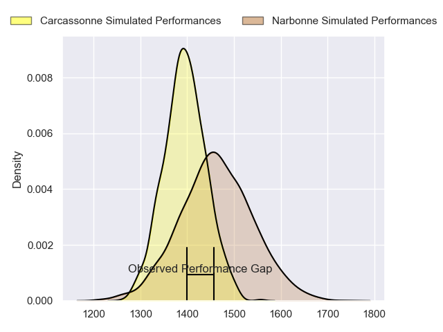
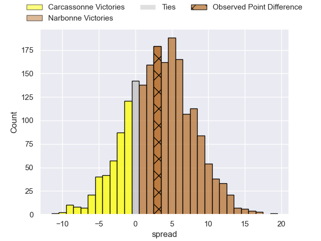
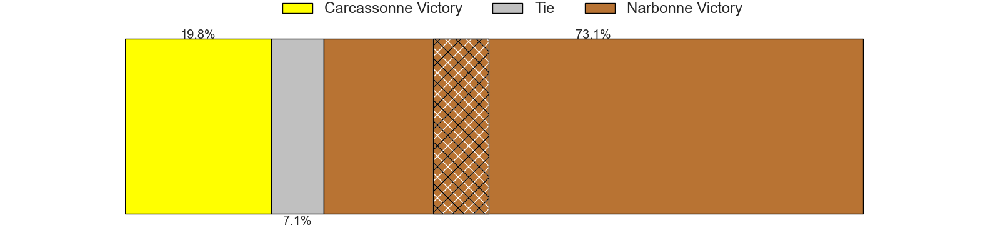
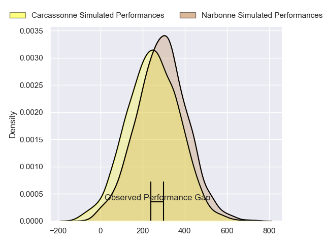
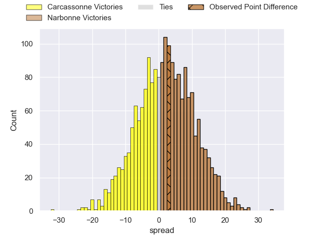
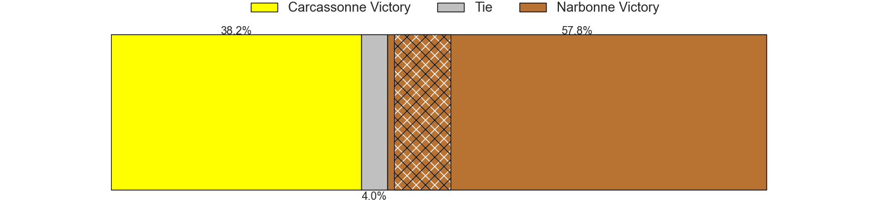

---  
layout: page  
title: Carcassonne at Narbonne; 20-23  
date: 2024-05-11 18:00:00 -0500  
categories: "Nationale 2023" match review  
---
# Carcassonne at Narbonne; 20-23

# Club Level Predictions

The first set of predictions treats a club as the smallest object, as the club develops its members, organizes a gameplan, and deploys its players as needed for each match. This club model has a prediction of 0.594, which translates to predicting Narbonne to win by 3.3.

Our Over/Under is 43.5 - and combined with the spread above, we have a predicted scoreline of 20 to 23

Each club has a rating and a rating deviation (similar to a Glicko rating), and expected performances can be generated. This allows for simulated matches and spreads like the ones below.
## Projected Performances - Club Model

## Projected Spreads - Club Model

## Projected Results - Club Model

# Player Level Predictions

Treating teams instead as an entity made up of the currently active players, I have ratings for each player in an altogether different system. These can be combined to form team ratings once teamsheets are announced, weighting starters a bit higher than the reserves. After the match is played, players can be weighted by their minutes on the field, allowing for an accurate measure of the team's composition. With these compiled team ratings, we can make predictions, measure inaccuracy, and update the individual player ratings.
## Prediction without Player Minutes: Narbonne by 2.0

Carcassonne by 6.0 on a neutral pitch

## Projected Performances - Player Model

## Projected Spreads - Player Model

## Projected Results - Player Model

|   Away Minutes | Away Player           |   Away Percentile |   Number |   Home Percentile | Home Player            |   Home Minutes |
|---------------:|:----------------------|------------------:|---------:|------------------:|:-----------------------|---------------:|
|             48 | Andrei Ursache        |             97.56 |        1 |             84.76 | Théo Castinel          |             60 |
|             80 | Raphael Carbou        |             86.18 |        2 |             15.13 | Clément Esteriola      |             65 |
|             62 | Nikoloz Narmania      |             19.72 |        3 |             53.87 | Jamie Hagan            |             50 |
|             80 | Romain Manchia        |             72.26 |        4 |              9.05 | Marius Antonescu       |             80 |
|             55 | Clément Fontaine      |             47.64 |        5 |              9.25 | Leva Fifita            |             60 |
|             67 | Valentin Sese         |              8.6  |        6 |              8.1  | Paul Belzons           |             80 |
|             80 | Etienne Herjean       |             90.61 |        7 |             80.53 | Baptiste Abescat-Leroy |             80 |
|             65 | Shaun Adendorff       |             72.71 |        8 |              2.77 | Charles Malet          |             44 |
|             79 | Gaetan Pichon         |             67.36 |        9 |             69.28 | Pierrick Nova          |             60 |
|             65 | Gabin Michet          |             71.86 |       10 |              4.9  | Gilles Bosch           |             75 |
|             80 | Clement Egiziano      |             96.14 |       11 |             67.44 | Ambrose Curtis         |             80 |
|             80 | Jordan Puletua        |             82.54 |       12 |             99.89 | Peter Betham           |             80 |
|             80 | Mathys Barka          |             11.04 |       13 |             39.33 | Pierre Nueno           |             54 |
|             72 | Sakiusa Bureitakiyaca |             15.56 |       14 |              7.25 | Pierre-Hugo Ducom      |             80 |
|             80 | Maxime Gianet         |             94.85 |       15 |             87.12 | Paul Auradou           |             80 |
|             36 | Yan Arnold            |            nan    |       16 |             45.72 | Benito Delacruz        |             24 |
|             22 | Fabien Lorenzon       |             90.22 |       17 |             90.46 | Christophe David       |             19 |
|             29 | Romain Guyot          |             64.12 |       18 |             83.62 | Levi Tikoipau          |             34 |
|             17 | Luka Petriashvili     |             62.83 |       19 |             60.8  | Dennis Visser          |             24 |
|             19 | Ferdinand Dreno       |             41.5  |       20 |             82.11 | Thibault Clauzade      |             40 |
|              5 | Martin Landajo        |              1.05 |       21 |             94.59 | Josh Valentine         |             24 |
|             19 | Damien Añon           |             77.47 |       22 |             55.94 | Clément Clavières      |             30 |
|             12 | Léo Darrelatour       |             93.04 |       23 |             37.53 | Tom Chauvet            |              9 |

