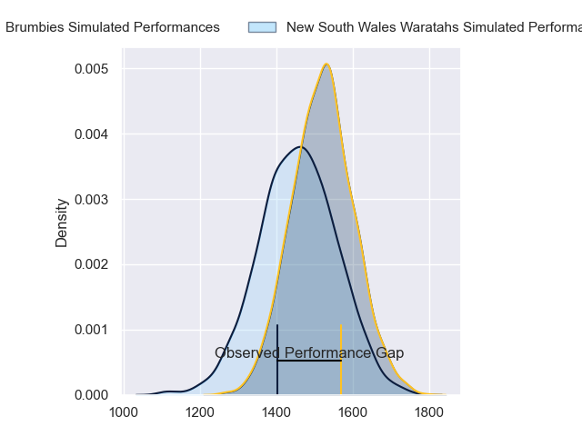
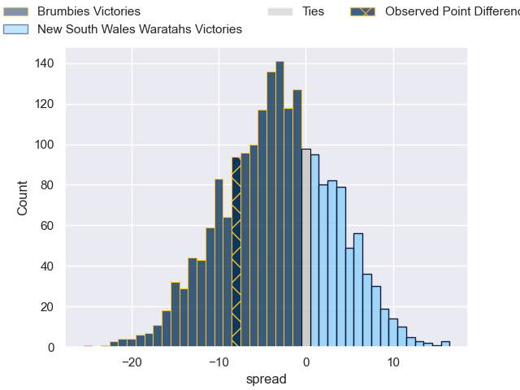
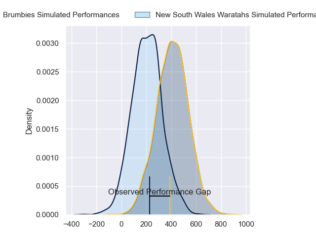
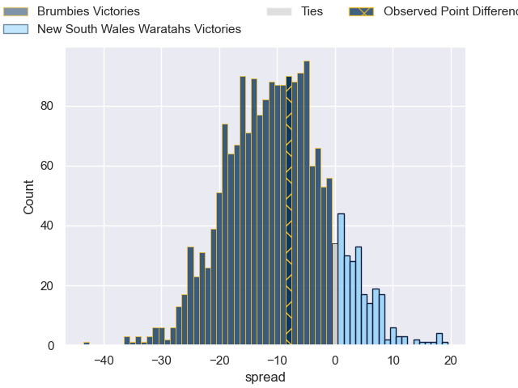

---  
layout: page  
title: Brumbies at New South Wales Waratahs; 29-21  
date: 2024-05-11 18:00:00 -0500  
categories: "Super Rugby Pacific 2024" match review  
---
# Brumbies at New South Wales Waratahs; 29-21

# Club Level Predictions

The first set of predictions treats a club as the smallest object, as the club develops its members, organizes a gameplan, and deploys its players as needed for each match. This club model has a prediction of 0.407, which translates to predicting Brumbies to win by 3.4.

Our Over/Under is 59.5 - and combined with the spread above, we have a predicted scoreline of 31 to 28

Each club has a rating and a rating deviation (similar to a Glicko rating), and expected performances can be generated. This allows for simulated matches and spreads like the ones below.
## Projected Performances - Club Model

## Projected Spreads - Club Model

## Projected Results - Club Model

# Player Level Predictions

Treating teams instead as an entity made up of the currently active players, I have ratings for each player in an altogether different system. These can be combined to form team ratings once teamsheets are announced, weighting starters a bit higher than the reserves. After the match is played, players can be weighted by their minutes on the field, allowing for an accurate measure of the team's composition. With these compiled team ratings, we can make predictions, measure inaccuracy, and update the individual player ratings.
## Prediction without Player Minutes: Brumbies by 8.7

Brumbies by 13.0 on a neutral pitch

## Projected Performances - Player Model

## Projected Spreads - Player Model

## Projected Results - Player Model

|   Away Minutes | Away Player      |   Away Percentile |   Number |   Home Percentile | Home Player              |   Home Minutes |
|---------------:|:-----------------|------------------:|---------:|------------------:|:-------------------------|---------------:|
|             55 | Harry Vella      |             41.81 |        1 |             92.58 | Hayden Thompson-Stringer |             80 |
|             55 | Connal McInerney |             88.16 |        2 |             54.11 | Jay Fonokalafi           |             80 |
|             66 | Allan Alaalatoa  |             96.66 |        3 |             56.89 | Harry Johnson-Holmes     |             36 |
|             80 | Darcy Swain      |             77.39 |        4 |             19.4  | Fergus Lee-Warner        |             53 |
|             80 | Nick Frost       |             49.75 |        5 |              3.62 | Miles Amatosero          |             80 |
|             80 | Rob Valetini     |             97.23 |        6 |             13.64 | Lachlan Swinton          |             80 |
|             55 | Rory Scott       |             62.35 |        7 |             69.57 | Charlie Gamble           |             67 |
|             38 | Charlie Cale     |             55.44 |        8 |             22.39 | Jed Holloway             |             80 |
|             60 | Ryan Lonergan    |             89.01 |        9 |             85.69 | Jake Gordon              |             72 |
|             80 | Jack Debreczeni  |             74.63 |       10 |              3.2  | Will Harrison            |             61 |
|             75 | Ollie Sapsford   |             91.4  |       11 |             80.48 | Dylan Pietsch            |             80 |
|             80 | Tamati Tua       |             64.67 |       12 |             74.45 | Lalakai Foketi           |             80 |
|             80 | Len Ikitau       |             70.87 |       13 |             81.91 | Joey Walton              |             80 |
|             80 | Andy Muirhead    |             93.33 |       14 |             55.36 | Triston Reilly           |             62 |
|             80 | Tom Wright       |             82.62 |       15 |             23.39 | Mark Nawaqanitawase      |             80 |
|             25 | Liam Bowron      |            nan    |       16 |            nan    | Ben Sugars               |              0 |
|             25 | Rhys Van Nek     |             73.92 |       17 |            nan    | George Thornton          |             14 |
|             14 | Sefo Kautai      |             31.38 |       18 |             50.12 | Pone Fa'amausili         |             44 |
|             42 | Cadeyrn Neville  |             99.3  |       19 |             11.56 | Hugh Sinclair            |             27 |
|             25 | Luke Reimer      |             53.85 |       20 |             28.95 | Hunter Ward              |             13 |
|             20 | Harrison Goddard |             24.08 |       21 |            nan    | Jack Grant               |              8 |
|              0 | Declan Meredith  |            nan    |       22 |             30.7  | Tane Edmed               |             19 |
|              5 | Ben O'Donnell    |            nan    |       23 |             46.06 | Harry Wilson             |             18 |

