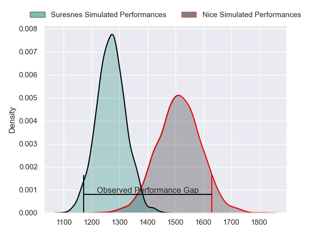
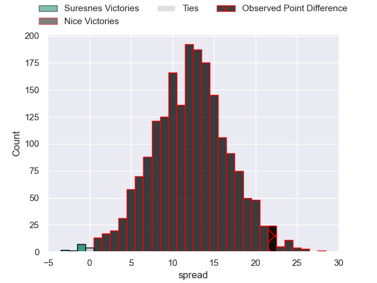
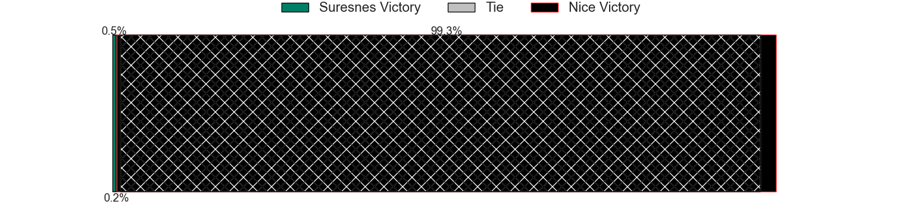
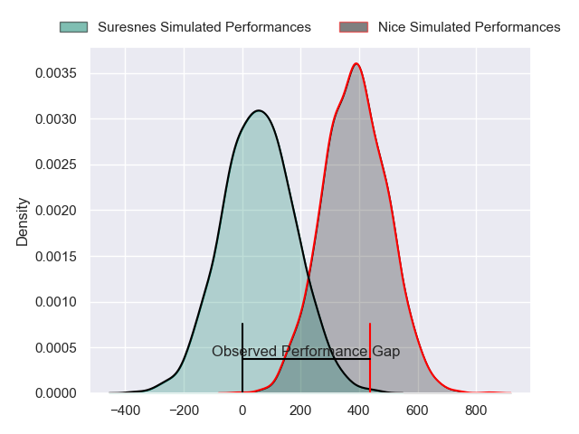
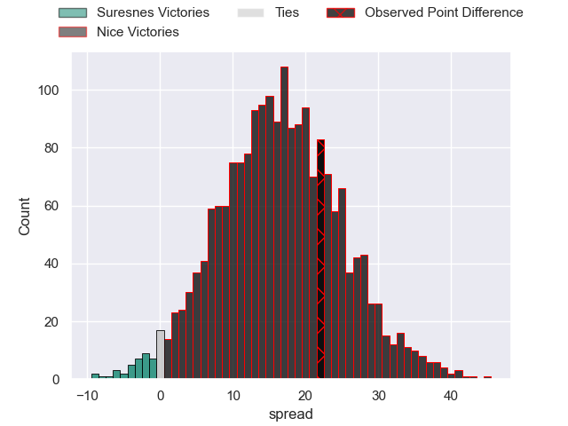
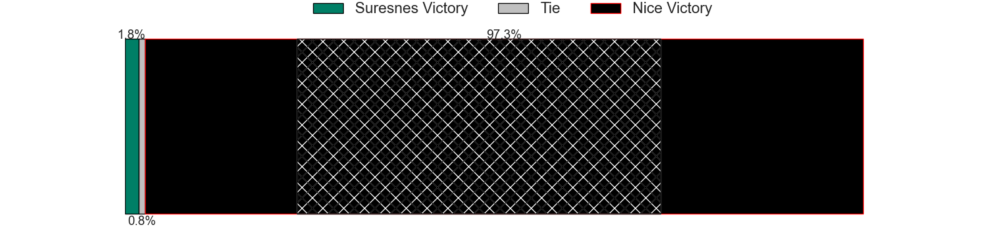

---  
layout: page  
title: Suresnes at Nice; 13-35  
date: 2024-05-11 18:00:00 -0500  
categories: "Nationale 2023" match review  
---
# Suresnes at Nice; 13-35

# Club Level Predictions

The first set of predictions treats a club as the smallest object, as the club develops its members, organizes a gameplan, and deploys its players as needed for each match. This club model has a prediction of 0.8, which translates to predicting Nice to win by 12.2.

Our Over/Under is 44.5 - and combined with the spread above, we have a predicted scoreline of 16 to 28

Each club has a rating and a rating deviation (similar to a Glicko rating), and expected performances can be generated. This allows for simulated matches and spreads like the ones below.
## Projected Performances - Club Model

## Projected Spreads - Club Model

## Projected Results - Club Model

# Player Level Predictions

Treating teams instead as an entity made up of the currently active players, I have ratings for each player in an altogether different system. These can be combined to form team ratings once teamsheets are announced, weighting starters a bit higher than the reserves. After the match is played, players can be weighted by their minutes on the field, allowing for an accurate measure of the team's composition. With these compiled team ratings, we can make predictions, measure inaccuracy, and update the individual player ratings.
## Prediction without Player Minutes: Nice by 17.6

Nice by 14.8 on a neutral pitch

## Projected Performances - Player Model

## Projected Spreads - Player Model

## Projected Results - Player Model

|   Away Minutes | Away Player             |   Away Percentile |   Number |   Home Percentile | Home Player               |   Home Minutes |
|---------------:|:------------------------|------------------:|---------:|------------------:|:--------------------------|---------------:|
|             58 | Elias Coulibaly         |             91.93 |        1 |              6.11 | Jules Martinez            |             51 |
|             58 | Jean-Étienne Lesueur    |             15.79 |        2 |             84.54 | Sione Anga'aelangi        |             62 |
|             80 | Leandro Mario Assi      |             49.55 |        3 |              9.94 | Nicolas Ciancio           |             51 |
|             80 | Christopher van Leeuwen |              8.34 |        4 |             99.6  | Tom Murday                |             80 |
|             58 | Yakine Djebarri         |             45.13 |        5 |             61.11 | Martin Freytes            |             47 |
|             80 | Damien Bozic            |             72.92 |        6 |             98.42 | Louis Suaud               |             51 |
|             58 | Wian Vosloo             |             57.81 |        7 |             69.17 | Arthur Vignolles          |             80 |
|             80 | Jean-Baptiste Lachaise  |             66.1  |        8 |              9.81 | Ramiha Tarrel Tia Smiler  |             65 |
|             63 | Théo Bachiri            |             10.3  |        9 |             93.02 | Jules Solinas             |             58 |
|             63 | Jean Chezeau            |             68.02 |       10 |             58.21 | Mathis Viard              |             80 |
|             80 | Faraj Fartass           |             84.93 |       11 |             97.1  | Andrzej Charlat           |             80 |
|             80 | Petero Tuwai            |             72.56 |       12 |             12.09 | Luca Cutayar              |             80 |
|             80 | Victor Barnier          |             82.12 |       13 |             89.06 | Nathan Courtade           |             69 |
|             58 | Ervin Muric             |              9.47 |       14 |             94.2  | Simon Delas               |             80 |
|             80 | Thomas Baudy            |              9.23 |       15 |             92.92 | David Odiete              |             80 |
|             22 | Lucas Dycke             |              1.71 |       16 |             86.23 | Sunia Vola                |             29 |
|             22 | Anthony Bajart          |             29.77 |       17 |             66.12 | Santiago Benjamin Ovejero |             18 |
|             22 | Marvin Woki             |             75.98 |       18 |             66.91 | Luvuyo Pupuma             |             29 |
|             22 | Florian Desbordes       |             24.11 |       19 |             43.32 | Yann Tivoli               |             33 |
|             17 | Thomas Lacroix          |             48.69 |       20 |             14.92 | Bastien Berenguel         |             29 |
|             17 | Tanguy Lacoste          |             77.61 |       21 |             92.96 | Laijiasa Bolenaivalu      |             15 |
|             22 | JJ Taulagi              |             13.56 |       22 |             16.75 | Matéo Jeune-Joly          |             22 |
|            nan | nan                     |            nan    |       23 |             17.38 | Pierre Le Huby            |             11 |

