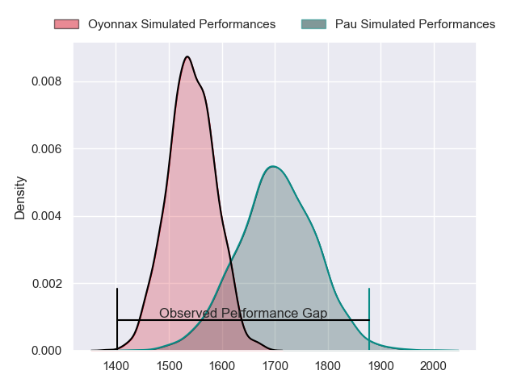
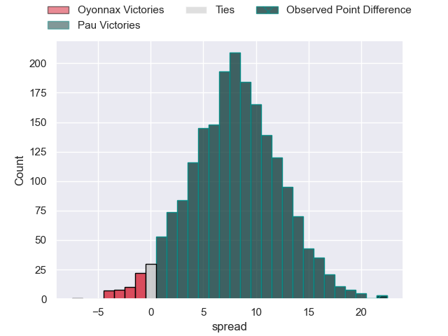
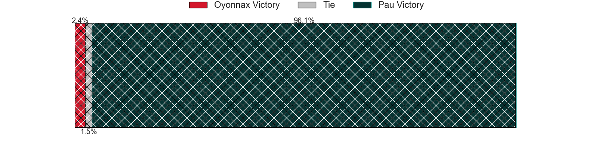
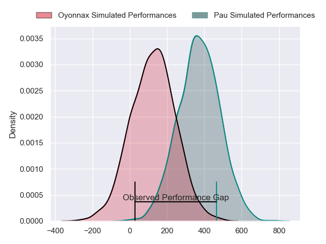
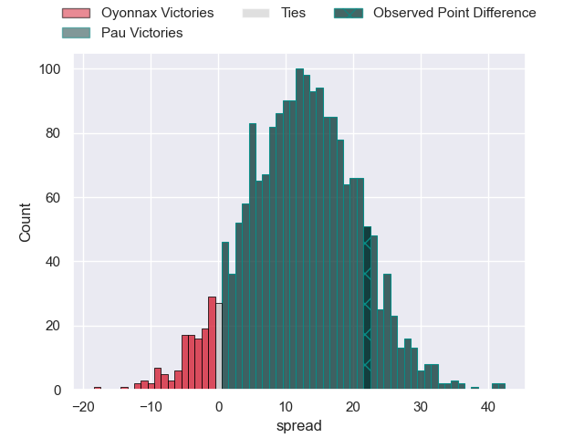
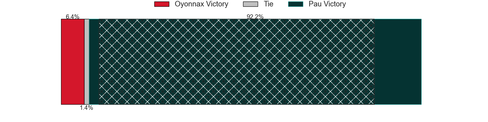

---  
layout: page  
title: Oyonnax at Pau; 17-39  
date: 2024-05-11 18:00:00 -0500  
categories: "Top 14 Orange 2023" match review  
---
# Oyonnax at Pau; 17-39

# Club Level Predictions

The first set of predictions treats a club as the smallest object, as the club develops its members, organizes a gameplan, and deploys its players as needed for each match. This club model has a prediction of 0.712, which translates to predicting Pau to win by 7.9.

Our Over/Under is 50.5 - and combined with the spread above, we have a predicted scoreline of 21 to 29

Each club has a rating and a rating deviation (similar to a Glicko rating), and expected performances can be generated. This allows for simulated matches and spreads like the ones below.
## Projected Performances - Club Model

## Projected Spreads - Club Model

## Projected Results - Club Model

# Player Level Predictions

Treating teams instead as an entity made up of the currently active players, I have ratings for each player in an altogether different system. These can be combined to form team ratings once teamsheets are announced, weighting starters a bit higher than the reserves. After the match is played, players can be weighted by their minutes on the field, allowing for an accurate measure of the team's composition. With these compiled team ratings, we can make predictions, measure inaccuracy, and update the individual player ratings.
## Prediction without Player Minutes: Pau by 14.0

Pau by 5.9 on a neutral pitch

## Projected Performances - Player Model

## Projected Spreads - Player Model

## Projected Results - Player Model

|   Away Minutes | Away Player        |   Away Percentile |   Number |   Home Percentile | Home Player          |   Home Minutes |
|---------------:|:-------------------|------------------:|---------:|------------------:|:---------------------|---------------:|
|             53 | Tommy Raynaud      |             84.11 |        1 |             44.91 | Simon-Pierre Chauvac |             55 |
|             59 | Benjamin Geledan   |             19.08 |        2 |             14.14 | Lucas Rey            |             54 |
|             59 | Christopher Vaotoa |             10.19 |        3 |             84.19 | Siate Tokolahi       |             41 |
|             60 | Phoenix Battye     |             96.38 |        4 |             19.1  | Guillaume Ducat      |             63 |
|             73 | Hugo Fabregue      |             65.23 |        5 |             98.99 | Samuel Whitelock     |             70 |
|             80 | Kevin Lebreton     |             38.83 |        6 |             21.54 | Sacha Zegueur        |             66 |
|             67 | Rory Grice         |             61.56 |        7 |             78.85 | Reece Hewat          |             80 |
|             66 | Loic Godener       |              3.84 |        8 |             68.66 | Beka Gorgadze        |             75 |
|             43 | Vasil Lobzhanidze  |             11.34 |        9 |             91.97 | Thibault Daubagna    |             61 |
|             53 | Domingo Miotti     |             86.57 |       10 |             83.37 | Joe Simmonds         |             63 |
|             80 | Daniel Ikpefan     |             67.92 |       11 |             78.36 | Thomas Carol         |             60 |
|             80 | Theo Millet        |             74.03 |       12 |             67.3  | Nathan Decron        |             80 |
|             20 | Chris Farrell      |             10.3  |       13 |             61.72 | Emilien Gailleton    |             80 |
|             80 | Gavin Stark        |              7.15 |       14 |             15.65 | Theo Attissogbe      |             74 |
|             80 | Darren Sweetnam    |             67.81 |       15 |             81.97 | Jack Maddocks        |             80 |
|             21 | Manu Leiataua      |              1.32 |       16 |             58.72 | Romain Ruffenach     |             26 |
|             27 | Adrien Bordenave   |              6.28 |       17 |            nan    | Hugo Parrou          |             25 |
|             27 | Victor Lebas       |              6.43 |       18 |             67.74 | Lekima Tagitagivalu  |             27 |
|             27 | Ewan Johnson       |             55.88 |       19 |             25.1  | Thibaut Hamonou      |             19 |
|             37 | Jonathan Ruru      |             94.24 |       20 |             97.91 | Dan Robson           |             19 |
|             27 | Justin Bouraux     |              6.44 |       21 |             80.17 | Axel Desperes        |             17 |
|             60 | Lucas Mensa        |             62.88 |       22 |             12.72 | Elliot Roudil        |             26 |
|             21 | Thibault Berthaud  |             38.96 |       23 |             17.2  | Guram Papidze        |             39 |

