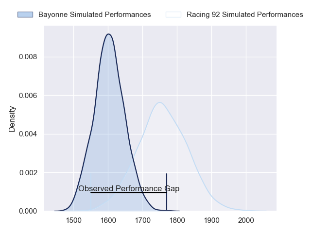
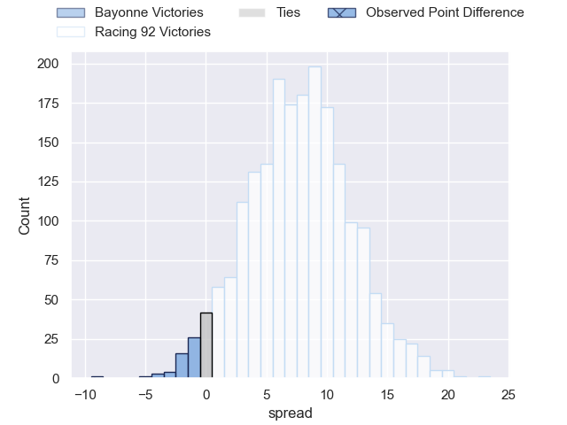
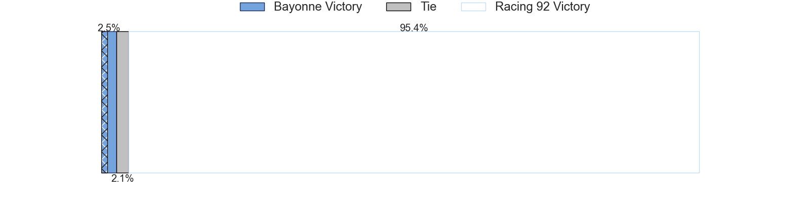
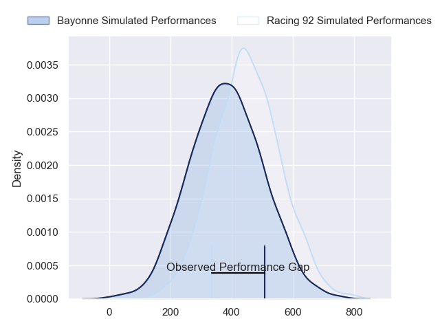
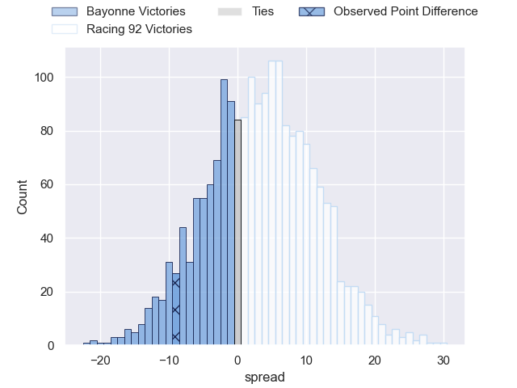
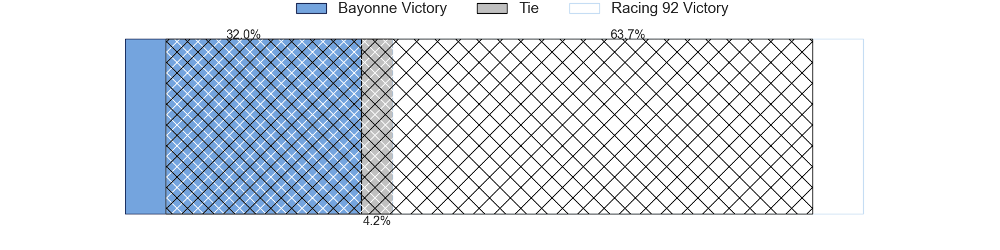

---  
layout: page  
title: Bayonne at Racing 92; 37-28  
date: 2024-05-11 18:00:00 -0500  
categories: "Top 14 Orange 2023" match review  
---
# Bayonne at Racing 92; 37-28

# Club Level Predictions

The first set of predictions treats a club as the smallest object, as the club develops its members, organizes a gameplan, and deploys its players as needed for each match. This club model has a prediction of 0.703, which translates to predicting Racing 92 to win by 7.5.

Our Over/Under is 56.5 - and combined with the spread above, we have a predicted scoreline of 25 to 32

Each club has a rating and a rating deviation (similar to a Glicko rating), and expected performances can be generated. This allows for simulated matches and spreads like the ones below.
## Projected Performances - Club Model

## Projected Spreads - Club Model

## Projected Results - Club Model

# Player Level Predictions

Treating teams instead as an entity made up of the currently active players, I have ratings for each player in an altogether different system. These can be combined to form team ratings once teamsheets are announced, weighting starters a bit higher than the reserves. After the match is played, players can be weighted by their minutes on the field, allowing for an accurate measure of the team's composition. With these compiled team ratings, we can make predictions, measure inaccuracy, and update the individual player ratings.
## Prediction without Player Minutes: Racing 92 by 6.0

Bayonne by 0.8 on a neutral pitch

## Projected Performances - Player Model

## Projected Spreads - Player Model

## Projected Results - Player Model

|   Away Minutes | Away Player           |   Away Percentile |   Number |   Home Percentile | Home Player         |   Home Minutes |
|---------------:|:----------------------|------------------:|---------:|------------------:|:--------------------|---------------:|
|             46 | Swan Cormenier        |             54.28 |        1 |             15.89 | Hassane Kolingar    |             41 |
|             34 | Vincent Giudicelli    |             12.5  |        2 |             92.93 | Camille Chat        |             50 |
|             46 | Luke Tagi             |             82.64 |        3 |             76.69 | Trevor Nyakane      |             41 |
|             75 | Denis Marchois        |             97.49 |        4 |             35.18 | Fabien Sanconnie    |             80 |
|             58 | Thomas Ceyte          |             84.22 |        5 |             30.05 | Will Rowlands       |             80 |
|             68 | Pierre Huguet         |             54.25 |        6 |             88.64 | Cameron Woki        |             80 |
|             65 | Remi Bourdeau         |             96.25 |        7 |             89.23 | Baptiste Chouzenoux |             50 |
|             80 | Rodrigo Bruni         |             99.79 |        8 |             81.66 | Siya Kolisi         |             80 |
|             70 | Maxime Machenaud      |             94.76 |        9 |             80.1  | Nolann Le Garrec    |             80 |
|             80 | Camille Lopez         |             94.46 |       10 |             89.98 | Antoine Gibert      |             57 |
|             80 | Remy Baget            |             90.24 |       11 |             28.6  | Vinaya Habosi       |             41 |
|             34 | Federico Mori         |             47.95 |       12 |             94.85 | Josua Tuisova       |             58 |
|             80 | Reece Hodge           |             88.85 |       13 |             97.27 | Gael Fickou         |             80 |
|             76 | Aurelien Callandret   |             86.86 |       14 |              9.95 | Henry Arundell      |             64 |
|             80 | Tom Spring            |             17.81 |       15 |             19.53 | Max Spring          |             80 |
|             46 | Facundo Bosch         |             94.9  |       16 |             32.89 | Janick Tarrit       |             30 |
|             34 | Matis Perchaud        |             52.97 |       17 |             97.47 | Eddy Ben Arous      |             39 |
|             27 | Lucas Paulos          |             59.1  |       18 |             77.49 | Boris Palu          |             30 |
|             27 | Baptiste Heguy        |             87.15 |       19 |             54.64 | Maxime Baudonne     |             39 |
|             10 | Gela Aprasidze        |             58.46 |       20 |             65.88 | Tristan Tedder      |             23 |
|             46 | Guillaume Martocq     |             14.62 |       21 |             19.98 | Francis Saili       |             22 |
|              4 | Arnaud Erbinartegaray |             52.68 |       22 |             95.46 | Christian Wade      |             16 |
|             34 | Tevita Tatafu         |             26.98 |       23 |             81.09 | Thomas Laclayat     |             39 |

